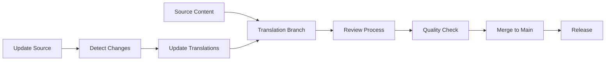

# 多语言支持 / Multi-Language Support

<!-- TOC START -->

- [多语言支持 / Multi-Language Support](#多语言支持-multi-language-support)
  - [1. 概述 / Overview](#1-概述-overview)
  - [2. 多语言内容管理 / Multi-Language Content Management](#2-多语言内容管理-multi-language-content-management)
    - [2.1 语言版本定义 / Language Version Definition](#21-语言版本定义-language-version-definition)
    - [2.2 内容同步策略 / Content Synchronization Strategy](#22-内容同步策略-content-synchronization-strategy)
  - [3. 翻译标准 / Translation Standards](#3-翻译标准-translation-standards)
    - [3.1 翻译质量标准 / Translation Quality Standards](#31-翻译质量标准-translation-quality-standards)
    - [3.2 术语管理标准 / Terminology Management Standards](#32-术语管理标准-terminology-management-standards)
  - [4. 本地化策略 / Localization Strategy](#4-本地化策略-localization-strategy)
    - [4.1 文化适应性 / Cultural Adaptation](#41-文化适应性-cultural-adaptation)
    - [4.2 技术本地化 / Technical Localization](#42-技术本地化-technical-localization)
  - [5. 语言版本控制 / Language Version Control](#5-语言版本控制-language-version-control)
    - [5.1 版本管理策略 / Version Management Strategy](#51-版本管理策略-version-management-strategy)
    - [5.2 变更追踪 / Change Tracking](#52-变更追踪-change-tracking)
  - [6. 多语言API设计 / Multi-Language API Design](#6-多语言api设计-multi-language-api-design)
    - [6.1 API国际化 / API Internationalization](#61-api国际化-api-internationalization)
    - [6.2 语言检测策略 / Language Detection Strategy](#62-语言检测策略-language-detection-strategy)
  - [7. 多语言内容交付 / Multi-Language Content Delivery](#7-多语言内容交付-multi-language-content-delivery)
    - [7.1 内容分发策略 / Content Distribution Strategy](#71-内容分发策略-content-distribution-strategy)
    - [7.2 性能优化 / Performance Optimization](#72-性能优化-performance-optimization)
  - [8. 多语言测试 / Multi-Language Testing](#8-多语言测试-multi-language-testing)
    - [8.1 本地化测试 / Localization Testing](#81-本地化测试-localization-testing)
    - [8.2 自动化测试 / Automated Testing](#82-自动化测试-automated-testing)
  - [9. 多语言监控 / Multi-Language Monitoring](#9-多语言监控-multi-language-monitoring)
    - [9.1 质量监控 / Quality Monitoring](#91-质量监控-quality-monitoring)
    - [9.2 用户反馈 / User Feedback](#92-用户反馈-user-feedback)
  - [10. 总结 / Summary](#10-总结-summary)

<!-- TOC END -->

## 1. 概述 / Overview

本文档定义容器与微服务系统的多语言支持标准，包括多语言内容管理、翻译标准、本地化策略等核心概念。

This document defines multi-language support standards for container and microservice systems, including multi-language content management, translation standards, and localization strategies.

## 2. 多语言内容管理 / Multi-Language Content Management

### 2.1 语言版本定义 / Language Version Definition

**定义2.1.1（语言版本）：**
语言版本是一个五元组 $LV = (Language, Locale, Content, Metadata, Version)$，其中：

- $Language$：语言代码（Language Code）
- $Locale$：地区设置（Locale Setting）
- $Content$：本地化内容（Localized Content）
- $Metadata$：元数据（Metadata）
- $Version$：版本信息（Version Information）

**支持的语言列表：**

```yaml
supported_languages:
  - code: "zh-CN"
    name: "简体中文"
    locale: "zh_CN.UTF-8"
    direction: "ltr"
  - code: "en-US"
    name: "English (US)"
    locale: "en_US.UTF-8"
    direction: "ltr"
  - code: "ja-JP"
    name: "日本語"
    locale: "ja_JP.UTF-8"
    direction: "ltr"
  - code: "ko-KR"
    name: "한국어"
    locale: "ko_KR.UTF-8"
    direction: "ltr"
  - code: "de-DE"
    name: "Deutsch"
    locale: "de_DE.UTF-8"
    direction: "ltr"
  - code: "fr-FR"
    name: "Français"
    locale: "fr_FR.UTF-8"
    direction: "ltr"
  - code: "es-ES"
    name: "Español"
    locale: "es_ES.UTF-8"
    direction: "ltr"
  - code: "ru-RU"
    name: "Русский"
    locale: "ru_RU.UTF-8"
    direction: "ltr"
```

### 2.2 内容同步策略 / Content Synchronization Strategy

**定义2.1.2（内容同步）：**
内容同步是一个四元组 $CS = (Source, Target, Sync, Validation)$，其中：

- $Source$：源语言内容（Source Language Content）
- $Target$：目标语言内容（Target Language Content）
- $Sync$：同步机制（Synchronization Mechanism）
- $Validation$：验证机制（Validation Mechanism）

**同步策略：**

```python
def sync_content(source_content, target_languages):
    """内容同步策略"""
    synced_content = {}
    
    for target_lang in target_languages:
        # 检查目标语言内容是否存在
        if not exists_content(target_lang):
            # 创建新翻译
            translated_content = translate_content(source_content, target_lang)
            synced_content[target_lang] = translated_content
        else:
            # 检查内容版本
            if is_content_outdated(target_lang, source_content):
                # 更新翻译
                updated_content = update_translation(source_content, target_lang)
                synced_content[target_lang] = updated_content
            else:
                # 内容已是最新
                synced_content[target_lang] = get_content(target_lang)
    
    return synced_content
```

## 3. 翻译标准 / Translation Standards

### 3.1 翻译质量标准 / Translation Quality Standards

**定义3.1.1（翻译质量）：**
翻译质量是一个五元组 $TQ = (Accuracy, Completeness, Consistency, Fluency, Terminology)$，其中：

- $Accuracy$：准确性（Translation Accuracy）
- $Completeness$：完整性（Translation Completeness）
- $Consistency$：一致性（Translation Consistency）
- $Fluency$：流畅性（Translation Fluency）
- $Terminology$：术语一致性（Terminology Consistency）

**质量评估标准：**

```yaml
quality_metrics:
  accuracy:
    weight: 0.3
    threshold: 0.95
    description: "翻译准确性评估"
  completeness:
    weight: 0.2
    threshold: 0.98
    description: "翻译完整性评估"
  consistency:
    weight: 0.2
    threshold: 0.90
    description: "术语一致性评估"
  fluency:
    weight: 0.15
    threshold: 0.85
    description: "语言流畅性评估"
  terminology:
    weight: 0.15
    threshold: 0.95
    description: "专业术语准确性"
```

### 3.2 术语管理标准 / Terminology Management Standards

**定义3.1.2（术语管理）：**
术语管理是一个四元组 $TM = (Glossary, Validation, Update, Distribution)$，其中：

- $Glossary$：术语表（Terminology Glossary）
- $Validation$：术语验证（Terminology Validation）
- $Update$：术语更新（Terminology Update）
- $Distribution$：术语分发（Terminology Distribution）

**术语表结构：**

```yaml
terminology_glossary:
  container:
    zh-CN: "容器"
    en-US: "Container"
    ja-JP: "コンテナ"
    ko-KR: "컨테이너"
    de-DE: "Container"
    fr-FR: "Conteneur"
    es-ES: "Contenedor"
    ru-RU: "Контейнер"
  microservice:
    zh-CN: "微服务"
    en-US: "Microservice"
    ja-JP: "マイクロサービス"
    ko-KR: "마이크로서비스"
    de-DE: "Microservice"
    fr-FR: "Microservice"
    es-ES: "Microservicio"
    ru-RU: "Микросервис"
  service_mesh:
    zh-CN: "服务网格"
    en-US: "Service Mesh"
    ja-JP: "サービスメッシュ"
    ko-KR: "서비스 메시"
    de-DE: "Service Mesh"
    fr-FR: "Maillage de Services"
    es-ES: "Malla de Servicios"
    ru-RU: "Сервисная сетка"
```

## 4. 本地化策略 / Localization Strategy

### 4.1 文化适应性 / Cultural Adaptation

**定义4.1.1（文化适应）：**
文化适应是一个五元组 $CA = (Culture, Adaptation, Context, Sensitivity, Compliance)$，其中：

- $Culture$：文化背景（Cultural Background）
- $Adaptation$：适应性调整（Adaptation Adjustment）
- $Context$：上下文理解（Context Understanding）
- $Sensitivity$：文化敏感性（Cultural Sensitivity）
- $Compliance$：合规要求（Compliance Requirements）

**文化适应指南：**

```yaml
cultural_adaptation:
  date_format:
    zh-CN: "YYYY年MM月DD日"
    en-US: "MM/DD/YYYY"
    ja-JP: "YYYY年MM月DD日"
    ko-KR: "YYYY년 MM월 DD일"
    de-DE: "DD.MM.YYYY"
    fr-FR: "DD/MM/YYYY"
    es-ES: "DD/MM/YYYY"
    ru-RU: "DD.MM.YYYY"
  number_format:
    zh-CN: "1,234.56"
    en-US: "1,234.56"
    ja-JP: "1,234.56"
    ko-KR: "1,234.56"
    de-DE: "1.234,56"
    fr-FR: "1 234,56"
    es-ES: "1.234,56"
    ru-RU: "1 234,56"
  currency_format:
    zh-CN: "¥1,234.56"
    en-US: "$1,234.56"
    ja-JP: "¥1,234"
    ko-KR: "₩1,234"
    de-DE: "1.234,56 €"
    fr-FR: "1 234,56 €"
    es-ES: "1.234,56 €"
    ru-RU: "1 234,56 ₽"
```

### 4.2 技术本地化 / Technical Localization

**定义4.1.2（技术本地化）：**
技术本地化是一个四元组 $TL = (Encoding, Format, Standards, Compatibility)$，其中：

- $Encoding$：字符编码（Character Encoding）
- $Format$：数据格式（Data Format）
- $Standards$：技术标准（Technical Standards）
- $Compatibility$：兼容性（Compatibility）

**技术本地化配置：**

```yaml
technical_localization:
  character_encoding:
    default: "UTF-8"
    fallback: "UTF-8"
    validation: true
  data_formats:
    json:
      encoding: "UTF-8"
      pretty_print: true
    xml:
      encoding: "UTF-8"
      declaration: true
    yaml:
      encoding: "UTF-8"
      explicit_start: true
  standards_compliance:
    unicode: "15.0"
    iso_639_1: true
    iso_3166_1: true
    rfc_5646: true
```

## 5. 语言版本控制 / Language Version Control

### 5.1 版本管理策略 / Version Management Strategy

**定义5.1.1（语言版本管理）：**
语言版本管理是一个五元组 $LVM = (Version, Branch, Merge, Conflict, Resolution)$，其中：

- $Version$：版本控制（Version Control）
- $Branch$：分支管理（Branch Management）
- $Merge$：合并策略（Merge Strategy）
- $Conflict$：冲突处理（Conflict Resolution）
- $Resolution$：解决方案（Resolution Strategy）

**版本控制工作流：**



### 5.2 变更追踪 / Change Tracking

**定义5.1.2（变更追踪）：**
变更追踪是一个四元组 $CT = (Changes, Impact, Propagation, Notification)$，其中：

- $Changes$：变更记录（Change Records）
- $Impact$：影响分析（Impact Analysis）
- $Propagation$：变更传播（Change Propagation）
- $Notification$：通知机制（Notification Mechanism）

**变更追踪系统：**

```python
def track_content_changes(source_content, target_languages):
    """内容变更追踪"""
    changes = {}
    
    for lang in target_languages:
        # 检测内容变更
        changes[lang] = detect_changes(source_content, lang)
        
        # 分析影响范围
        impact = analyze_impact(changes[lang])
        
        # 传播变更
        if impact['severity'] > threshold:
            propagate_changes(lang, changes[lang])
            
        # 发送通知
        notify_translators(lang, changes[lang])
    
    return changes
```

## 6. 多语言API设计 / Multi-Language API Design

### 6.1 API国际化 / API Internationalization

**定义6.1.1（API国际化）：**
API国际化是一个五元组 $API_I18N = (Headers, Parameters, Responses, Errors, Documentation)$，其中：

- $Headers$：国际化头部（Internationalization Headers）
- $Parameters$：参数本地化（Parameter Localization）
- $Responses$：响应本地化（Response Localization）
- $Errors$：错误信息本地化（Error Message Localization）
- $Documentation$：文档本地化（Documentation Localization）

**API国际化标准：**

```yaml
api_internationalization:
  headers:
    accept_language: "Accept-Language"
    content_language: "Content-Language"
    accept_charset: "Accept-Charset"
  parameters:
    locale: "locale"
    timezone: "timezone"
    currency: "currency"
  responses:
    language: "language"
    region: "region"
    encoding: "encoding"
  errors:
    localization: true
    fallback_language: "en-US"
    error_codes: true
```

### 6.2 语言检测策略 / Language Detection Strategy

**定义6.1.2（语言检测）：**
语言检测是一个四元组 $LD = (Detection, Fallback, Preference, Validation)$，其中：

- $Detection$：检测算法（Detection Algorithm）
- $Fallback$：回退策略（Fallback Strategy）
- $Preference$：偏好设置（Preference Setting）
- $Validation$：验证机制（Validation Mechanism）

**语言检测算法：**

```python
def detect_language(request):
    """语言检测算法"""
    # 1. 检查Accept-Language头部
    accept_language = request.headers.get('Accept-Language')
    if accept_language:
        detected_lang = parse_accept_language(accept_language)
        if is_supported(detected_lang):
            return detected_lang
    
    # 2. 检查用户偏好设置
    user_preference = get_user_preference(request.user_id)
    if user_preference and is_supported(user_preference):
        return user_preference
    
    # 3. 检查IP地理位置
    geo_location = get_geo_location(request.ip)
    if geo_location:
        geo_lang = map_location_to_language(geo_location)
        if is_supported(geo_lang):
            return geo_lang
    
    # 4. 回退到默认语言
    return get_default_language()
```

## 7. 多语言内容交付 / Multi-Language Content Delivery

### 7.1 内容分发策略 / Content Distribution Strategy

**定义7.1.1（内容分发）：**
内容分发是一个五元组 $CD = (Distribution, Caching, CDN, Optimization, Monitoring)$，其中：

- $Distribution$：分发策略（Distribution Strategy）
- $Caching$：缓存策略（Caching Strategy）
- $CDN$：内容分发网络（Content Delivery Network）
- $Optimization$：优化策略（Optimization Strategy）
- $Monitoring$：监控机制（Monitoring Mechanism）

**内容分发配置：**

```yaml
content_distribution:
  cdn:
    enabled: true
    providers:
      - "CloudFront"
      - "Cloudflare"
      - "Akamai"
    regions:
      - "us-east-1"
      - "eu-west-1"
      - "ap-northeast-1"
  caching:
    strategy: "language-aware"
    ttl: 3600
    invalidation: "selective"
  optimization:
    compression: true
    minification: true
    image_optimization: true
```

### 7.2 性能优化 / Performance Optimization

**定义7.1.2（性能优化）：**
性能优化是一个四元组 $PO = (Loading, Rendering, Bandwidth, Latency)$，其中：

- $Loading$：加载优化（Loading Optimization）
- $Rendering$：渲染优化（Rendering Optimization）
- $Bandwidth$：带宽优化（Bandwidth Optimization）
- $Latency$：延迟优化（Latency Optimization）

## 8. 多语言测试 / Multi-Language Testing

### 8.1 本地化测试 / Localization Testing

**定义8.1.1（本地化测试）：**
本地化测试是一个五元组 $LT = (Functional, Linguistic, Cultural, Technical, Compliance)$，其中：

- $Functional$：功能测试（Functional Testing）
- $Linguistic$：语言测试（Linguistic Testing）
- $Cultural$：文化测试（Cultural Testing）
- $Technical$：技术测试（Technical Testing）
- $Compliance$：合规测试（Compliance Testing）

**测试策略：**

```yaml
localization_testing:
  functional:
    - "UI elements display correctly"
    - "Navigation works properly"
    - "Forms handle input correctly"
  linguistic:
    - "Translation accuracy"
    - "Grammar and spelling"
    - "Terminology consistency"
  cultural:
    - "Date and time formats"
    - "Number and currency formats"
    - "Cultural sensitivity"
  technical:
    - "Character encoding"
    - "Text rendering"
    - "Performance impact"
  compliance:
    - "Accessibility standards"
    - "Legal requirements"
    - "Industry standards"
```

### 8.2 自动化测试 / Automated Testing

**定义8.1.2（自动化测试）：**
自动化测试是一个四元组 $AT = (Framework, Scripts, CI/CD, Reporting)$，其中：

- $Framework$：测试框架（Testing Framework）
- $Scripts$：测试脚本（Test Scripts）
- $CI/CD$：持续集成/持续部署（Continuous Integration/Deployment）
- $Reporting$：测试报告（Test Reporting）

## 9. 多语言监控 / Multi-Language Monitoring

### 9.1 质量监控 / Quality Monitoring

**定义9.1.1（质量监控）：**
质量监控是一个五元组 $QM = (Metrics, Alerts, Dashboards, Reports, Analytics)$，其中：

- $Metrics$：监控指标（Monitoring Metrics）
- $Alerts$：告警机制（Alert Mechanism）
- $Dashboards$：监控面板（Monitoring Dashboards）
- $Reports$：监控报告（Monitoring Reports）
- $Analytics$：数据分析（Data Analytics）

**监控指标：**

```yaml
quality_metrics:
  translation_coverage:
    threshold: 0.95
    alert: true
  translation_quality:
    threshold: 0.90
    alert: true
  response_time:
    threshold: 2000
    alert: true
  error_rate:
    threshold: 0.01
    alert: true
  user_satisfaction:
    threshold: 4.0
    alert: true
```

### 9.2 用户反馈 / User Feedback

**定义9.1.2（用户反馈）：**
用户反馈是一个四元组 $UF = (Collection, Analysis, Action, Followup)$，其中：

- $Collection$：反馈收集（Feedback Collection）
- $Analysis$：反馈分析（Feedback Analysis）
- $Action$：行动措施（Action Measures）
- $Followup$：后续跟踪（Followup Tracking）

## 10. 总结 / Summary

多语言支持标准提供了：

1. **内容管理**：多语言内容的版本控制和同步策略
2. **翻译标准**：翻译质量评估和术语管理标准
3. **本地化策略**：文化适应性和技术本地化
4. **版本控制**：语言版本的变更追踪和管理
5. **API设计**：国际化的API设计和语言检测
6. **内容交付**：多语言内容的分发和优化
7. **测试策略**：本地化测试和自动化测试
8. **监控体系**：多语言质量监控和用户反馈

这些标准为容器与微服务系统的多语言支持提供了完整的框架。

---

**参考文献 / References**:

1. Unicode Consortium. "The Unicode Standard"
2. ISO/IEC 639-1. "Codes for the representation of names of languages"
3. ISO/IEC 3166-1. "Codes for the representation of names of countries and their subdivisions"
4. RFC 5646. "Tags for Identifying Languages"
5. W3C. "Internationalization (i18n) Activity"
6. Microsoft. "Globalization and Localization Guidelines"
7. Google. "Material Design Internationalization"
8. Apple. "Internationalization and Localization Guide"
