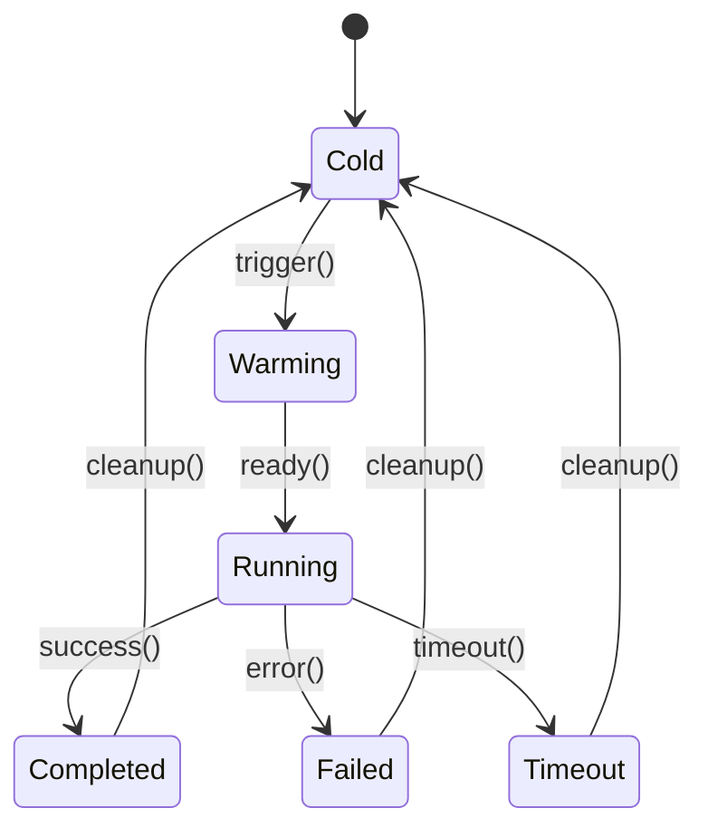

# Serverless形式化定义 / Serverless Formal Definitions

<!-- TOC START -->

- [Serverless形式化定义 / Serverless Formal Definitions](#serverless形式化定义-serverless-formal-definitions)
  - [1. 概述 / Overview](#1-概述-overview)
  - [2. Serverless函数定义 / Serverless Function Definitions](#2-serverless函数定义-serverless-function-definitions)
    - [2.1 基本函数定义 / Basic Function Definition](#21-基本函数定义-basic-function-definition)
    - [2.2 函数执行模型 / Function Execution Model](#22-函数执行模型-function-execution-model)
  - [3. 事件驱动模型 / Event-Driven Model](#3-事件驱动模型-event-driven-model)
    - [3.1 事件定义 / Event Definition](#31-事件定义-event-definition)
    - [3.2 事件流模型 / Event Stream Model](#32-事件流模型-event-stream-model)
  - [4. 冷启动模型 / Cold Start Model](#4-冷启动模型-cold-start-model)
    - [4.1 冷启动定义 / Cold Start Definition](#41-冷启动定义-cold-start-definition)
    - [4.2 预热策略 / Warmup Strategy](#42-预热策略-warmup-strategy)
  - [5. 资源分配模型 / Resource Allocation Model](#5-资源分配模型-resource-allocation-model)
    - [5.1 动态资源分配 / Dynamic Resource Allocation](#51-动态资源分配-dynamic-resource-allocation)
    - [5.2 自动扩展模型 / Auto-Scaling Model](#52-自动扩展模型-auto-scaling-model)
  - [6. 计费模型 / Billing Model](#6-计费模型-billing-model)
    - [6.1 按使用计费 / Pay-Per-Use Billing](#61-按使用计费-pay-per-use-billing)
    - [6.2 成本优化模型 / Cost Optimization Model](#62-成本优化模型-cost-optimization-model)
  - [7. 扩展模型 / Scaling Model](#7-扩展模型-scaling-model)
    - [7.1 水平扩展 / Horizontal Scaling](#71-水平扩展-horizontal-scaling)
    - [7.2 垂直扩展 / Vertical Scaling](#72-垂直扩展-vertical-scaling)
  - [8. 安全模型 / Security Model](#8-安全模型-security-model)
    - [8.1 函数安全 / Function Security](#81-函数安全-function-security)
    - [8.2 运行时安全 / Runtime Security](#82-运行时安全-runtime-security)
  - [9. 性能模型 / Performance Model](#9-性能模型-performance-model)
    - [9.1 延迟模型 / Latency Model](#91-延迟模型-latency-model)
    - [9.2 吞吐量模型 / Throughput Model](#92-吞吐量模型-throughput-model)
  - [10. 监控模型 / Monitoring Model](#10-监控模型-monitoring-model)
    - [10.1 指标定义 / Metrics Definition](#101-指标定义-metrics-definition)
    - [10.2 告警模型 / Alerting Model](#102-告警模型-alerting-model)
  - [11. 集成模型 / Integration Model](#11-集成模型-integration-model)
    - [11.1 API网关集成 / API Gateway Integration](#111-api网关集成-api-gateway-integration)
    - [11.2 数据库集成 / Database Integration](#112-数据库集成-database-integration)
  - [12. 总结 / Summary](#12-总结-summary)

<!-- TOC END -->

## 1. 概述 / Overview

本文档提供Serverless计算范式的形式化定义，包括函数计算、事件驱动、资源管理等核心概念。

This document provides formal definitions for the Serverless computing paradigm, including function computing, event-driven models, and resource management.

## 2. Serverless函数定义 / Serverless Function Definitions

### 2.1 基本函数定义 / Basic Function Definition

**定义2.1.1（Serverless函数）：**
Serverless函数是一个七元组 $F = (Code, Runtime, Trigger, Resources, Timeout, Memory, Environment)$，其中：

- $Code$：函数代码（Function Code）
- $Runtime$：运行时环境（Runtime Environment）
- $Trigger$：触发器集合（Trigger Set）
- $Resources$：资源限制（Resource Limits）
- $Timeout$：超时时间（Timeout Duration）
- $Memory$：内存限制（Memory Limit）
- $Environment$：环境变量（Environment Variables）

**形式化表达：**
$$ServerlessFunction = (Code, Runtime, Trigger, Resources, Timeout, Memory, Environment)$$

### 2.2 函数执行模型 / Function Execution Model

**定义2.1.2（函数执行状态）：**
函数执行状态是一个状态机 $S = (States, Transitions, Events)$，其中：

- $States = \{Cold, Warming, Running, Completed, Failed, Timeout\}$
- $Transitions$：状态转换关系
- $Events$：触发事件集合

**状态转换图：**

## 3. 事件驱动模型 / Event-Driven Model

### 3.1 事件定义 / Event Definition

**定义3.1.1（事件）：**
事件是一个四元组 $E = (Type, Data, Source, Timestamp)$，其中：

- $Type$：事件类型（Event Type）
- $Data$：事件数据（Event Data）
- $Source$：事件源（Event Source）
- $Timestamp$：时间戳（Timestamp）

**形式化表达：**
$$Event = (Type, Data, Source, Timestamp)$$

### 3.2 事件流模型 / Event Stream Model

**定义3.1.2（事件流）：**
事件流是一个三元组 $ES = (Events, Order, Processing)$，其中：

- $Events$：事件序列（Event Sequence）
- $Order$：排序规则（Ordering Rules）
- $Processing$：处理策略（Processing Strategy）

**数学表达：**
$$ES = \{e_1, e_2, ..., e_n\} \text{ where } e_i = (Type_i, Data_i, Source_i, Timestamp_i)$$

## 4. 冷启动模型 / Cold Start Model

### 4.1 冷启动定义 / Cold Start Definition

**定义4.1.1（冷启动）：**
冷启动是一个五元组 $CS = (InitTime, WarmupTime, ResourceAllocation, Performance, Cost)$，其中：

- $InitTime$：初始化时间（Initialization Time）
- $WarmupTime$：预热时间（Warmup Time）
- $ResourceAllocation$：资源分配（Resource Allocation）
- $Performance$：性能影响（Performance Impact）
- $Cost$：成本影响（Cost Impact）

**冷启动时间模型：**
$$T_{ColdStart} = T_{Init} + T_{Warmup} + T_{ResourceAlloc}$$

### 4.2 预热策略 / Warmup Strategy

**定义4.1.2（预热策略）：**
预热策略是一个四元组 $WS = (Trigger, Duration, Resources, Frequency)$，其中：

- $Trigger$：预热触发条件（Warmup Trigger）
- $Duration$：预热持续时间（Warmup Duration）
- $Resources$：预热资源（Warmup Resources）
- $Frequency$：预热频率（Warmup Frequency）

## 5. 资源分配模型 / Resource Allocation Model

### 5.1 动态资源分配 / Dynamic Resource Allocation

**定义5.1.1（资源分配）：**
资源分配是一个六元组 $RA = (CPU, Memory, Network, Storage, Scaling, Limits)$，其中：

- $CPU$：CPU分配（CPU Allocation）
- $Memory$：内存分配（Memory Allocation）
- $Network$：网络分配（Network Allocation）
- $Storage$：存储分配（Storage Allocation）
- $Scaling$：扩展策略（Scaling Strategy）
- $Limits$：资源限制（Resource Limits）

**资源分配函数：**
$$RA(t) = (CPU(t), Memory(t), Network(t), Storage(t))$$

### 5.2 自动扩展模型 / Auto-Scaling Model

**定义5.1.2（自动扩展）：**
自动扩展是一个五元组 $AS = (Metrics, Threshold, Policy, Cooldown, Limits)$，其中：

- $Metrics$：扩展指标（Scaling Metrics）
- $Threshold$：扩展阈值（Scaling Threshold）
- $Policy$：扩展策略（Scaling Policy）
- $Cooldown$：冷却时间（Cooldown Period）
- $Limits$：扩展限制（Scaling Limits）

**扩展决策函数：**
$$Scale(t) = f(Metrics(t), Threshold, Policy)$$

## 6. 计费模型 / Billing Model

### 6.1 按使用计费 / Pay-Per-Use Billing

**定义6.1.1（计费模型）：**
计费模型是一个五元组 $BM = (ExecutionTime, MemoryUsage, RequestCount, DataTransfer, StorageUsage)$，其中：

- $ExecutionTime$：执行时间（Execution Time）
- $MemoryUsage$：内存使用（Memory Usage）
- $RequestCount$：请求数量（Request Count）
- $DataTransfer$：数据传输（Data Transfer）
- $StorageUsage$：存储使用（Storage Usage）

**计费公式：**
$$Cost = \sum_{i=1}^{n} (T_i \times C_{time} + M_i \times C_{memory} + R_i \times C_{request})$$

其中：

- $T_i$：第i次执行时间
- $M_i$：第i次内存使用
- $R_i$：第i次请求成本
- $C_{time}, C_{memory}, C_{request}$：单位成本

### 6.2 成本优化模型 / Cost Optimization Model

**定义6.1.2（成本优化）：**
成本优化是一个四元组 $CO = (Efficiency, Optimization, Monitoring, Prediction)$，其中：

- $Efficiency$：执行效率（Execution Efficiency）
- $Optimization$：优化策略（Optimization Strategy）
- $Monitoring$：成本监控（Cost Monitoring）
- $Prediction$：成本预测（Cost Prediction）

## 7. 扩展模型 / Scaling Model

### 7.1 水平扩展 / Horizontal Scaling

**定义7.1.1（水平扩展）：**
水平扩展是一个四元组 $HS = (Instances, Load, Distribution, Synchronization)$，其中：

- $Instances$：实例数量（Instance Count）
- $Load$：负载分布（Load Distribution）
- $Distribution$：请求分发（Request Distribution）
- $Synchronization$：状态同步（State Synchronization）

**扩展函数：**
$$Instances(t) = f(Load(t), Threshold, Policy)$$

### 7.2 垂直扩展 / Vertical Scaling

**定义7.1.2（垂直扩展）：**
垂直扩展是一个三元组 $VS = (Resources, Performance, Limits)$，其中：

- $Resources$：资源增加（Resource Increase）
- $Performance$：性能提升（Performance Improvement）
- $Limits$：扩展限制（Scaling Limits）

## 8. 安全模型 / Security Model

### 8.1 函数安全 / Function Security

**定义8.1.1（函数安全）：**
函数安全是一个五元组 $FS = (Authentication, Authorization, Isolation, Encryption, Audit)$，其中：

- $Authentication$：身份认证（Authentication）
- $Authorization$：权限授权（Authorization）
- $Isolation$：执行隔离（Execution Isolation）
- $Encryption$：数据加密（Data Encryption）
- $Audit$：安全审计（Security Audit）

### 8.2 运行时安全 / Runtime Security

**定义8.1.2（运行时安全）：**
运行时安全是一个四元组 $RS = (Sandbox, Network, Storage, Monitoring)$，其中：

- $Sandbox$：沙箱环境（Sandbox Environment）
- $Network$：网络安全（Network Security）
- $Storage$：存储安全（Storage Security）
- $Monitoring$：安全监控（Security Monitoring）

## 9. 性能模型 / Performance Model

### 9.1 延迟模型 / Latency Model

**定义9.1.1（端到端延迟）：**
端到端延迟是一个四元组 $L = (ColdStart, Execution, Network, Total)$，其中：

- $ColdStart$：冷启动延迟（Cold Start Latency）
- $Execution$：执行延迟（Execution Latency）
- $Network$：网络延迟（Network Latency）
- $Total$：总延迟（Total Latency）

**延迟公式：**
$$L_{Total} = L_{ColdStart} + L_{Execution} + L_{Network}$$

### 9.2 吞吐量模型 / Throughput Model

**定义9.1.2（吞吐量）：**
吞吐量是一个三元组 $T = (Concurrency, Rate, Capacity)$，其中：

- $Concurrency$：并发数（Concurrency）
- $Rate$：处理速率（Processing Rate）
- $Capacity$：处理容量（Processing Capacity）

**吞吐量公式：**
$$Throughput = \frac{Requests}{Time} = Concurrency \times Rate$$

## 10. 监控模型 / Monitoring Model

### 10.1 指标定义 / Metrics Definition

**定义10.1.1（监控指标）：**
监控指标是一个五元组 $M = (Performance, Resource, Business, Error, Custom)$，其中：

- $Performance$：性能指标（Performance Metrics）
- $Resource$：资源指标（Resource Metrics）
- $Business$：业务指标（Business Metrics）
- $Error$：错误指标（Error Metrics）
- $Custom$：自定义指标（Custom Metrics）

### 10.2 告警模型 / Alerting Model

**定义10.1.2（告警规则）：**
告警规则是一个四元组 $AR = (Condition, Threshold, Action, Notification)$，其中：

- $Condition$：告警条件（Alert Condition）
- $Threshold$：告警阈值（Alert Threshold）
- $Action$：告警动作（Alert Action）
- $Notification$：通知方式（Notification Method）

## 11. 集成模型 / Integration Model

### 11.1 API网关集成 / API Gateway Integration

**定义11.1.1（API网关）：**
API网关是一个五元组 $AG = (Routes, Authentication, RateLimit, Caching, Transformation)$，其中：

- $Routes$：路由规则（Routing Rules）
- $Authentication$：身份认证（Authentication）
- $RateLimit$：限流策略（Rate Limiting）
- $Caching$：缓存策略（Caching Strategy）
- $Transformation$：数据转换（Data Transformation）

### 11.2 数据库集成 / Database Integration

**定义11.1.2（数据库连接）：**
数据库连接是一个四元组 $DB = (Connection, Pool, Transaction, Security)$，其中：

- $Connection$：连接管理（Connection Management）
- $Pool$：连接池（Connection Pool）
- $Transaction$：事务处理（Transaction Handling）
- $Security$：安全策略（Security Policy）

## 12. 总结 / Summary

Serverless形式化定义提供了：

1. **精确的概念定义**：使用数学符号和集合论定义核心概念
2. **状态机模型**：描述函数生命周期和状态转换
3. **性能模型**：量化延迟、吞吐量等性能指标
4. **成本模型**：建立按使用计费的数学模型
5. **安全模型**：定义安全边界和保护机制

这些形式化定义为Serverless系统的设计、实现和优化提供了理论基础。

---

**参考文献 / References**-

1. AWS Lambda Documentation. "AWS Lambda Developer Guide"
2. Google Cloud Functions Documentation. "Cloud Functions Documentation"
3. Azure Functions Documentation. "Azure Functions Documentation"
4. Serverless Framework Documentation. "Serverless Framework Guide"
5. Knative Documentation. "Knative Serving Documentation"
