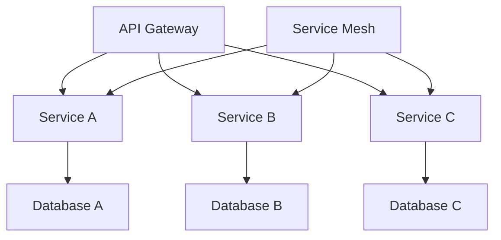
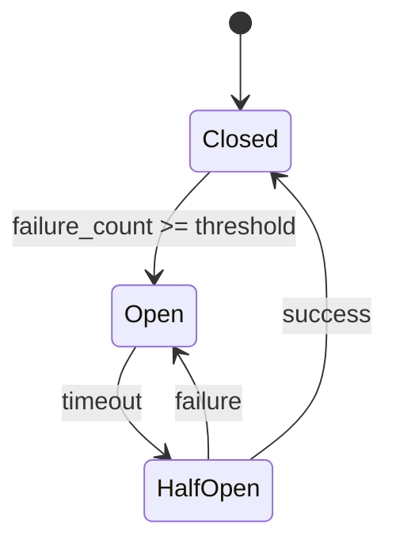

# 云原生架构形式化定义 / Cloud-Native Architecture Formal Definitions

## 1. 概述 / Overview

本文档提供云原生架构的形式化定义，包括云原生原则、架构模式、设计模式、部署策略等核心概念。

This document provides formal definitions for cloud-native architecture, including cloud-native principles, architectural patterns, design patterns, and deployment strategies.

## 2. 云原生原则定义 / Cloud-Native Principles Definition

### 2.1 云原生核心原则 / Core Cloud-Native Principles

**定义2.1.1（云原生原则）：**
云原生原则是一个六元组 $CNP = (Elasticity, Resilience, Observability, Automation, Security, Agility)$，其中：

- $Elasticity$：弹性伸缩（Elastic Scaling）
- $Resilience$：韧性容错（Resilience and Fault Tolerance）
- $Observability$：可观测性（Observability）
- $Automation$：自动化（Automation）
- $Security$：安全性（Security）
- $Agility$：敏捷性（Agility）

**形式化表达：**
$$CloudNative = (Elasticity, Resilience, Observability, Automation, Security, Agility)$$

### 2.2 云原生成熟度模型 / Cloud-Native Maturity Model

**定义2.1.2（成熟度模型）：**
云原生成熟度是一个五元组 $CMM = (Level, Capabilities, Metrics, Assessment, Roadmap)$，其中：

- $Level = \{Basic, Intermediate, Advanced, Expert\}$
- $Capabilities$：能力集合（Capability Set）
- $Metrics$：评估指标（Assessment Metrics）
- $Assessment$：评估方法（Assessment Method）
- $Roadmap$：演进路径（Evolution Roadmap）

## 3. 云原生架构模式 / Cloud-Native Architectural Patterns

### 3.1 微服务架构 / Microservices Architecture

**定义3.1.1（微服务架构）：**
微服务架构是一个七元组 $MSA = (Services, Communication, Data, Deployment, Governance, Monitoring, Security)$，其中：

- $Services$：服务集合（Service Set）
- $Communication$：通信模式（Communication Pattern）
- $Data$：数据管理（Data Management）
- $Deployment$：部署策略（Deployment Strategy）
- $Governance$：治理机制（Governance Mechanism）
- $Monitoring$：监控体系（Monitoring System）
- $Security$：安全框架（Security Framework）

**架构图：**

### 3.2 事件驱动架构 / Event-Driven Architecture

**定义3.1.2（事件驱动架构）：**
事件驱动架构是一个五元组 $EDA = (Events, Producers, Consumers, Brokers, Processing)$，其中：

- $Events$：事件集合（Event Set）
- $Producers$：事件生产者（Event Producers）
- $Consumers$：事件消费者（Event Consumers）
- $Brokers$：事件代理（Event Brokers）
- $Processing$：事件处理（Event Processing）

**事件流模型：**
$$EDA = \{e_1, e_2, ..., e_n\} \text{ where } e_i = (Producer_i, Consumer_i, Broker_i, Processing_i)$$

## 4. 云原生设计模式 / Cloud-Native Design Patterns

### 4.1 断路器模式 / Circuit Breaker Pattern

**定义4.1.1（断路器）：**
断路器是一个五元组 $CB = (State, Threshold, Timeout, Fallback, Recovery)$，其中：

- $State = \{Closed, Open, HalfOpen\}$
- $Threshold$：失败阈值（Failure Threshold）
- $Timeout$：超时时间（Timeout Duration）
- $Fallback$：降级策略（Fallback Strategy）
- $Recovery$：恢复机制（Recovery Mechanism）

**状态转换图：**

### 4.2 重试模式 / Retry Pattern

**定义4.1.2（重试策略）：**
重试策略是一个四元组 $RP = (MaxAttempts, Backoff, Jitter, Conditions)$，其中：

- $MaxAttempts$：最大重试次数（Maximum Attempts）
- $Backoff$：退避策略（Backoff Strategy）
- $Jitter$：抖动策略（Jitter Strategy）
- $Conditions$：重试条件（Retry Conditions）

**重试函数：**
$$Retry(t) = \min(MaxAttempts, t) \times Backoff(t) \times (1 + Jitter(t))$$

### 4.3 缓存模式 / Caching Pattern

**定义4.1.3（缓存策略）：**
缓存策略是一个五元组 $CP = (Data, TTL, Eviction, Consistency, Distribution)$，其中：

- $Data$：缓存数据（Cached Data）
- $TTL$：生存时间（Time To Live）
- $Eviction$：淘汰策略（Eviction Policy）
- $Consistency$：一致性策略（Consistency Policy）
- $Distribution$：分布式策略（Distribution Policy）

## 5. 云原生部署模型 / Cloud-Native Deployment Model

### 5.1 蓝绿部署 / Blue-Green Deployment

**定义5.1.1（蓝绿部署）：**
蓝绿部署是一个五元组 $BGD = (Blue, Green, Switch, Rollback, Validation)$，其中：

- $Blue$：蓝环境（Blue Environment）
- $Green$：绿环境（Green Environment）
- $Switch$：切换机制（Switch Mechanism）
- $Rollback$：回滚策略（Rollback Strategy）
- $Validation$：验证机制（Validation Mechanism）

**部署状态：**
$$DeploymentState = \begin{cases}
Blue & \text{if } Current = Blue \\
Green & \text{if } Current = Green \\
Transitioning & \text{if } Switching
\end{cases}$$

### 5.2 金丝雀部署 / Canary Deployment

**定义5.1.2（金丝雀部署）：**
金丝雀部署是一个四元组 $CD = (Canary, Production, Traffic, Gradual)$，其中：

- $Canary$：金丝雀版本（Canary Version）
- $Production$：生产版本（Production Version）
- $Traffic$：流量分配（Traffic Distribution）
- $Gradual$：渐进策略（Gradual Strategy）

**流量分配函数：**
$$Traffic(t) = \alpha(t) \times Canary + (1 - \alpha(t)) \times Production$$

其中 $\alpha(t)$ 是时间相关的流量比例函数。

### 5.3 滚动部署 / Rolling Deployment

**定义5.1.3（滚动部署）：**
滚动部署是一个五元组 $RD = (Replicas, Strategy, Health, Progress, Rollback)$，其中：

- $Replicas$：副本集合（Replica Set）
- $Strategy$：更新策略（Update Strategy）
- $Health$：健康检查（Health Check）
- $Progress$：进度跟踪（Progress Tracking）
- $Rollback$：回滚机制（Rollback Mechanism）

## 6. 云原生治理模型 / Cloud-Native Governance Model

### 6.1 服务治理 / Service Governance

**定义6.1.1（服务治理）：**
服务治理是一个六元组 $SG = (Discovery, LoadBalancing, CircuitBreaker, RateLimit, Monitoring, Security)$，其中：

- $Discovery$：服务发现（Service Discovery）
- $LoadBalancing$：负载均衡（Load Balancing）
- $CircuitBreaker$：断路器（Circuit Breaker）
- $RateLimit$：限流（Rate Limiting）
- $Monitoring$：监控（Monitoring）
- $Security$：安全（Security）

### 6.2 配置治理 / Configuration Governance

**定义6.1.2（配置管理）：**
配置管理是一个五元组 $CM = (Config, Version, Distribution, Validation, Rollback)$，其中：

- $Config$：配置集合（Configuration Set）
- $Version$：版本管理（Version Management）
- $Distribution$：分发机制（Distribution Mechanism）
- $Validation$：验证规则（Validation Rules）
- $Rollback$：回滚机制（Rollback Mechanism）

## 7. 云原生安全模型 / Cloud-Native Security Model

### 7.1 零信任安全 / Zero Trust Security

**定义7.1.1（零信任模型）：**
零信任模型是一个五元组 $ZTS = (Identity, Device, Network, Application, Data)$，其中：

- $Identity$：身份验证（Identity Verification）
- $Device$：设备安全（Device Security）
- $Network$：网络安全（Network Security）
- $Application$：应用安全（Application Security）
- $Data$：数据安全（Data Security）

**安全策略：**
$$Security = \min(Identity, Device, Network, Application, Data)$$

### 7.2 安全边界 / Security Boundary

**定义7.1.2（安全边界）：**
安全边界是一个四元组 $SB = (Perimeter, Access, Encryption, Audit)$，其中：

- $Perimeter$：边界定义（Perimeter Definition）
- $Access$：访问控制（Access Control）
- $Encryption$：加密策略（Encryption Policy）
- $Audit$：审计机制（Audit Mechanism）

## 8. 云原生监控模型 / Cloud-Native Monitoring Model

### 8.1 可观测性 / Observability

**定义8.1.1（可观测性）：**
可观测性是一个三元组 $OBS = (Metrics, Logs, Traces)$，其中：

- $Metrics$：指标监控（Metrics Monitoring）
- $Logs$：日志管理（Log Management）
- $Traces$：链路追踪（Distributed Tracing）

**可观测性函数：**
$$Observability = f(Metrics, Logs, Traces)$$

### 8.2 监控指标 / Monitoring Metrics

**定义8.1.2（监控指标）：**
监控指标是一个五元组 $MM = (Performance, Availability, Reliability, Scalability, Security)$，其中：

- $Performance$：性能指标（Performance Metrics）
- $Availability$：可用性指标（Availability Metrics）
- $Reliability$：可靠性指标（Reliability Metrics）
- $Scalability$：可扩展性指标（Scalability Metrics）
- $Security$：安全指标（Security Metrics）

## 9. 云原生资源管理 / Cloud-Native Resource Management

### 9.1 资源编排 / Resource Orchestration

**定义9.1.1（资源编排）：**
资源编排是一个五元组 $RO = (Resources, Scheduling, Scaling, Optimization, Monitoring)$，其中：

- $Resources$：资源集合（Resource Set）
- $Scheduling$：调度策略（Scheduling Strategy）
- $Scaling$：扩展策略（Scaling Strategy）
- $Optimization$：优化策略（Optimization Strategy）
- $Monitoring$：监控机制（Monitoring Mechanism）

### 9.2 成本优化 / Cost Optimization

**定义9.1.2（成本优化）：**
成本优化是一个四元组 $CO = (Analysis, Prediction, Optimization, Control)$，其中：

- $Analysis$：成本分析（Cost Analysis）
- $Prediction$：成本预测（Cost Prediction）
- $Optimization$：优化策略（Optimization Strategy）
- $Control$：成本控制（Cost Control）

## 10. 云原生网络模型 / Cloud-Native Network Model

### 10.1 服务网格 / Service Mesh

**定义10.1.1（服务网格）：**
服务网格是一个四元组 $SM = (DataPlane, ControlPlane, Policies, Observability)$，其中：

- $DataPlane$：数据平面（Data Plane）
- $ControlPlane$：控制平面（Control Plane）
- $Policies$：策略管理（Policy Management）
- $Observability$：可观测性（Observability）

### 10.2 网络策略 / Network Policy

**定义10.1.2（网络策略）：**
网络策略是一个五元组 $NP = (Ingress, Egress, Isolation, Security, QoS)$，其中：

- $Ingress$：入站规则（Ingress Rules）
- $Egress$：出站规则（Egress Rules）
- $Isolation$：隔离策略（Isolation Policy）
- $Security$：安全策略（Security Policy）
- $QoS$：服务质量（Quality of Service）

## 11. 云原生存储模型 / Cloud-Native Storage Model

### 11.1 存储抽象 / Storage Abstraction

**定义11.1.1（存储抽象）：**
存储抽象是一个四元组 $SA = (Interface, Implementation, Performance, Consistency)$，其中：

- $Interface$：接口定义（Interface Definition）
- $Implementation$：实现方式（Implementation Method）
- $Performance$：性能特征（Performance Characteristics）
- $Consistency$：一致性模型（Consistency Model）

### 11.2 数据管理 / Data Management

**定义11.1.2（数据管理）：**
数据管理是一个五元组 $DM = (Storage, Backup, Replication, Migration, Archival)$，其中：

- $Storage$：存储策略（Storage Strategy）
- $Backup$：备份策略（Backup Strategy）
- $Replication$：复制策略（Replication Strategy）
- $Migration$：迁移策略（Migration Strategy）
- $Archival$：归档策略（Archival Strategy）

## 12. 云原生API模型 / Cloud-Native API Model

### 12.1 API设计 / API Design

**定义12.1.1（API设计）：**
API设计是一个五元组 $APID = (Interface, Versioning, Documentation, Testing, Governance)$，其中：

- $Interface$：接口定义（Interface Definition）
- $Versioning$：版本管理（Version Management）
- $Documentation$：文档规范（Documentation Standards）
- $Testing$：测试策略（Testing Strategy）
- $Governance$：治理机制（Governance Mechanism）

### 12.2 API网关 / API Gateway

**定义12.1.2（API网关）：**
API网关是一个六元组 $APIG = (Routing, Authentication, RateLimit, Caching, Transformation, Monitoring)$，其中：

- $Routing$：路由规则（Routing Rules）
- $Authentication$：身份认证（Authentication）
- $RateLimit$：限流策略（Rate Limiting）
- $Caching$：缓存策略（Caching Strategy）
- $Transformation$：数据转换（Data Transformation）
- $Monitoring$：监控机制（Monitoring Mechanism）

## 13. 总结 / Summary

云原生架构形式化定义提供了：

1. **架构原则**：定义云原生的核心原则和成熟度模型
2. **设计模式**：提供标准化的架构和设计模式
3. **部署策略**：定义现代化的部署方法
4. **治理框架**：建立完整的治理体系
5. **安全模型**：确保云原生应用的安全性
6. **监控体系**：提供全面的可观测性

这些形式化定义为云原生系统的设计、实现和运维提供了理论基础。

---

**参考文献 / References**

1. Cloud Native Computing Foundation. "Cloud Native Architecture Whitepaper"
2. Martin Fowler. "Microservices Architecture"
3. Netflix. "Netflix OSS Documentation"
4. Kubernetes Documentation. "Kubernetes Architecture"
5. Istio Documentation. "Istio Service Mesh"
6. CNCF Landscape. "Cloud Native Landscape"
