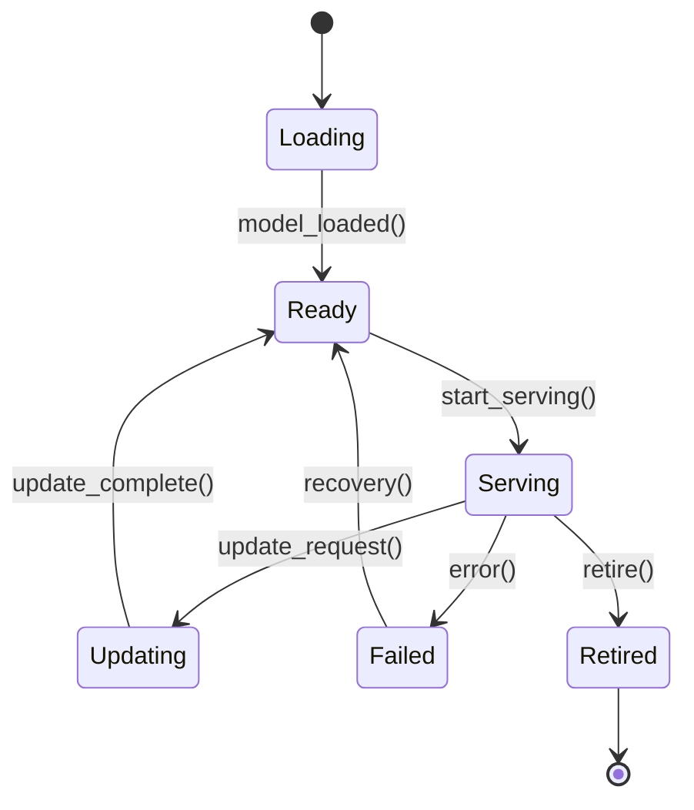
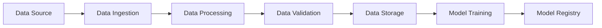

# AI微服务形式化定义 / AI Microservices Formal Definitions

## 1. 概述 / Overview

本文档提供AI微服务的形式化定义，包括AI模型服务、推理引擎、模型管理、数据流水线、MLOps等核心概念。

This document provides formal definitions for AI microservices, including AI model services, inference engines, model management, data pipelines, and MLOps.

## 2. AI模型服务定义 / AI Model Service Definition

### 2.1 基本模型服务 / Basic Model Service

**定义2.1.1（AI模型服务）：**
AI模型服务是一个八元组 $AMS = (Model, Input, Output, Preprocessing, Postprocessing, Inference, Monitoring, Version)$，其中：

- $Model$：AI模型（AI Model）
- $Input$：输入接口（Input Interface）
- $Output$：输出接口（Output Interface）
- $Preprocessing$：预处理（Preprocessing）
- $Postprocessing$：后处理（Postprocessing）
- $Inference$：推理引擎（Inference Engine）
- $Monitoring$：模型监控（Model Monitoring）
- $Version$：版本管理（Version Management）

**形式化表达：**
$$AIModelService = (Model, Input, Output, Preprocessing, Postprocessing, Inference, Monitoring, Version)$$

### 2.2 模型服务状态 / Model Service State

**定义2.1.2（模型服务状态）：**
模型服务状态是一个状态机 $MS = (States, Transitions, Events)$，其中：

- $States = \{Loading, Ready, Serving, Updating, Failed, Retired\}$
- $Transitions$：状态转换关系
- $Events$：触发事件集合

**状态转换图：**

## 3. 推理引擎模型 / Inference Engine Model

### 3.1 推理引擎定义 / Inference Engine Definition

**定义3.1.1（推理引擎）：**
推理引擎是一个六元组 $IE = (Framework, Hardware, Optimization, Batch, Streaming, Performance)$，其中：

- $Framework$：推理框架（Inference Framework）
- $Hardware$：硬件加速（Hardware Acceleration）
- $Optimization$：优化策略（Optimization Strategy）
- $Batch$：批处理（Batch Processing）
- $Streaming$：流处理（Stream Processing）
- $Performance$：性能指标（Performance Metrics）

**推理性能模型：**
$$Inference_{Performance} = f(Framework, Hardware, Optimization, BatchSize, StreamRate)$$

### 3.2 推理优化 / Inference Optimization

**定义3.1.2（推理优化）：**
推理优化是一个五元组 $IO = (Quantization, Pruning, Compilation, Caching, Parallelization)$，其中：

- $Quantization$：量化策略（Quantization Strategy）
- $Pruning$：模型剪枝（Model Pruning）
- $Compilation$：模型编译（Model Compilation）
- $Caching$：结果缓存（Result Caching）
- $Parallelization$：并行处理（Parallel Processing）

## 4. 模型管理系统 / Model Management System

### 4.1 模型注册 / Model Registry

**定义4.1.1（模型注册）：**
模型注册是一个七元组 $MR = (Model, Metadata, Version, Artifacts, Dependencies, Lineage, Access)$，其中：

- $Model$：模型文件（Model Files）
- $Metadata$：元数据（Metadata）
- $Version$：版本信息（Version Information）
- $Artifacts$：模型制品（Model Artifacts）
- $Dependencies$：依赖关系（Dependencies）
- $Lineage$：模型血缘（Model Lineage）
- $Access$：访问控制（Access Control）

**模型版本控制：**
$$Version_{Model} = (Major, Minor, Patch, Build, Timestamp)$$

### 4.2 模型部署 / Model Deployment

**定义4.1.2（模型部署）：**
模型部署是一个六元组 $MD = (Environment, Resources, Scaling, Health, Rollback, Monitoring)$，其中：

- $Environment$：部署环境（Deployment Environment）
- $Resources$：资源需求（Resource Requirements）
- $Scaling$：扩展策略（Scaling Strategy）
- $Health$：健康检查（Health Check）
- $Rollback$：回滚机制（Rollback Mechanism）
- $Monitoring$：部署监控（Deployment Monitoring）

## 5. 数据流水线模型 / Data Pipeline Model

### 5.1 数据流水线定义 / Data Pipeline Definition

**定义5.1.1（数据流水线）：**
数据流水线是一个六元组 $DP = (Source, Processing, Storage, Quality, Monitoring, Orchestration)$，其中：

- $Source$：数据源（Data Sources）
- $Processing$：数据处理（Data Processing）
- $Storage$：数据存储（Data Storage）
- $Quality$：数据质量（Data Quality）
- $Monitoring$：流水线监控（Pipeline Monitoring）
- $Orchestration$：流水线编排（Pipeline Orchestration）

**流水线拓扑：**

### 5.2 数据质量模型 / Data Quality Model

**定义5.1.2（数据质量）：**
数据质量是一个五元组 $DQ = (Completeness, Accuracy, Consistency, Timeliness, Validity)$，其中：

- $Completeness$：完整性（Data Completeness）
- $Accuracy$：准确性（Data Accuracy）
- $Consistency$：一致性（Data Consistency）
- $Timeliness$：时效性（Data Timeliness）
- $Validity$：有效性（Data Validity）

**质量评分函数：**
$$Quality_{Score} = \alpha \times Completeness + \beta \times Accuracy + \gamma \times Consistency + \delta \times Timeliness + \epsilon \times Validity$$

其中 $\alpha + \beta + \gamma + \delta + \epsilon = 1$

## 6. MLOps模型 / MLOps Model

### 6.1 MLOps定义 / MLOps Definition

**定义6.1.1（MLOps）：**
MLOps是一个七元组 $MLO = (Development, Testing, Deployment, Monitoring, Governance, Automation, Collaboration)$，其中：

- $Development$：模型开发（Model Development）
- $Testing$：模型测试（Model Testing）
- $Deployment$：模型部署（Model Deployment）
- $Monitoring$：模型监控（Model Monitoring）
- $Governance$：模型治理（Model Governance）
- $Automation$：自动化流程（Automation Pipeline）
- $Collaboration$：协作机制（Collaboration Mechanism）

### 6.2 持续集成/持续部署 / CI/CD

**定义6.1.2（CI/CD流水线）：**
CI/CD流水线是一个五元组 $CICD = (Build, Test, Deploy, Monitor, Rollback)$，其中：

- $Build$：构建阶段（Build Stage）
- $Test$：测试阶段（Test Stage）
- $Deploy$：部署阶段（Deploy Stage）
- $Monitor$：监控阶段（Monitor Stage）
- $Rollback$：回滚机制（Rollback Mechanism）

**流水线状态：**
$$Pipeline_{State} = \begin{cases}
Building & \text{if } Stage = Build \\
Testing & \text{if } Stage = Test \\
Deploying & \text{if } Stage = Deploy \\
Monitoring & \text{if } Stage = Monitor \\
Failed & \text{if } Error \\
Success & \text{if } Complete
\end{cases}$$

## 7. 模型监控模型 / Model Monitoring Model

### 7.1 模型性能监控 / Model Performance Monitoring

**定义7.1.1（性能监控）：**
性能监控是一个五元组 $PM = (Metrics, Thresholds, Alerts, Dashboards, Reports)$，其中：

- $Metrics$：性能指标（Performance Metrics）
- $Thresholds$：监控阈值（Monitoring Thresholds）
- $Alerts$：告警机制（Alert Mechanism）
- $Dashboards$：监控面板（Monitoring Dashboards）
- $Reports$：监控报告（Monitoring Reports）

### 7.2 模型漂移检测 / Model Drift Detection

**定义7.1.2（模型漂移）：**
模型漂移是一个四元组 $MD = (DataDrift, ConceptDrift, PerformanceDrift, Detection)$，其中：

- $DataDrift$：数据漂移（Data Drift）
- $ConceptDrift$：概念漂移（Concept Drift）
- $PerformanceDrift$：性能漂移（Performance Drift）
- $Detection$：检测算法（Detection Algorithm）

**漂移检测函数：**
$$Drift_{Score} = f(DataDrift, ConceptDrift, PerformanceDrift)$$

## 8. AI服务编排 / AI Service Orchestration

### 8.1 服务编排定义 / Service Orchestration Definition

**定义8.1.1（AI服务编排）：**
AI服务编排是一个六元组 $ASO = (Services, Workflow, Dependencies, Scheduling, LoadBalancing, FaultTolerance)$，其中：

- $Services$：服务集合（Service Set）
- $Workflow$：工作流定义（Workflow Definition）
- $Dependencies$：服务依赖（Service Dependencies）
- $Scheduling$：调度策略（Scheduling Strategy）
- $LoadBalancing$：负载均衡（Load Balancing）
- $FaultTolerance$：容错机制（Fault Tolerance）

### 8.2 工作流引擎 / Workflow Engine

**定义8.1.2（工作流引擎）：**
工作流引擎是一个五元组 $WE = (Tasks, Transitions, Conditions, Execution, State)$，其中：

- $Tasks$：任务集合（Task Set）
- $Transitions$：任务转换（Task Transitions）
- $Conditions$：执行条件（Execution Conditions）
- $Execution$：执行引擎（Execution Engine）
- $State$：工作流状态（Workflow State）

## 9. 模型安全模型 / Model Security Model

### 9.1 模型安全定义 / Model Security Definition

**定义9.1.1（模型安全）：**
模型安全是一个六元组 $MS = (Authentication, Authorization, Encryption, Privacy, Audit, Compliance)$，其中：

- $Authentication$：身份认证（Authentication）
- $Authorization$：权限授权（Authorization）
- $Encryption$：数据加密（Data Encryption）
- $Privacy$：隐私保护（Privacy Protection）
- $Audit$：安全审计（Security Audit）
- $Compliance$：合规性（Compliance）

### 9.2 隐私保护 / Privacy Protection

**定义9.1.2（隐私保护）：**
隐私保护是一个四元组 $PP = (Anonymization, DifferentialPrivacy, FederatedLearning, SecureComputation)$，其中：

- $Anonymization$：数据匿名化（Data Anonymization）
- $DifferentialPrivacy$：差分隐私（Differential Privacy）
- $FederatedLearning$：联邦学习（Federated Learning）
- $SecureComputation$：安全计算（Secure Computation）

## 10. 模型解释性 / Model Interpretability

### 10.1 解释性定义 / Interpretability Definition

**定义10.1.1（模型解释性）：**
模型解释性是一个五元组 $MI = (Transparency, Explainability, Fairness, Accountability, Trust)$，其中：

- $Transparency$：模型透明度（Model Transparency）
- $Explainability$：可解释性（Explainability）
- $Fairness$：公平性（Fairness）
- $Accountability$：可问责性（Accountability）
- $Trust$：可信度（Trustworthiness）

### 10.2 解释方法 / Explanation Methods

**定义10.1.2（解释方法）：**
解释方法是一个四元组 $EM = (FeatureImportance, SHAP, LIME, Counterfactual)$，其中：

- $FeatureImportance$：特征重要性（Feature Importance）
- $SHAP$：SHAP值（SHAP Values）
- $LIME$：局部解释（Local Interpretable Model-agnostic Explanations）
- $Counterfactual$：反事实解释（Counterfactual Explanations）

## 11. 边缘AI模型 / Edge AI Model

### 11.1 边缘计算定义 / Edge Computing Definition

**定义11.1.1（边缘AI）：**
边缘AI是一个五元组 $EA = (Edge, Model, Inference, Communication, Optimization)$，其中：

- $Edge$：边缘节点（Edge Nodes）
- $Model$：边缘模型（Edge Models）
- $Inference$：边缘推理（Edge Inference）
- $Communication$：通信协议（Communication Protocol）
- $Optimization$：边缘优化（Edge Optimization）

### 11.2 边缘部署 / Edge Deployment

**定义11.1.2（边缘部署）：**
边缘部署是一个四元组 $ED = (Distribution, Synchronization, Offloading, Coordination)$，其中：

- $Distribution$：模型分发（Model Distribution）
- $Synchronization$：模型同步（Model Synchronization）
- $Offloading$：计算卸载（Computation Offloading）
- $Coordination$：边缘协调（Edge Coordination）

## 12. 联邦学习模型 / Federated Learning Model

### 12.1 联邦学习定义 / Federated Learning Definition

**定义12.1.1（联邦学习）：**
联邦学习是一个六元组 $FL = (Clients, Server, Aggregation, Privacy, Communication, Convergence)$，其中：

- $Clients$：客户端集合（Client Set）
- $Server$：中央服务器（Central Server）
- $Aggregation$：模型聚合（Model Aggregation）
- $Privacy$：隐私保护（Privacy Protection）
- $Communication$：通信协议（Communication Protocol）
- $Convergence$：收敛性（Convergence）

### 12.2 聚合算法 / Aggregation Algorithm

**定义12.1.2（聚合算法）：**
聚合算法是一个四元组 $AA = (FedAvg, FedProx, FedNova, SecureAggregation)$，其中：

- $FedAvg$：联邦平均（Federated Averaging）
- $FedProx$：联邦近端（Federated Proximal）
- $FedNova$：联邦归一化（Federated Normalized）
- $SecureAggregation$：安全聚合（Secure Aggregation）

**聚合函数：**
$$w_{global} = \frac{1}{N} \sum_{i=1}^{N} w_i$$

其中 $w_i$ 是第i个客户端的模型参数，$N$ 是客户端数量。

## 13. 总结 / Summary

AI微服务形式化定义提供了：

1. **模型服务定义**：精确的AI模型服务形式化描述
2. **推理引擎模型**：高性能推理的数学模型
3. **模型管理系统**：完整的模型生命周期管理
4. **数据流水线**：端到端的数据处理流程
5. **MLOps框架**：自动化机器学习运维
6. **安全与隐私**：AI系统的安全保护机制
7. **边缘计算**：分布式AI部署模型
8. **联邦学习**：隐私保护的分布式学习

这些形式化定义为AI微服务系统的设计、实现和优化提供了理论基础。

---

**参考文献 / References**

1. Google Cloud AI Platform Documentation. "AI Platform Documentation"
2. AWS SageMaker Documentation. "Amazon SageMaker Developer Guide"
3. Microsoft Azure ML Documentation. "Azure Machine Learning Documentation"
4. Kubeflow Documentation. "Kubeflow User Guide"
5. MLflow Documentation. "MLflow Documentation"
6. TensorFlow Serving Documentation. "TensorFlow Serving Guide"
7. ONNX Documentation. "ONNX Model Format"
8. PyTorch Serve Documentation. "PyTorch Serve Guide"
