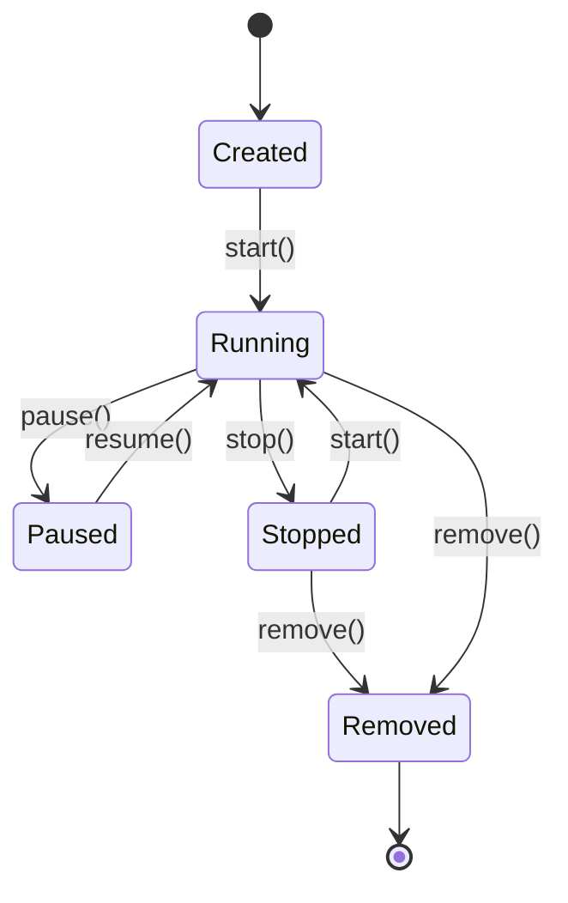

# 7.1.1.1 容器技术形式化定义 / Container Technology Formal Definition

<!-- TOC START -->

- [7.1.1.1 容器技术形式化定义 / Container Technology Formal Definition](#7111-容器技术形式化定义-container-technology-formal-definition)
  - [1. 容器基本定义 / Container Basic Definition](#1-容器基本定义-container-basic-definition)
    - [1.1 容器四元组模型 / Container Quadruple Model](#11-容器四元组模型-container-quadruple-model)
    - [1.2 容器镜像定义 / Container Image Definition](#12-容器镜像定义-container-image-definition)
    - [1.3 容器运行时定义 / Container Runtime Definition](#13-容器运行时定义-container-runtime-definition)
  - [2. 容器状态机模型 / Container State Machine Model](#2-容器状态机模型-container-state-machine-model)
    - [2.1 状态定义 / State Definition](#21-状态定义-state-definition)
    - [2.2 状态机形式化 / State Machine Formalization](#22-状态机形式化-state-machine-formalization)
    - [2.3 状态转换图 / State Transition Diagram](#23-状态转换图-state-transition-diagram)
  - [3. 容器资源模型 / Container Resource Model](#3-容器资源模型-container-resource-model)
    - [3.1 资源定义 / Resource Definition](#31-资源定义-resource-definition)
    - [3.2 资源利用率模型 / Resource Utilization Model](#32-资源利用率模型-resource-utilization-model)
    - [3.3 资源约束模型 / Resource Constraint Model](#33-资源约束模型-resource-constraint-model)
  - [4. 容器隔离模型 / Container Isolation Model](#4-容器隔离模型-container-isolation-model)
    - [4.1 隔离级别定义 / Isolation Level Definition](#41-隔离级别定义-isolation-level-definition)
    - [4.2 安全隔离模型 / Security Isolation Model](#42-安全隔离模型-security-isolation-model)
  - [5. 容器编排模型 / Container Orchestration Model](#5-容器编排模型-container-orchestration-model)
    - [5.1 编排定义 / Orchestration Definition](#51-编排定义-orchestration-definition)
    - [5.2 调度策略模型 / Scheduling Strategy Model](#52-调度策略模型-scheduling-strategy-model)
  - [6. 容器网络模型 / Container Network Model](#6-容器网络模型-container-network-model)
    - [6.1 网络命名空间 / Network Namespace](#61-网络命名空间-network-namespace)
    - [6.2 网络策略模型 / Network Policy Model](#62-网络策略模型-network-policy-model)
  - [7. 容器存储模型 / Container Storage Model](#7-容器存储模型-container-storage-model)
    - [7.1 存储层次 / Storage Hierarchy](#71-存储层次-storage-hierarchy)
    - [7.2 数据卷模型 / Volume Model](#72-数据卷模型-volume-model)
  - [8. 容器安全模型 / Container Security Model](#8-容器安全模型-container-security-model)
    - [8.1 安全策略 / Security Policy](#81-安全策略-security-policy)
    - [8.2 零信任模型 / Zero Trust Model](#82-零信任模型-zero-trust-model)
  - [9. 容器监控模型 / Container Monitoring Model](#9-容器监控模型-container-monitoring-model)
    - [9.1 监控指标 / Monitoring Metrics](#91-监控指标-monitoring-metrics)
    - [9.2 日志模型 / Logging Model](#92-日志模型-logging-model)
  - [10. 容器生命周期管理 / Container Lifecycle Management](#10-容器生命周期管理-container-lifecycle-management)
    - [10.1 生命周期事件 / Lifecycle Events](#101-生命周期事件-lifecycle-events)
    - [10.2 版本管理 / Version Management](#102-版本管理-version-management)

<!-- TOC END -->

## 1. 容器基本定义 / Container Basic Definition

### 1.1 容器四元组模型 / Container Quadruple Model

**定义1.1.1（容器）：**
容器是一个四元组 $C = (I, R, E, S)$，其中：

- $I$：镜像（Image），包含应用程序和依赖
- $R$：运行时（Runtime），提供隔离环境
- $E$：环境（Environment），包含配置和资源限制
- $S$：状态（State），容器的运行状态

**形式化表达：**
$$Container = (Image, Runtime, Environment, State)$$

### 1.2 容器镜像定义 / Container Image Definition

**定义1.1.2（容器镜像）：**
镜像是一个三元组 $I = (L, D, M)$，其中：

- $L$：层（Layers），分层存储结构
- $D$：依赖（Dependencies），应用程序依赖
- $M$：元数据（Metadata），镜像描述信息

**形式化表达：**
$$Image = (Layers, Dependencies, Metadata)$$

### 1.3 容器运行时定义 / Container Runtime Definition

**定义1.1.3（容器运行时）：**
运行时是一个四元组 $R = (NS, CG, FS, NET)$，其中：

- $NS$：命名空间（Namespaces），提供隔离
- $CG$：控制组（Cgroups），资源限制
- $FS$：文件系统（Filesystem），存储隔离
- $NET$：网络（Network），网络隔离

**形式化表达：**
$$Runtime = (Namespaces, Cgroups, Filesystem, Network)$$

## 2. 容器状态机模型 / Container State Machine Model

### 2.1 状态定义 / State Definition

**定义1.1.4（容器状态）：**
容器状态集合 $S = \{Created, Running, Paused, Stopped, Removed\}$

**状态转换函数：**
$$\delta: S \times \Sigma \rightarrow S$$

其中 $\Sigma = \{start, pause, resume, stop, remove\}$ 是事件集合

### 2.2 状态机形式化 / State Machine Formalization

**状态机模型：**
$$M_{container} = (S, \Sigma, \delta, s_0, F)$$

其中：

- $S$：状态集合
- $\Sigma$：事件集合
- $\delta$：状态转换函数
- $s_0 = Created$：初始状态
- $F = \{Removed\}$：终止状态集合

### 2.3 状态转换图 / State Transition Diagram

## 3. 容器资源模型 / Container Resource Model

### 3.1 资源定义 / Resource Definition

**定义1.1.5（容器资源）：**
容器资源是一个四元组 $R = (CPU, Memory, Storage, Network)$

**资源分配函数：**
$$R_{alloc}(c_i) = \sum_{j=1}^{4} w_j \cdot r_{i,j}$$

其中：

- $c_i$：容器i
- $r_{i,j}$：资源j的分配量
- $w_j$：资源j的权重

### 3.2 资源利用率模型 / Resource Utilization Model

**资源利用率：**
$$U_{resource} = \frac{\sum_{i=1}^{n} R_{used}(c_i)}{\sum_{i=1}^{n} R_{alloc}(c_i)}$$

**资源效率：**
$$E_{resource} = \frac{Throughput}{Resource_{cost}}$$

### 3.3 资源约束模型 / Resource Constraint Model

**资源约束：**
$$\sum_{i=1}^{n} r_{i,j} \leq R_{j,max}, \forall j \in \{CPU, Memory, Storage, Network\}$$

**资源冲突检测：**
$$Conflict(c_i, c_j) = \exists k: r_{i,k} + r_{j,k} > R_{k,max}$$

## 4. 容器隔离模型 / Container Isolation Model

### 4.1 隔离级别定义 / Isolation Level Definition

**定义1.1.6（隔离级别）：**
隔离级别是一个三元组 $IL = (Process, Network, Storage)$

**隔离强度：**
$$Isolation_{score} = f(VM_{level}, Sandbox_{level}, Kernel_{attack surface})$$

### 4.2 安全隔离模型 / Security Isolation Model

**安全边界：**
$$Security_{boundary} = \{Namespace_{isolation}, CGroup_{isolation}, Network_{isolation}\}$$

**威胁模型：**
$$Threat_{model} = \{Privilege_{escalation}, Resource_{exhaustion}, Network_{attack}\}$$

## 5. 容器编排模型 / Container Orchestration Model

### 5.1 编排定义 / Orchestration Definition

**定义1.1.7（容器编排）：**
容器编排是一个五元组 $O = (C, S, N, P, M)$，其中：

- $C$：容器集合 $\{c_1, c_2, ..., c_n\}$
- $S$：调度策略（Scheduling Strategy）
- $N$：网络配置（Network Configuration）
- $P$：持久化配置（Persistence Configuration）
- $M$：监控配置（Monitoring Configuration）

### 5.2 调度策略模型 / Scheduling Strategy Model

**调度函数：**
$$S: C \times N \rightarrow A$$

其中：

- $C$：容器集合
- $N$：节点集合
- $A$：分配结果

**调度优化目标：**
$$\min \sum_{i=1}^{n} \sum_{j=1}^{m} c_{i,j} \cdot x_{i,j}$$

约束条件：
$$\sum_{j=1}^{m} x_{i,j} = 1, \forall i$$
$$\sum_{i=1}^{n} r_{i,k} \cdot x_{i,j} \leq R_{j,k}, \forall j,k$$

## 6. 容器网络模型 / Container Network Model

### 6.1 网络命名空间 / Network Namespace

**网络命名空间定义：**
$$Network_{namespace} = (Interface_{set}, Routing_{table}, Firewall_{rules})$$

**网络连接：**
$$Network_{connection} = \{Bridge, Overlay, Host, None\}$$

### 6.2 网络策略模型 / Network Policy Model

**网络策略：**
$$Network_{policy} = \{Ingress_{rules}, Egress_{rules}, Security_{groups}\}$$

**流量控制：**
$$Traffic_{control} = \{Bandwidth_{limit}, QoS_{policy}, Load_{balancing}\}$$

## 7. 容器存储模型 / Container Storage Model

### 7.1 存储层次 / Storage Hierarchy

**存储层次定义：**
$$Storage_{hierarchy} = \{Image_{layer}, Container_{layer}, Volume_{layer}\}$$

**存储驱动：**
$$Storage_{driver} = \{Overlay2, AUFS, Btrfs, ZFS\}$$

### 7.2 数据卷模型 / Volume Model

**数据卷定义：**
$$Volume = (Source, Target, Options, Permissions)$$

**持久化策略：**
$$Persistence_{strategy} = \{Bind_{mount}, Named_{volume}, tmpfs\}$$

## 8. 容器安全模型 / Container Security Model

### 8.1 安全策略 / Security Policy

**安全策略定义：**
$$Security_{policy} = \{Access_{control}, Resource_{limits}, Network_{isolation}\}$$

**安全扫描：**
$$Security_{scan} = \{Vulnerability_{scan}, Image_{signing}, Runtime_{protection}\}$$

### 8.2 零信任模型 / Zero Trust Model

**零信任原则：**
$$Zero_{trust} = \{Never_{trust}, Always_{verify}, Assume_{breach}\}$$

**身份验证：**
$$Authentication = \{Certificate_{based}, Token_{based}, Biometric_{based}\}$$

## 9. 容器监控模型 / Container Monitoring Model

### 9.1 监控指标 / Monitoring Metrics

**性能指标：**
$$Performance_{metrics} = \{CPU_{usage}, Memory_{usage}, Network_{io}, Disk_{io}\}$$

**健康指标：**
$$Health_{metrics} = \{Liveness_{probe}, Readiness_{probe}, Startup_{probe}\}$$

### 9.2 日志模型 / Logging Model

**日志格式：**
$$Log_{format} = \{Timestamp, Level, Message, Context\}$$

**日志聚合：**
$$Log_{aggregation} = \{Centralized_{logging}, Distributed_{tracing}, Error_{tracking}\}$$

## 10. 容器生命周期管理 / Container Lifecycle Management

### 10.1 生命周期事件 / Lifecycle Events

**生命周期事件：**
$$Lifecycle_{events} = \{Create, Start, Pause, Resume, Stop, Remove\}$$

**事件处理：**
$$Event_{handler} = \{Pre_{hook}, Post_{hook}, Error_{handler}\}$$

### 10.2 版本管理 / Version Management

**版本控制：**
$$Version_{control} = \{Image_{tagging}, Rollback_{strategy}, Blue_{green_{deployment}}\}$$

**更新策略：**
$$Update_{strategy} = \{Rolling_{update}, Recreate, Canary_{deployment}\}$$

---

**参考文献 / References:**

1. Docker Documentation. "Docker Overview". <https://docs.docker.com/get-started/overview/>
2. Kubernetes Documentation. "Container Runtime". <https://kubernetes.io/docs/setup/production-environment/container-runtimes/>
3. OCI Specification. "Open Container Initiative". <https://opencontainers.org/>
4. Linux Namespaces. "Namespaces in operation". <https://lwn.net/Articles/531114/>
5. Cgroups. "Control Groups". <https://www.kernel.org/doc/html/latest/admin-guide/cgroup-v2.html>
