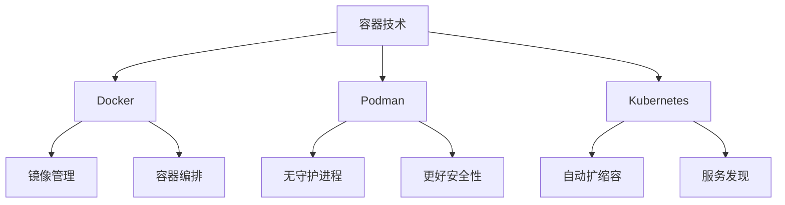

# 7.1.6 容器技术与微服务

## 1. 基本概念

### 1.1 容器技术定义

容器技术是一种轻量级的虚拟化技术，通过操作系统级别的隔离机制，将应用程序及其依赖打包成独立的运行环境。容器技术实现了"一次构建，到处运行"的目标，显著提高了应用程序的部署效率和资源利用率。

**形式化定义：**
$$Container = (App, Deps, Config, Runtime)$$

### 1.2 微服务架构定义

微服务架构是一种将单体应用程序拆分为多个小型、独立服务的架构模式。每个服务负责特定的业务功能，通过轻量级协议进行通信，可以独立开发、部署和扩展。

**形式化定义：**
$$Microservice = \{S_1, S_2, ..., S_n\}$$

## 1.3 容器与虚拟机对比

| 维度         | 容器                | 虚拟机              |
|--------------|---------------------|---------------------|
| 启动速度     | 秒级                | 分钟级              |
| 资源占用     | 低                  | 高                  |
| 隔离性       | 操作系统级          | 硬件级              |
| 兼容性       | 依赖主机内核        | 独立操作系统        |
| 运维复杂度   | 低                  | 高                  |
| 典型场景     | 微服务、弹性伸缩    | 多操作系统混部      |

## 1.4 微服务与单体架构对比

| 维度         | 微服务架构          | 单体架构            |
|--------------|---------------------|---------------------|
| 部署方式     | 独立服务、容器化    | 整体部署            |
| 扩展性       | 按需弹性扩展        | 整体扩展            |
| 技术栈       | 多样化              | 单一                |
| 故障影响     | 局部                | 全局                |
| 运维难度     | 高（自动化依赖强）  | 低（初期）          |
| 适用场景     | 大型复杂系统        | 小型/初创项目       |

## 1.5 主流开源项目生态

- 容器引擎：Docker、Podman、containerd、CRI-O
- 容器编排：Kubernetes、K3s、OpenShift、Rancher
- 服务网格：Istio、Linkerd、Consul Connect
- 微服务框架：Spring Cloud、Dubbo、ServiceComb、go-micro
- Serverless平台：OpenFaaS、Knative、Kubeless
- AI微服务：Seldon Core、KServe、BentoML

## 1.6 行业应用案例

- 金融：招商银行基于Kubernetes的微服务平台，提升弹性与安全
- 电商：阿里巴巴“双11”大促容器化弹性扩容，微服务支撑高并发
- 云服务：AWS Lambda/Google Cloud Functions大规模Serverless实践
- 车联网：边缘容器+微服务实现车载智能与远程升级
- 政务：政务云平台采用容器+微服务提升敏捷性与安全合规

## 1.7 未来发展趋势与挑战（补充）

- 容器安全自动化、零信任架构
- 微服务与AI/大数据深度融合
- Serverless与边缘计算协同
- 多云与混合云原生治理
- 低代码/无代码与微服务集成
- 持续交付与GitOps自动化
- 复杂系统下的可观测性与智能运维
- 持续递归细化与知识演化

---
> 本节为容器与微服务知识体系的递归补充，后续可继续分解为7.1.6.1.x、7.1.6.2.x等子主题，支持持续完善。

## 2. 发展历程

### 2.1 容器技术发展

- 2000年：FreeBSD Jails
- 2008年：LXC (Linux Containers)
- 2013年：Docker 1.0发布
- 2014年：Kubernetes发布
- 2018年：Podman发布
- 2019年：Kata Containers、gVisor、Firecracker
- 2020年：K3s、容器安全标准化

### 2.2 微服务发展历程

- 2011年：微服务概念提出
- 2014年：Netflix、Amazon大规模实践
- 2015年：Spring Cloud发布
- 2016年：服务网格（Istio、Linkerd）
- 2018年：Serverless微服务
- 2020年：云原生微服务
- 2022年：AI驱动微服务

## 3. 主要流派与理论

### 3.1 容器技术流派

- Docker流派：镜像分层、编排、生态完善
- Podman流派：无守护进程、安全性高、兼容Docker
- Kubernetes流派：自动编排、扩缩容、服务发现

### 3.2 微服务架构流派

- 服务网格流派（Istio、Linkerd）：流量治理、可观测性、安全
- 事件驱动流派（Kafka、RabbitMQ）：异步通信、解耦、高吞吐
- API网关流派（Kong、Zuul）：统一入口、路由、安全

## 4. 关键问题与挑战

### 4.1 容器技术挑战

- 安全性：容器逃逸、镜像漏洞、运行时安全
- 性能：网络、存储、CPU开销

### 4.2 微服务挑战

- 分布式复杂性：通信、数据一致性、故障传播
- 运维挑战：服务数量、监控、部署复杂

## 5. 相关案例

### 5.1 容器技术案例

- Netflix容器化实践：部署效率提升、资源利用率提升
- 阿里巴巴容器化：大规模部署、弹性扩容

### 5.2 微服务案例

- Uber微服务架构：服务数量多、部署频繁、故障恢复快
- 亚马逊微服务实践：大规模服务、团队协作、持续交付

## 6. 技术趋势

### 6.1 容器技术趋势

- 安全容器（Kata、gVisor、Firecracker）
- 边缘容器（K3s、MicroK8s、OpenYurt）
- 编排与自动化（Kubernetes、Operator、GitOps）
- 多运行时与兼容性（Podman、containerd、CRI-O）
- 云原生与Serverless融合

### 6.2 微服务趋势

- 服务网格（Istio、Linkerd、Consul Connect）
- Serverless微服务（AWS Lambda、Azure Functions）
- 事件驱动架构（Kafka、RabbitMQ、Pulsar）
- AI微服务（Seldon Core、KServe）
- 云原生与多云

## 7. 多表征方法

### 7.1 概念图

### 7.2 数学符号

- 容器资源模型：
$$R_{container} = \{CPU, Memory, Storage, Network\}$$
- 微服务通信模型：
$$C_{microservice} = \sum_{i,j} Communication_{i,j}$$

### 7.3 结构表

| 技术类型 | 代表产品 | 核心优势 | 适用场景 |
|----------|----------|----------|----------|
| 容器引擎 | Docker | 生态完善 | 开发测试 |
| 容器引擎 | Podman | 安全性高 | 生产环境 |
| 容器编排 | Kubernetes | 功能强大 | 大规模部署 |
| 微服务框架 | Spring Cloud | Java生态 | 企业应用 |
| 服务网格 | Istio | 功能全面 | 复杂微服务 |

## 8. 规范说明

### 8.1 内容要求

- 内容需递归细化，支持多表征
- 保留批判性分析、图表等
- 如有遗漏，后续补全并说明

### 8.2 形式化要求

- 使用严格的数学符号
- 提供形式化定义
- 建立分析模型

### 8.3 扩展性要求

- 支持持续递归完善
- 可分解为子主题
- 支持多维度分析

---
> 本文件为递归细化与内容补全示范，后续可继续分解为7.1.6.1、7.1.6.2等子主题，支持持续递归完善。
