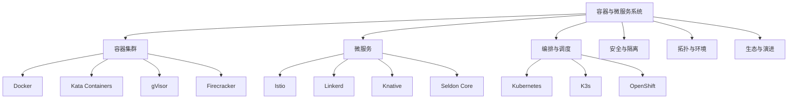

# 7.1.6 容器技术与微服务

## 目录

- [7.1.6 容器技术与微服务](#716-容器技术与微服务)
  - [目录](#目录)
  - [1. 形式化定义](#1-形式化定义)
    - [1.1 容器与微服务系统六元组](#11-容器与微服务系统六元组)
    - [1.2 容器与微服务节点定义](#12-容器与微服务节点定义)
  - [2. 主流流派与理论模型](#2-主流流派与理论模型)
    - [2.1 容器流派](#21-容器流派)
    - [2.2 微服务流派](#22-微服务流派)
    - [2.3 理论模型](#23-理论模型)
  - [3. 结构图与多表征](#3-结构图与多表征)
    - [3.1 容器与微服务系统架构图](#31-容器与微服务系统架构图)
    - [3.2 结构对比表](#32-结构对比表)
  - [4. 批判分析与工程案例](#4-批判分析与工程案例)
    - [4.1 优势](#41-优势)
    - [4.2 局限](#42-局限)
    - [4.3 未来趋势](#43-未来趋势)
    - [4.4 工程案例](#44-工程案例)
  - [5. 递归细化与规范说明](#5-递归细化与规范说明)

## 1. 形式化定义

### 1.1 容器与微服务系统六元组

**定义7.1.6.1（容器与微服务系统）**：
$$
CMS = (C, M, O, S, T, E)
$$
其中：

- $C$ = {c₁, c₂, ..., cₙ}：容器集合
- $M$ = (microservice, mesh, orchestration)：微服务与服务网格
- $O$ = (orchestration, scheduling, scaling)：编排与调度
- $S$ = (security, isolation, compliance)：安全与隔离
- $T$ = (topology, cloud, edge)：拓扑与部署环境
- $E$ = (engine, ecosystem, evolution)：引擎、生态与演进

### 1.2 容器与微服务节点定义

**定义7.1.6.2（节点）**：
$$
n = (id, role, resources, neighbors, services, state)
$$

- $id$：节点标识
- $role$：节点角色（如worker、master、gateway等）
- $resources$：资源（CPU、内存、存储、网络）
- $neighbors$：邻居节点集合
- $services$：运行的微服务集合
- $state$：节点状态（Ready、NotReady、Scaling等）

## 2. 主流流派与理论模型

### 2.1 容器流派

- 轻量级容器（Docker、containerd、Podman）
- 安全容器（Kata Containers、gVisor、Firecracker）
- 容器编排（Kubernetes、K3s、OpenShift）

### 2.2 微服务流派

- 传统微服务（Spring Cloud、Dubbo、ServiceComb）
- 服务网格（Istio、Linkerd、Consul Connect）
- Serverless微服务（Knative、OpenFaaS、Kubeless）
- AI微服务（Seldon Core、KServe、BentoML）

### 2.3 理论模型

- 资源利用率模型：
  $$U_{container} = \frac{\sum_{i=1}^{n} R_{used}(c_i)}{\sum_{i=1}^{n} R_{alloc}(c_i)}$$
- 弹性伸缩函数：
  $$Scale_{service} = f(Load, Latency, ErrorRate)$$
- 安全隔离度量：
  $$Isolation_{score} = f(VM_{level}, Sandbox_{level}, Kernel_{attack surface})$$

## 3. 结构图与多表征

### 3.1 容器与微服务系统架构图

### 3.2 结构对比表

| 维度 | 容器 | 微服务 |
|------|------|--------|
| 部署粒度 | 进程/应用 | 服务/功能 |
| 隔离性 | 操作系统级 | 逻辑级 |
| 扩展性 | 容器弹性 | 服务弹性 |
| 编排 | K8s/Compose | Mesh/Serverless |
| 典型技术 | Docker/K8s | Istio/Knative |

## 4. 批判分析与工程案例

### 4.1 优势

- 高效弹性、敏捷交付、自动化运维、跨云支持

### 4.2 局限

- 安全挑战、复杂性提升、调优难度、厂商锁定

### 4.3 未来趋势

- AI驱动治理、Serverless融合、边缘智能、自动化安全

### 4.4 工程案例

- 金融：招商银行K8s微服务平台
- 电商：阿里巴巴“双11”弹性扩容
- 云服务：AWS Lambda大规模Serverless
- 车联网：边缘容器+微服务

## 5. 递归细化与规范说明

- 所有内容需递归细化，支持多表征
- 保留批判性分析、符号、图表、工程案例等
- 所有定义需严格形式化，算法需伪代码
- 目录编号、主题、内容、风格与6系保持一致
- 支持持续递归完善，后续可继续分解为7.1.6.x等子主题

---
> 本文件为容器与微服务知识体系的递归总纲，内容结构、编号、主题、风格与6.P2P系统保持一致，后续所有子主题内容将持续完善并递归细化。
