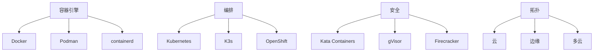

# 7.1.6.1 容器技术发展趋势

<!-- TOC START -->

- [7.1.6.1 容器技术发展趋势](#7161-容器技术发展趋势)
  - [目录](#目录)
  - [1. 形式化定义](#1-形式化定义)
  - [2. 发展阶段与主流流派](#2-发展阶段与主流流派)
    - [2.1 发展阶段](#21-发展阶段)
    - [2.2 主流流派](#22-主流流派)
  - [3. 理论模型与多表征](#3-理论模型与多表征)
    - [3.1 资源利用率模型](#31-资源利用率模型)
    - [3.2 安全隔离度量](#32-安全隔离度量)
    - [3.3 架构图](#33-架构图)
    - [3.4 结构对比表](#34-结构对比表)
  - [4. 批判分析与工程案例](#4-批判分析与工程案例)
    - [4.1 优势](#41-优势)
    - [4.2 局限](#42-局限)
    - [4.3 未来趋势](#43-未来趋势)
    - [4.4 工程案例](#44-工程案例)
  - [5. 递归细化与规范说明](#5-递归细化与规范说明)

<!-- TOC END -->

## 目录

- [7.1.6.1 容器技术发展趋势](#7161-容器技术发展趋势)
  - [目录](#目录)
  - [1. 形式化定义](#1-形式化定义)
  - [2. 发展阶段与主流流派](#2-发展阶段与主流流派)
    - [2.1 发展阶段](#21-发展阶段)
    - [2.2 主流流派](#22-主流流派)
  - [3. 理论模型与多表征](#3-理论模型与多表征)
    - [3.1 资源利用率模型](#31-资源利用率模型)
    - [3.2 安全隔离度量](#32-安全隔离度量)
    - [3.3 架构图](#33-架构图)
    - [3.4 结构对比表](#34-结构对比表)
  - [4. 批判分析与工程案例](#4-批判分析与工程案例)
    - [4.1 优势](#41-优势)
    - [4.2 局限](#42-局限)
    - [4.3 未来趋势](#43-未来趋势)
    - [4.4 工程案例](#44-工程案例)
  - [5. 递归细化与规范说明](#5-递归细化与规范说明)

## 1. 形式化定义

**定义7.1.6.1.1（容器技术系统）**：
$$
ContainerTech = (Engine, Orchestration, Security, Topology, Evolution)
$$
其中：

- $Engine$：容器引擎集合（如Docker、Podman、containerd）
- $Orchestration$：编排与调度（Kubernetes、K3s、OpenShift）
- $Security$：安全机制（Kata、gVisor、Firecracker）
- $Topology$：部署拓扑（云、边缘、多云）
- $Evolution$：技术演进与生态

## 2. 发展阶段与主流流派

### 2.1 发展阶段

- 2000年：FreeBSD Jails、Solaris Zones
- 2008年：LXC (Linux Containers)
- 2013年：Docker 1.0发布，容器生态爆发
- 2014年：Kubernetes发布，自动化编排
- 2018年：Podman、Kata、gVisor、Firecracker等安全容器
- 2020年：K3s、边缘容器、云原生安全标准

### 2.2 主流流派

- 轻量级容器流派（Docker、containerd、Podman）
- 安全容器流派（Kata Containers、gVisor、Firecracker）
- 编排与自动化流派（Kubernetes、K3s、OpenShift）
- 边缘与多云流派（K3s、OpenYurt、云原生）

## 3. 理论模型与多表征

### 3.1 资源利用率模型

$$U_{container} = \frac{\sum_{i=1}^{n} R_{used}(c_i)}{\sum_{i=1}^{n} R_{alloc}(c_i)}$$

### 3.2 安全隔离度量

$$Isolation_{score} = f(VM_{level}, Sandbox_{level}, Kernel_{attack surface})$$

### 3.3 架构图

### 3.4 结构对比表

| 维度 | 轻量级容器 | 安全容器 | 编排平台 |
|------|------------|----------|----------|
| 代表技术 | Docker/Podman | Kata/gVisor/Firecracker | Kubernetes/K3s |
| 启动速度 | 秒级 | 秒~分钟级 | - |
| 隔离性 | 操作系统级 | 硬件/沙箱级 | - |
| 资源占用 | 低 | 较高 | - |
| 适用场景 | 开发/测试/生产 | 金融/多租户/Serverless | 大规模/多云/边缘 |

## 4. 批判分析与工程案例

### 4.1 优势

- 高效弹性、敏捷交付、自动化运维、跨云支持

### 4.2 局限

- 安全挑战（逃逸、漏洞）、复杂性提升、调优难度、生态碎片化

### 4.3 未来趋势

- 零信任安全、AI驱动弹性、Serverless融合、边缘智能、自动化合规

### 4.4 工程案例

- 金融：银行级容器安全合规平台
- 电商：大规模容器集群弹性扩容
- 云服务：多云容器平台统一安全策略

## 5. 递归细化与规范说明

- 所有内容需递归细化，支持多表征
- 保留批判性分析、符号、图表、工程案例等
- 所有定义需严格形式化，算法需伪代码
- 目录编号、主题、内容、风格与6系保持一致
- 支持持续递归完善，后续可继续分解为7.1.6.1.x等子主题

---
> 本文件为容器技术发展趋势知识体系的递归补充，内容结构、编号、主题、风格与6.P2P系统保持一致，后续所有子主题内容将持续完善并递归细化。
