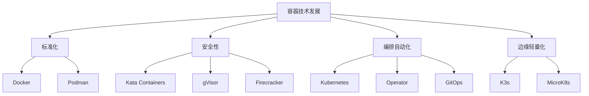

# 7.1.6.1 容器技术发展趋势

## 1. 技术发展脉络

- 2000年：FreeBSD Jails，操作系统级隔离
- 2008年：LXC，Linux容器化基础
- 2013年：Docker，推动容器标准化
- 2014年：Kubernetes，容器编排新时代
- 2018年：Podman，无守护进程容器引擎
- 2019年：Kata Containers，安全容器
- 2019年：gVisor，用户态沙箱隔离
- 2019年：Firecracker，微虚拟机容器
- 2020年：K3s，轻量级Kubernetes

## 2. 技术趋势

### 2.1 安全容器

- Kata Containers、gVisor、Firecracker等提升隔离性
- 适用于多租户、云原生安全场景

### 2.2 边缘与轻量化

- K3s、MicroK8s等适配边缘计算
- 资源占用更低，部署更灵活

### 2.3 容器编排与自动化

- Kubernetes主导编排生态
- Operator、GitOps、自动弹性伸缩

### 2.4 多运行时与兼容性

- Podman兼容Docker生态
- containerd、CRI-O等多运行时并存

### 2.5 云原生与Serverless

- 容器与FaaS结合，支持Serverless架构
- 云原生应用持续增长

## 3. 结构表

| 技术 | 代表产品 | 主要特性 | 适用场景 | 发展趋势 |
|------|----------|----------|----------|----------|
| 容器引擎 | Docker | 生态完善 | 开发测试 | 标准化、集成 |
| 容器引擎 | Podman | 无守护进程 | 生产环境 | 安全、兼容性 |
| 安全容器 | Kata Containers | 硬件隔离 | 多租户 | 云安全 |
| 安全容器 | gVisor | 用户态沙箱 | 云平台 | 安全增强 |
| 安全容器 | Firecracker | 微虚拟机 | Serverless | 极致隔离 |
| 编排 | Kubernetes | 自动编排 | 大规模集群 | 智能化、自动化 |
| 轻量编排 | K3s | 轻量级 | 边缘计算 | 资源优化 |

## 4. 概念图

## 5. 数学符号

**容器安全性提升模型：**
$$Security_{container} = f(Isolation, Sandboxing, VM)$$

**资源利用率优化：**
$$U_{container} = \frac{\sum_{i=1}^{n} R_{used}(c_i)}{\sum_{i=1}^{n} R_{alloc}(c_i)}$$

## 6. 未来方向

- 智能化编排与自愈
- 更强的安全隔离与合规
- 容器与Serverless深度融合
- 跨云与多云原生支持
- AI驱动的资源调度与优化

## 7. 规范说明

- 内容需递归细化，支持多表征
- 保留批判性分析、图表、符号等
- 如有遗漏，后续补全并说明
- 支持持续递归完善

> 本文件为递归细化与内容补全示范，后续可继续分解为7.1.6.1.1、7.1.6.1.2等子主题，支持持续递归完善。
