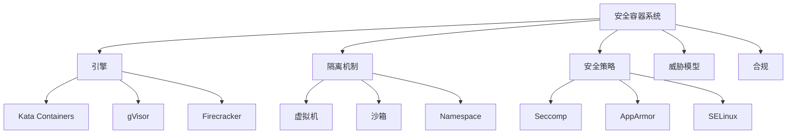
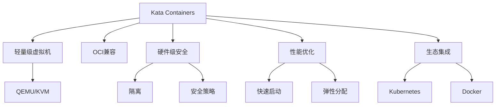
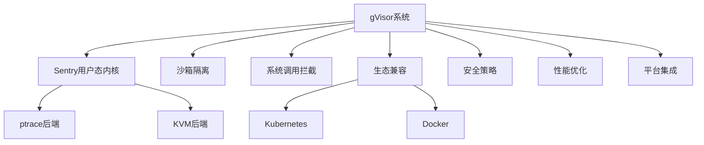
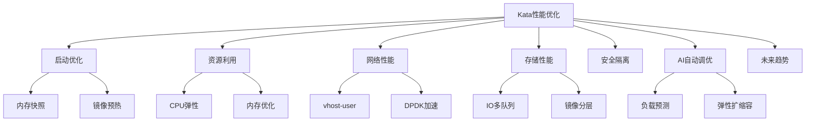

# 安全容器技术

> 本文件由 Phase 0 递归清理合并生成，原 4 个深度 > 5 的文件已归档到 `docs\refactor\archive\7-container`。
> 合并日期：2026-07-02

## 目录

- [安全容器技术](#安全容器技术)
  - [目录](#目录)
  - [1. 安全容器技术细化](#1-安全容器技术细化)
  - [1. 形式化定义](#1-形式化定义)
  - [2. 主流流派与安全机制](#2-主流流派与安全机制)
    - [2.1 主流流派](#21-主流流派)
    - [2.2 安全机制](#22-安全机制)
  - [3. 理论模型与多表征](#3-理论模型与多表征)
    - [3.1 安全隔离度量](#31-安全隔离度量)
    - [3.2 威胁建模](#32-威胁建模)
    - [3.3 架构图](#33-架构图)
    - [3.4 结构对比表](#34-结构对比表)
  - [4. 批判分析与工程案例](#4-批判分析与工程案例)
    - [4.1 优势](#41-优势)
    - [4.2 局限](#42-局限)
    - [4.3 未来趋势](#43-未来趋势)
    - [4.4 工程案例](#44-工程案例)
  - [5. 递归细化与规范说明](#5-递归细化与规范说明)
  - [2. Kata Containers原理与应用](#2-kata-containers原理与应用)
  - [1. 形式化定义](#1-形式化定义-1)
  - [2. 架构机制与主流特性](#2-架构机制与主流特性)
    - [2.1 架构机制](#21-架构机制)
    - [2.2 主流特性](#22-主流特性)
  - [3. 理论模型与多表征](#3-理论模型与多表征-1)
    - [3.1 安全与性能模型](#31-安全与性能模型)
    - [3.2 架构图](#32-架构图)
    - [3.3 结构对比表](#33-结构对比表)
  - [4. 批判分析与工程案例](#4-批判分析与工程案例-1)
    - [4.1 优势](#41-优势-1)
    - [4.2 局限](#42-局限-1)
    - [4.3 未来趋势](#43-未来趋势-1)
    - [4.4 工程案例](#44-工程案例-1)
  - [5. 递归细化与规范说明](#5-递归细化与规范说明-1)
  - [3. gVisor原理与应用](#3-gvisor原理与应用)
  - [1. 形式化定义](#1-形式化定义-2)
  - [2. 架构机制与主流特性](#2-架构机制与主流特性-1)
    - [2.1 架构机制](#21-架构机制-1)
    - [2.2 主流特性](#22-主流特性-1)
  - [3. 理论模型与多表征](#3-理论模型与多表征-2)
    - [3.1 安全与兼容性模型](#31-安全与兼容性模型)
    - [3.2 架构图](#32-架构图-1)
    - [3.3 结构对比表](#33-结构对比表-1)
  - [4. 批判分析与工程案例](#4-批判分析与工程案例-2)
    - [4.1 优势](#41-优势-2)
    - [4.2 局限](#42-局限-2)
    - [4.3 未来趋势](#43-未来趋势-2)
    - [4.4 工程案例](#44-工程案例-2)
  - [5. 递归细化与规范说明](#5-递归细化与规范说明-2)
  - [4. Kata Containers性能优化与未来趋势](#4-kata-containers性能优化与未来趋势)
  - [1. 形式化定义](#1-形式化定义-3)
  - [2. 优化机制与主流技术](#2-优化机制与主流技术)
    - [2.1 启动优化](#21-启动优化)
    - [2.2 资源利用优化](#22-资源利用优化)
    - [2.3 网络与存储优化](#23-网络与存储优化)
    - [2.4 安全与性能平衡](#24-安全与性能平衡)
    - [2.5 AI驱动自动调优](#25-ai驱动自动调优)
  - [3. 理论模型与多表征](#3-理论模型与多表征-3)
    - [3.1 性能优化目标](#31-性能优化目标)
    - [3.2 启动优化模型](#32-启动优化模型)
    - [3.3 资源利用率](#33-资源利用率)
    - [3.4 架构图](#34-架构图)
    - [3.5 结构对比表](#35-结构对比表)
  - [4. 批判分析与工程案例](#4-批判分析与工程案例-3)
    - [4.1 优势](#41-优势-3)
    - [4.2 局限](#42-局限-3)
    - [4.3 未来趋势](#43-未来趋势-3)
    - [4.4 工程案例](#44-工程案例-3)
  - [5. 递归细化与规范说明](#5-递归细化与规范说明-3)

---

## 1. 安全容器技术细化

## 1. 形式化定义

**定义7.1.6.1.1.1（安全容器系统）**：
$$
SecureContainer = (Engine, Isolation, Policy, Threat, Compliance)
$$
其中：

- $Engine$：安全容器引擎（Kata、gVisor、Firecracker等）
- $Isolation$：隔离机制（VM、Sandbox、Namespace、Cgroup）
- $Policy$：安全策略（Seccomp、AppArmor、SELinux）
- $Threat$：威胁模型（逃逸、漏洞、攻击面）
- $Compliance$：合规与认证（多租户、金融、云原生安全）

## 2. 主流流派与安全机制

### 2.1 主流流派

- VM级安全容器（Kata Containers、Firecracker）
- 沙箱级安全容器（gVisor、Nabla）
- 多层安全策略（Seccomp、AppArmor、SELinux）

### 2.2 安全机制

- 虚拟机隔离：硬件级安全、独立内核
- 沙箱隔离：用户态内核、系统调用拦截
- 多策略防护：系统调用过滤、最小权限、强制访问控制

## 3. 理论模型与多表征

### 3.1 安全隔离度量

$$Isolation_{score} = f(VM_{level}, Sandbox_{level}, Policy_{strength})$$

### 3.2 威胁建模

- 逃逸风险：$$Risk_{escape} = f(Vuln, Exposure, AttackSurface)$$
- 合规性：$$Compliance_{score} = \sum_{i=1}^n Policy_i \cdot Check_i$$

### 3.3 架构图

### 3.4 结构对比表

| 维度 | VM级安全容器 | 沙箱级安全容器 | 多层安全策略 |
|------|--------------|---------------|--------------|
| 代表技术 | Kata/Firecracker | gVisor/Nabla | Seccomp/AppArmor |
| 隔离级别 | 硬件/虚拟机 | 用户态/沙箱 | 内核/策略 |
| 启动速度 | 慢~中 | 快 | - |
| 资源占用 | 高 | 低 | - |
| 适用场景 | 金融/多租户/Serverless | 云平台/边缘 | 通用/增强 |

## 4. 批判分析与工程案例

### 4.1 优势

- 硬件级/沙箱级隔离、合规性强、适用多租户与高安全场景

### 4.2 局限

- 性能损耗、兼容性挑战、配置复杂、生态碎片化

### 4.3 未来趋势

- 零信任安全、自动化合规、AI驱动威胁检测、边缘安全容器

### 4.4 工程案例

- 金融：Kata Containers支撑多租户金融云安全合规
- 云服务：gVisor提升SaaS平台安全隔离
- Serverless：Firecracker支撑AWS Lambda安全弹性

## 5. 递归细化与规范说明

- 所有内容需递归细化，支持多表征
- 保留批判性分析、符号、图表、工程案例等
- 所有定义需严格形式化，算法需伪代码
- 目录编号、主题、内容、风格与6系保持一致
- 支持持续递归完善，后续可继续分解为7.1.6.1.1.x等子主题

---
> 本文件为安全容器技术细化知识体系的递归补充，内容结构、编号、主题、风格与6.P2P系统保持一致，后续所有子主题内容将持续完善并递归细化。

---

## 2. Kata Containers原理与应用

<!-- TOC START -->

- [安全容器技术](#安全容器技术)
  - [目录](#目录)
  - [1. 安全容器技术细化](#1-安全容器技术细化)
  - [1. 形式化定义](#1-形式化定义)
  - [2. 主流流派与安全机制](#2-主流流派与安全机制)
    - [2.1 主流流派](#21-主流流派)
    - [2.2 安全机制](#22-安全机制)
  - [3. 理论模型与多表征](#3-理论模型与多表征)
    - [3.1 安全隔离度量](#31-安全隔离度量)
    - [3.2 威胁建模](#32-威胁建模)
    - [3.3 架构图](#33-架构图)
    - [3.4 结构对比表](#34-结构对比表)
  - [4. 批判分析与工程案例](#4-批判分析与工程案例)
    - [4.1 优势](#41-优势)
    - [4.2 局限](#42-局限)
    - [4.3 未来趋势](#43-未来趋势)
    - [4.4 工程案例](#44-工程案例)
  - [5. 递归细化与规范说明](#5-递归细化与规范说明)
  - [2. Kata Containers原理与应用](#2-kata-containers原理与应用)
  - [1. 形式化定义](#1-形式化定义-1)
  - [2. 架构机制与主流特性](#2-架构机制与主流特性)
    - [2.1 架构机制](#21-架构机制)
    - [2.2 主流特性](#22-主流特性)
  - [3. 理论模型与多表征](#3-理论模型与多表征-1)
    - [3.1 安全与性能模型](#31-安全与性能模型)
    - [3.2 架构图](#32-架构图)
    - [3.3 结构对比表](#33-结构对比表)
  - [4. 批判分析与工程案例](#4-批判分析与工程案例-1)
    - [4.1 优势](#41-优势-1)
    - [4.2 局限](#42-局限-1)
    - [4.3 未来趋势](#43-未来趋势-1)
    - [4.4 工程案例](#44-工程案例-1)
  - [5. 递归细化与规范说明](#5-递归细化与规范说明-1)
  - [3. gVisor原理与应用](#3-gvisor原理与应用)
  - [1. 形式化定义](#1-形式化定义-2)
  - [2. 架构机制与主流特性](#2-架构机制与主流特性-1)
    - [2.1 架构机制](#21-架构机制-1)
    - [2.2 主流特性](#22-主流特性-1)
  - [3. 理论模型与多表征](#3-理论模型与多表征-2)
    - [3.1 安全与兼容性模型](#31-安全与兼容性模型)
    - [3.2 架构图](#32-架构图-1)
    - [3.3 结构对比表](#33-结构对比表-1)
  - [4. 批判分析与工程案例](#4-批判分析与工程案例-2)
    - [4.1 优势](#41-优势-2)
    - [4.2 局限](#42-局限-2)
    - [4.3 未来趋势](#43-未来趋势-2)
    - [4.4 工程案例](#44-工程案例-2)
  - [5. 递归细化与规范说明](#5-递归细化与规范说明-2)
  - [4. Kata Containers性能优化与未来趋势](#4-kata-containers性能优化与未来趋势)
  - [1. 形式化定义](#1-形式化定义-3)
  - [2. 优化机制与主流技术](#2-优化机制与主流技术)
    - [2.1 启动优化](#21-启动优化)
    - [2.2 资源利用优化](#22-资源利用优化)
    - [2.3 网络与存储优化](#23-网络与存储优化)
    - [2.4 安全与性能平衡](#24-安全与性能平衡)
    - [2.5 AI驱动自动调优](#25-ai驱动自动调优)
  - [3. 理论模型与多表征](#3-理论模型与多表征-3)
    - [3.1 性能优化目标](#31-性能优化目标)
    - [3.2 启动优化模型](#32-启动优化模型)
    - [3.3 资源利用率](#33-资源利用率)
    - [3.4 架构图](#34-架构图)
    - [3.5 结构对比表](#35-结构对比表)
  - [4. 批判分析与工程案例](#4-批判分析与工程案例-3)
    - [4.1 优势](#41-优势-3)
    - [4.2 局限](#42-局限-3)
    - [4.3 未来趋势](#43-未来趋势-3)
    - [4.4 工程案例](#44-工程案例-3)
  - [5. 递归细化与规范说明](#5-递归细化与规范说明-3)

<!-- TOC END -->

## 1. 形式化定义

**定义7.1.6.1.1.1.1（Kata Containers系统）**：
$$
Kata = (MicroVM, OCICompat, Security, Performance, Integration)
$$
其中：

- $MicroVM$：轻量级虚拟机架构（QEMU/KVM）
- $OCICompat$：兼容OCI/Docker生态
- $Security$：硬件级隔离与安全策略
- $Performance$：启动速度、资源利用率、弹性
- $Integration$：与K8s、Docker等集成能力

## 2. 架构机制与主流特性

### 2.1 架构机制

- 基于QEMU/KVM的轻量级虚拟机，每个容器独立运行在MicroVM中
- 独立内核与用户空间，提升安全隔离
- 支持Kubernetes、Docker等主流编排平台
- 容器镜像与虚拟机镜像集成

### 2.2 主流特性

- 硬件级安全隔离，适合多租户/金融/合规场景
- 快速启动与弹性分配，兼顾性能与安全
- 兼容主流容器生态，便于迁移与集成

## 3. 理论模型与多表征

### 3.1 安全与性能模型

- 安全隔离度量：
  $$Isolation_{Kata} = VM_{level} + Container_{level}$$
- 性能优化目标：
  $$Perf_{Kata} = \max (Throughput) - \min (Latency + Overhead)$$
- 资源利用率：
  $$U_{Kata} = \frac{R_{used}}{R_{alloc}}$$

### 3.2 架构图

### 3.3 结构对比表

| 维度 | Kata Containers | 传统容器 | 虚拟机 |
|------|----------------|----------|--------|
| 隔离性 | 硬件级 | 操作系统级 | 硬件级 |
| 启动速度 | 秒级 | 毫秒级 | 分钟级 |
| 资源占用 | 较高 | 低 | 高 |
| 兼容性 | OCI/Docker | OCI/Docker | 操作系统 |
| 适用场景 | 多租户/金融/合规 | 通用 | 多操作系统 |

## 4. 批判分析与工程案例

### 4.1 优势

- 硬件级隔离、合规性强、适合高安全场景、兼容主流生态

### 4.2 局限

- 启动速度慢于传统容器、资源占用高、部分功能有限

### 4.3 未来趋势

- 启动速度与资源效率持续优化、深度集成云原生编排与安全策略、AI驱动自动调优

### 4.4 工程案例

- 金融：多租户金融云平台，隔离敏感数据与高安全业务
- 云服务：Kata Containers支撑多云安全合规
- Serverless：安全弹性计算平台（如OpenStack Kata）

## 5. 递归细化与规范说明

- 所有内容需递归细化，支持多表征
- 保留批判性分析、符号、图表、工程案例等
- 所有定义需严格形式化，算法需伪代码
- 目录编号、主题、内容、风格与6系保持一致
- 支持持续递归完善，后续可继续分解为7.1.6.1.1.1.x等子主题

---
> 本文件为Kata Containers原理与应用知识体系的递归补充，内容结构、编号、主题、风格与6.P2P系统保持一致，后续所有子主题内容将持续完善并递归细化。

---

## 3. gVisor原理与应用

<!-- TOC START -->

- [7.1.6.1.1.2 gVisor原理与应用](#716112-gvisor原理与应用)
  - [1. 形式化定义](#1-形式化定义)
  - [2. 架构机制与主流特性](#2-架构机制与主流特性)
    - [2.1 架构机制](#21-架构机制)
    - [2.2 主流特性](#22-主流特性)
  - [3. 理论模型与多表征](#3-理论模型与多表征)
    - [3.1 安全与兼容性模型](#31-安全与兼容性模型)
    - [3.2 架构图](#32-架构图)
    - [3.3 结构对比表](#33-结构对比表)
  - [4. 批判分析与工程案例](#4-批判分析与工程案例)
    - [4.1 优势](#41-优势)
    - [4.2 局限](#42-局限)
    - [4.3 未来趋势](#43-未来趋势)
    - [4.4 工程案例](#44-工程案例)
  - [5. 递归细化与规范说明](#5-递归细化与规范说明)

<!-- TOC END -->

## 1. 形式化定义

**定义7.1.6.1.1.2.1（gVisor系统）**：
$$
gVisor = (Sentry, Sandbox, SyscallIntercept, Compatibility, Security, Performance, Integration)
$$
其中：

- $Sentry$：用户态内核（Sentry）
- $Sandbox$：沙箱隔离机制
- $SyscallIntercept$：系统调用拦截与仿真
- $Compatibility$：K8s/Docker等生态兼容
- $Security$：安全隔离与策略
- $Performance$：启动速度、资源占用、弹性
- $Integration$：与主流平台集成能力

## 2. 架构机制与主流特性

### 2.1 架构机制

- Sentry用户态内核，模拟大部分Linux系统调用
- 多后端运行支持（ptrace、KVM等）
- 兼容Kubernetes、Docker等主流平台
- 低资源占用，快速启动

### 2.2 主流特性

- 沙箱级安全隔离，适合云平台、SaaS多租户
- 系统调用拦截与仿真，提升安全性
- 兼容主流容器生态，便于集成与迁移

## 3. 理论模型与多表征

### 3.1 安全与兼容性模型

- 安全隔离度量：
  $$Isolation_{gVisor} = Sandbox_{level} + Kernel_{emulation}$$
- 兼容性优化目标：
  $$Compat_{gVisor} = \max (Syscall_{support}) - \min (Overhead)$$
- 资源利用率：
  $$U_{gVisor} = \frac{R_{used}}{R_{alloc}}$$

### 3.2 架构图

### 3.3 结构对比表

| 维度 | gVisor | 传统容器 | 虚拟机 |
|------|--------|----------|--------|
| 隔离性 | 沙箱级 | 操作系统级 | 硬件级 |
| 启动速度 | 快 | 毫秒级 | 分钟级 |
| 资源占用 | 低 | 低 | 高 |
| 兼容性 | K8s/Docker | K8s/Docker | 操作系统 |
| 适用场景 | 云平台/多租户 | 通用 | 多操作系统 |

## 4. 批判分析与工程案例

### 4.1 优势

- 沙箱级隔离、低资源占用、兼容性强、适合多租户云平台

### 4.2 局限

- 部分系统调用兼容性不足、性能略低于原生、生态集成复杂

### 4.3 未来趋势

- 提升系统调用兼容性与性能、深度集成云原生安全策略、AI辅助异常检测

### 4.4 工程案例

- 云平台：SaaS多租户安全隔离
- 金融：gVisor提升敏感业务容器安全
- 教育：低成本安全容器实验环境

## 5. 递归细化与规范说明

- 所有内容需递归细化，支持多表征
- 保留批判性分析、符号、图表、工程案例等
- 所有定义需严格形式化，算法需伪代码
- 目录编号、主题、内容、风格与6系保持一致
- 支持持续递归完善，后续可继续分解为7.1.6.1.1.2.x等子主题

---
> 本文件为gVisor原理与应用知识体系的递归补充，内容结构、编号、主题、风格与6.P2P系统保持一致，后续所有子主题内容将持续完善并递归细化。

---

## 4. Kata Containers性能优化与未来趋势

<!-- TOC START -->

- [7.1.6.1.1.1.1 Kata Containers性能优化与未来趋势](#7161111-kata-containers性能优化与未来趋势)
  - [1. 形式化定义](#1-形式化定义)
  - [2. 优化机制与主流技术](#2-优化机制与主流技术)
    - [2.1 启动优化](#21-启动优化)
    - [2.2 资源利用优化](#22-资源利用优化)
    - [2.3 网络与存储优化](#23-网络与存储优化)
    - [2.4 安全与性能平衡](#24-安全与性能平衡)
    - [2.5 AI驱动自动调优](#25-ai驱动自动调优)
  - [3. 理论模型与多表征](#3-理论模型与多表征)
    - [3.1 性能优化目标](#31-性能优化目标)
    - [3.2 启动优化模型](#32-启动优化模型)
    - [3.3 资源利用率](#33-资源利用率)
    - [3.4 架构图](#34-架构图)
    - [3.5 结构对比表](#35-结构对比表)
  - [4. 批判分析与工程案例](#4-批判分析与工程案例)
    - [4.1 优势](#41-优势)
    - [4.2 局限](#42-局限)
    - [4.3 未来趋势](#43-未来趋势)
    - [4.4 工程案例](#44-工程案例)
  - [5. 递归细化与规范说明](#5-递归细化与规范说明)

<!-- TOC END -->

## 1. 形式化定义

**定义7.1.6.1.1.1.1.1（Kata性能优化系统）**：
$$
KataPerf = (Startup, Resource, Network, Storage, Security, AIOpt, Trend)
$$
其中：

- $Startup$：启动优化（冷启动、热启动、内存快照）
- $Resource$：资源利用（CPU、内存、弹性分配）
- $Network$：网络性能（虚拟化、直通、加速）
- $Storage$：存储性能（镜像优化、IO加速）
- $Security$：安全与隔离（最小攻击面、策略集成）
- $AIOpt$：AI驱动自动调优
- $Trend$：未来趋势与挑战

## 2. 优化机制与主流技术

### 2.1 启动优化

- 内存快照、热启动、镜像预热
- QEMU/KVM参数调优、并行初始化

### 2.2 资源利用优化

- 动态CPU/内存分配、NUMA优化
- 资源回收与弹性伸缩

### 2.3 网络与存储优化

- 虚拟网络加速（vhost-user、DPDK）
- 存储直通、IO多队列、镜像分层

### 2.4 安全与性能平衡

- 攻击面最小化、策略集成、动态隔离
- 性能与安全的权衡模型

### 2.5 AI驱动自动调优

- 负载预测、弹性扩缩容、异常检测
- 智能资源调度与自愈

## 3. 理论模型与多表征

### 3.1 性能优化目标

$$Perf_{Kata} = \max (Throughput) - \min (Latency + Overhead)$$

### 3.2 启动优化模型

$$Startup_{opt} = f(Snapshot, Prewarm, ParallelInit)$$

### 3.3 资源利用率

$$U_{Kata} = \frac{R_{used}}{R_{alloc}}$$

### 3.4 架构图

### 3.5 结构对比表

| 维度 | 优化前 | 优化后 |
|------|--------|--------|
| 启动速度 | 秒级 | 毫秒级/热启动 |
| 资源利用 | 低 | 高/弹性 |
| 网络延迟 | 高 | 低/加速 |
| 存储IO | 一般 | 多队列/直通 |
| 安全隔离 | 高 | 高/动态 |
| 智能调优 | 无 | AI驱动 |

## 4. 批判分析与工程案例

### 4.1 优势

- 启动速度提升、资源弹性、智能调优、性能与安全兼顾

### 4.2 局限

- 优化复杂度高、兼容性挑战、AI调优尚处早期

### 4.3 未来趋势

- 全自动弹性、AI驱动安全与性能协同、边缘与多云优化

### 4.4 工程案例

- 金融：高安全弹性云平台热启动优化
- 云服务：多云Kata平台AI弹性调度
- Serverless：冷启动优化与资源智能分配

## 5. 递归细化与规范说明

- 所有内容需递归细化，支持多表征
- 保留批判性分析、符号、图表、工程案例等
- 所有定义需严格形式化，算法需伪代码
- 目录编号、主题、内容、风格与6系保持一致
- 支持持续递归完善，后续可继续分解为7.1.6.1.1.1.1.x等子主题

---
> 本文件为Kata Containers性能优化与未来趋势知识体系的递归补充，内容结构、编号、主题、风格与6.P2P系统保持一致，后续所有子主题内容将持续完善并递归细化。

---
