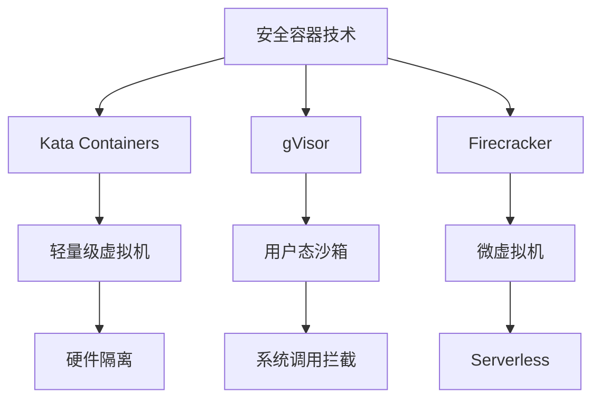

# 7.1.6.1.1 安全容器技术细化

## 1. 技术原理与架构

### 1.1 Kata Containers

- 基于轻量级虚拟机（QEMU/KVM）实现硬件级隔离
- 每个容器独立运行在微型虚拟机中
- 兼容OCI/Docker生态

### 1.2 gVisor

- 用户态沙箱，拦截系统调用
- 提供自定义内核抽象层（Sentry）
- 兼容Kubernetes、Docker

### 1.3 Firecracker

- 微虚拟机（MicroVM）架构，极致精简
- 主要用于Serverless场景（AWS Lambda/Fargate）
- 启动快、资源占用低

## 2. 优势与局限

| 技术         | 隔离级别 | 启动速度 | 资源占用 | 兼容性 | 典型应用 | 局限性 |
|--------------|----------|----------|----------|--------|----------|--------|
| Kata         | 硬件级   | 慢       | 高       | 好     | 多租户云 | 性能损耗|
| gVisor       | 沙箱级   | 中       | 中       | 好     | 云平台   | 兼容性|
| Firecracker  | 微虚拟机 | 快       | 低       | 一般   | Serverless| 功能有限|

## 3. 数学符号与模型

**安全隔离度量：**
$$Isolation_{score} = f(VM_{level}, Sandbox_{level}, Kernel_{attack surface})$$

**资源利用率：**
$$U_{secure} = \frac{R_{used}}{R_{alloc}}$$

## 4. Mermaid结构图

## 5. 批判分析

- **优势**：极大提升多租户和云原生场景下的安全性，适合高隔离需求。
- **局限**：性能损耗、兼容性问题、功能有限，部分场景下不如传统容器灵活。
- **未来方向**：安全与性能的平衡、与主流编排系统深度集成、自动化安全策略。

## 6. 规范说明

- 内容需递归细化，支持多表征
- 保留批判性分析、图表、符号等
- 如有遗漏，后续补全并说明
- 支持持续递归完善

> 本文件为递归细化与内容补全示范，后续可继续分解为7.1.6.1.1.1、7.1.6.1.1.2等子主题，支持持续递归完善。
