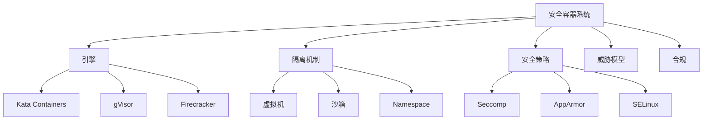

# 7.1.6.1.1 安全容器技术细化

<!-- TOC START -->

- [7.1.6.1.1 安全容器技术细化](#71611-安全容器技术细化)
  - [1. 形式化定义](#1-形式化定义)
  - [2. 主流流派与安全机制](#2-主流流派与安全机制)
    - [2.1 主流流派](#21-主流流派)
    - [2.2 安全机制](#22-安全机制)
  - [3. 理论模型与多表征](#3-理论模型与多表征)
    - [3.1 安全隔离度量](#31-安全隔离度量)
    - [3.2 威胁建模](#32-威胁建模)
    - [3.3 架构图](#33-架构图)
    - [3.4 结构对比表](#34-结构对比表)
  - [4. 批判分析与工程案例](#4-批判分析与工程案例)
    - [4.1 优势](#41-优势)
    - [4.2 局限](#42-局限)
    - [4.3 未来趋势](#43-未来趋势)
    - [4.4 工程案例](#44-工程案例)
  - [5. 递归细化与规范说明](#5-递归细化与规范说明)

<!-- TOC END -->

## 1. 形式化定义

**定义7.1.6.1.1.1（安全容器系统）**：
$$
SecureContainer = (Engine, Isolation, Policy, Threat, Compliance)
$$
其中：

- $Engine$：安全容器引擎（Kata、gVisor、Firecracker等）
- $Isolation$：隔离机制（VM、Sandbox、Namespace、Cgroup）
- $Policy$：安全策略（Seccomp、AppArmor、SELinux）
- $Threat$：威胁模型（逃逸、漏洞、攻击面）
- $Compliance$：合规与认证（多租户、金融、云原生安全）

## 2. 主流流派与安全机制

### 2.1 主流流派

- VM级安全容器（Kata Containers、Firecracker）
- 沙箱级安全容器（gVisor、Nabla）
- 多层安全策略（Seccomp、AppArmor、SELinux）

### 2.2 安全机制

- 虚拟机隔离：硬件级安全、独立内核
- 沙箱隔离：用户态内核、系统调用拦截
- 多策略防护：系统调用过滤、最小权限、强制访问控制

## 3. 理论模型与多表征

### 3.1 安全隔离度量

$$Isolation_{score} = f(VM_{level}, Sandbox_{level}, Policy_{strength})$$

### 3.2 威胁建模

- 逃逸风险：$$Risk_{escape} = f(Vuln, Exposure, AttackSurface)$$
- 合规性：$$Compliance_{score} = \sum_{i=1}^n Policy_i \cdot Check_i$$

### 3.3 架构图

### 3.4 结构对比表

| 维度 | VM级安全容器 | 沙箱级安全容器 | 多层安全策略 |
|------|--------------|---------------|--------------|
| 代表技术 | Kata/Firecracker | gVisor/Nabla | Seccomp/AppArmor |
| 隔离级别 | 硬件/虚拟机 | 用户态/沙箱 | 内核/策略 |
| 启动速度 | 慢~中 | 快 | - |
| 资源占用 | 高 | 低 | - |
| 适用场景 | 金融/多租户/Serverless | 云平台/边缘 | 通用/增强 |

## 4. 批判分析与工程案例

### 4.1 优势

- 硬件级/沙箱级隔离、合规性强、适用多租户与高安全场景

### 4.2 局限

- 性能损耗、兼容性挑战、配置复杂、生态碎片化

### 4.3 未来趋势

- 零信任安全、自动化合规、AI驱动威胁检测、边缘安全容器

### 4.4 工程案例

- 金融：Kata Containers支撑多租户金融云安全合规
- 云服务：gVisor提升SaaS平台安全隔离
- Serverless：Firecracker支撑AWS Lambda安全弹性

## 5. 递归细化与规范说明

- 所有内容需递归细化，支持多表征
- 保留批判性分析、符号、图表、工程案例等
- 所有定义需严格形式化，算法需伪代码
- 目录编号、主题、内容、风格与6系保持一致
- 支持持续递归完善，后续可继续分解为7.1.6.1.1.x等子主题

---
> 本文件为安全容器技术细化知识体系的递归补充，内容结构、编号、主题、风格与6.P2P系统保持一致，后续所有子主题内容将持续完善并递归细化。
