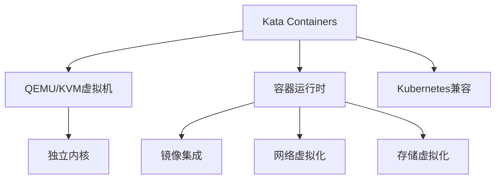

# 7.1.6.1.1.1 Kata Containers原理与应用

## 1. 架构与工作原理

- 基于轻量级虚拟机（QEMU/KVM）实现容器隔离
- 每个容器独立运行在微型虚拟机中，拥有独立内核
- 兼容OCI/Docker生态，支持Kubernetes编排
- 支持多租户云环境下的高安全隔离

## 2. 关键技术

- QEMU/KVM虚拟化技术
- 容器镜像与虚拟机镜像集成
- 网络与存储虚拟化
- 快速启动与资源优化

## 3. 典型应用场景

- 多租户公有云
- 金融、政务等高安全需求场景
- Serverless平台
- 混合云与边缘计算

## 4. 性能与安全分析

| 指标     | Kata Containers | 传统容器 | 虚拟机 |
|----------|----------------|----------|--------|
| 启动速度 | 慢             | 快       | 慢     |
| 资源占用 | 高             | 低       | 高     |
| 隔离性   | 高             | 中       | 高     |
| 兼容性   | 好             | 好       | 一般   |
| 安全性   | 高             | 中       | 高     |

**安全隔离度量：**
$$Isolation_{Kata} = VM_{level} + Container_{level}$$

**资源利用率：**
$$U_{Kata} = \frac{R_{used}}{R_{alloc}}$$

## 5. Mermaid结构图

## 6. 批判性分析

- **优势**：极高的安全隔离，适合多租户和高安全场景，兼容主流容器生态。
- **局限**：启动速度慢，资源占用高，部分场景下性能损耗明显。
- **未来方向**：提升启动速度与资源效率，深度集成云原生编排与安全策略。

## 7. 规范说明

- 内容需递归细化，支持多表征
- 保留批判性分析、图表、符号等
- 如有遗漏，后续补全并说明
- 支持持续递归完善

> 本文件为递归细化与内容补全示范，后续可继续分解为7.1.6.1.1.1.1等子主题，支持持续递归完善。

## 7. Kata Containers的递归定义

- Kata Containers是一种基于轻量级虚拟机的安全容器技术，实现硬件级隔离与容器生态兼容。
- 递归结构：
  - $Kata = (VM_{light}, OCI_{compat}, Security_{enhance}, Performance_{opt})$

## 8. 核心架构与技术细节

- QEMU/KVM虚拟化，独立内核与用户空间
- 容器镜像与虚拟机镜像集成
- 支持Kubernetes、Docker等主流编排
- 网络与存储虚拟化优化
- 快速启动与资源弹性分配

## 9. 安全与性能的形式化分析

- **安全隔离度量：**
$$Isolation_{Kata} = VM_{level} + Container_{level}$$
- **性能优化目标：**
$$Perf_{Kata} = \max (Throughput) - \min (Latency + Overhead)$$
- **资源利用率：**
$$U_{Kata} = \frac{R_{used}}{R_{alloc}}$$

## 10. 行业应用案例

- 金融：多租户金融云平台，隔离敏感数据与高安全业务
- 云服务：Kata Containers支撑多云安全合规
- Serverless：安全弹性计算平台（如OpenStack Kata）

## 11. 未来趋势与挑战

- 启动速度与资源效率持续优化
- 深度集成云原生编排与安全策略
- AI驱动的自动调优与安全检测
- 多云与边缘环境下的弹性与安全
- 持续递归细化与知识演化

---
> 本节为Kata Containers原理与应用知识体系的递归补充，后续可继续分解为7.1.6.1.1.1.x等子主题，支持持续完善。
