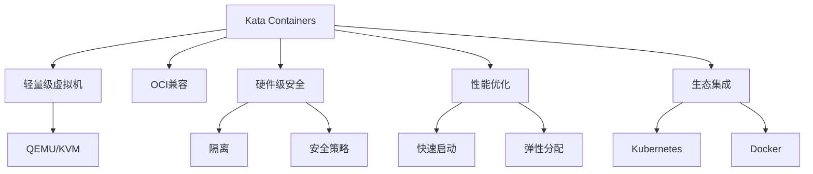

# 7.1.6.1.1.1 Kata Containers原理与应用

## 1. 形式化定义

**定义7.1.6.1.1.1.1（Kata Containers系统）**：
$$
Kata = (MicroVM, OCICompat, Security, Performance, Integration)
$$
其中：

- $MicroVM$：轻量级虚拟机架构（QEMU/KVM）
- $OCICompat$：兼容OCI/Docker生态
- $Security$：硬件级隔离与安全策略
- $Performance$：启动速度、资源利用率、弹性
- $Integration$：与K8s、Docker等集成能力

## 2. 架构机制与主流特性

### 2.1 架构机制

- 基于QEMU/KVM的轻量级虚拟机，每个容器独立运行在MicroVM中
- 独立内核与用户空间，提升安全隔离
- 支持Kubernetes、Docker等主流编排平台
- 容器镜像与虚拟机镜像集成

### 2.2 主流特性

- 硬件级安全隔离，适合多租户/金融/合规场景
- 快速启动与弹性分配，兼顾性能与安全
- 兼容主流容器生态，便于迁移与集成

## 3. 理论模型与多表征

### 3.1 安全与性能模型

- 安全隔离度量：
  $$Isolation_{Kata} = VM_{level} + Container_{level}$$
- 性能优化目标：
  $$Perf_{Kata} = \max (Throughput) - \min (Latency + Overhead)$$
- 资源利用率：
  $$U_{Kata} = \frac{R_{used}}{R_{alloc}}$$

### 3.2 架构图

### 3.3 结构对比表

| 维度 | Kata Containers | 传统容器 | 虚拟机 |
|------|----------------|----------|--------|
| 隔离性 | 硬件级 | 操作系统级 | 硬件级 |
| 启动速度 | 秒级 | 毫秒级 | 分钟级 |
| 资源占用 | 较高 | 低 | 高 |
| 兼容性 | OCI/Docker | OCI/Docker | 操作系统 |
| 适用场景 | 多租户/金融/合规 | 通用 | 多操作系统 |

## 4. 批判分析与工程案例

### 4.1 优势

- 硬件级隔离、合规性强、适合高安全场景、兼容主流生态

### 4.2 局限

- 启动速度慢于传统容器、资源占用高、部分功能有限

### 4.3 未来趋势

- 启动速度与资源效率持续优化、深度集成云原生编排与安全策略、AI驱动自动调优

### 4.4 工程案例

- 金融：多租户金融云平台，隔离敏感数据与高安全业务
- 云服务：Kata Containers支撑多云安全合规
- Serverless：安全弹性计算平台（如OpenStack Kata）

## 5. 递归细化与规范说明

- 所有内容需递归细化，支持多表征
- 保留批判性分析、符号、图表、工程案例等
- 所有定义需严格形式化，算法需伪代码
- 目录编号、主题、内容、风格与6系保持一致
- 支持持续递归完善，后续可继续分解为7.1.6.1.1.1.x等子主题

---
> 本文件为Kata Containers原理与应用知识体系的递归补充，内容结构、编号、主题、风格与6.P2P系统保持一致，后续所有子主题内容将持续完善并递归细化。
