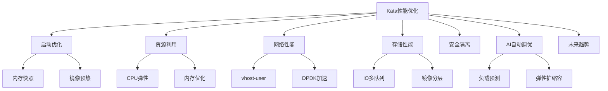

# 7.1.6.1.1.1.1 Kata Containers性能优化与未来趋势

<!-- TOC START -->

- [7.1.6.1.1.1.1 Kata Containers性能优化与未来趋势](#7161111-kata-containers性能优化与未来趋势)
  - [1. 形式化定义](#1-形式化定义)
  - [2. 优化机制与主流技术](#2-优化机制与主流技术)
    - [2.1 启动优化](#21-启动优化)
    - [2.2 资源利用优化](#22-资源利用优化)
    - [2.3 网络与存储优化](#23-网络与存储优化)
    - [2.4 安全与性能平衡](#24-安全与性能平衡)
    - [2.5 AI驱动自动调优](#25-ai驱动自动调优)
  - [3. 理论模型与多表征](#3-理论模型与多表征)
    - [3.1 性能优化目标](#31-性能优化目标)
    - [3.2 启动优化模型](#32-启动优化模型)
    - [3.3 资源利用率](#33-资源利用率)
    - [3.4 架构图](#34-架构图)
    - [3.5 结构对比表](#35-结构对比表)
  - [4. 批判分析与工程案例](#4-批判分析与工程案例)
    - [4.1 优势](#41-优势)
    - [4.2 局限](#42-局限)
    - [4.3 未来趋势](#43-未来趋势)
    - [4.4 工程案例](#44-工程案例)
  - [5. 递归细化与规范说明](#5-递归细化与规范说明)

<!-- TOC END -->

## 1. 形式化定义

**定义7.1.6.1.1.1.1.1（Kata性能优化系统）**：
$$
KataPerf = (Startup, Resource, Network, Storage, Security, AIOpt, Trend)
$$
其中：

- $Startup$：启动优化（冷启动、热启动、内存快照）
- $Resource$：资源利用（CPU、内存、弹性分配）
- $Network$：网络性能（虚拟化、直通、加速）
- $Storage$：存储性能（镜像优化、IO加速）
- $Security$：安全与隔离（最小攻击面、策略集成）
- $AIOpt$：AI驱动自动调优
- $Trend$：未来趋势与挑战

## 2. 优化机制与主流技术

### 2.1 启动优化

- 内存快照、热启动、镜像预热
- QEMU/KVM参数调优、并行初始化

### 2.2 资源利用优化

- 动态CPU/内存分配、NUMA优化
- 资源回收与弹性伸缩

### 2.3 网络与存储优化

- 虚拟网络加速（vhost-user、DPDK）
- 存储直通、IO多队列、镜像分层

### 2.4 安全与性能平衡

- 攻击面最小化、策略集成、动态隔离
- 性能与安全的权衡模型

### 2.5 AI驱动自动调优

- 负载预测、弹性扩缩容、异常检测
- 智能资源调度与自愈

## 3. 理论模型与多表征

### 3.1 性能优化目标

$$Perf_{Kata} = \max (Throughput) - \min (Latency + Overhead)$$

### 3.2 启动优化模型

$$Startup_{opt} = f(Snapshot, Prewarm, ParallelInit)$$

### 3.3 资源利用率

$$U_{Kata} = \frac{R_{used}}{R_{alloc}}$$

### 3.4 架构图

### 3.5 结构对比表

| 维度 | 优化前 | 优化后 |
|------|--------|--------|
| 启动速度 | 秒级 | 毫秒级/热启动 |
| 资源利用 | 低 | 高/弹性 |
| 网络延迟 | 高 | 低/加速 |
| 存储IO | 一般 | 多队列/直通 |
| 安全隔离 | 高 | 高/动态 |
| 智能调优 | 无 | AI驱动 |

## 4. 批判分析与工程案例

### 4.1 优势

- 启动速度提升、资源弹性、智能调优、性能与安全兼顾

### 4.2 局限

- 优化复杂度高、兼容性挑战、AI调优尚处早期

### 4.3 未来趋势

- 全自动弹性、AI驱动安全与性能协同、边缘与多云优化

### 4.4 工程案例

- 金融：高安全弹性云平台热启动优化
- 云服务：多云Kata平台AI弹性调度
- Serverless：冷启动优化与资源智能分配

## 5. 递归细化与规范说明

- 所有内容需递归细化，支持多表征
- 保留批判性分析、符号、图表、工程案例等
- 所有定义需严格形式化，算法需伪代码
- 目录编号、主题、内容、风格与6系保持一致
- 支持持续递归完善，后续可继续分解为7.1.6.1.1.1.1.x等子主题

---
> 本文件为Kata Containers性能优化与未来趋势知识体系的递归补充，内容结构、编号、主题、风格与6.P2P系统保持一致，后续所有子主题内容将持续完善并递归细化。
