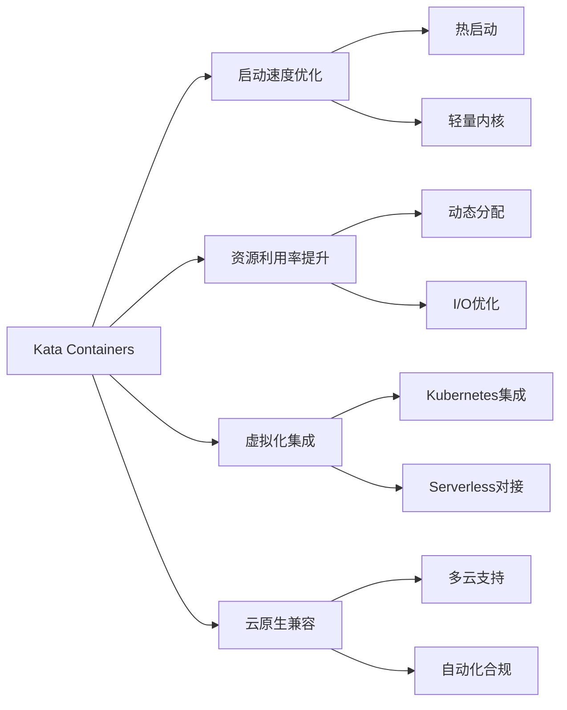

# 7.1.6.1.1.1.1 Kata Containers性能优化与未来趋势

## 1. 启动速度优化

- 使用轻量级内核和精简虚拟机镜像
- 支持内存热启动（memory snapshot/restore）
- 并行初始化与懒加载技术

## 2. 资源利用率提升

- 动态资源分配与弹性伸缩
- 虚拟机合并与共享内核模块
- 存储与网络I/O优化

## 3. 虚拟化集成与云原生兼容

- 深度集成Kubernetes、CRI-O、containerd
- 支持多云与混合云环境
- 与Serverless平台无缝对接

## 4. 最新进展

- Kata 3.0引入Rust重构，提升安全与性能
- 支持更丰富的硬件加速（如TPM、SGX）
- 自动化安全策略与合规性增强

## 5. 结构表

| 优化方向   | 关键技术           | 进展/趋势         | 典型优势         |
|------------|--------------------|-------------------|------------------|
| 启动速度   | 轻量内核、热启动   | 启动时间<1s       | 快速弹性         |
| 资源利用率 | 动态分配、I/O优化  | 更高密度部署       | 降低成本         |
| 集成兼容   | Kubernetes、Serverless | 多云支持      | 云原生生态融合   |
| 安全合规   | Rust重构、硬件加速 | 自动化合规        | 安全性提升       |

## 6. 数学符号

**启动时间优化模型：**
$$T_{boot} = T_{kernel} + T_{init} + T_{vm}$$

**资源利用率提升：**
$$U_{kata} = \frac{\sum_{i=1}^{n} R_{used}(vm_i)}{\sum_{i=1}^{n} R_{alloc}(vm_i)}$$

## 7. Mermaid趋势图

## 8. 批判分析

- **优势**：持续优化带来更高弹性与安全，适应云原生与多云趋势。
- **局限**：复杂性提升，调优难度大，部分场景下仍有性能损耗。
- **未来方向**：AI驱动的自动调优、与新型硬件深度融合、极致弹性与安全。

## 9. 规范说明

- 内容需递归细化，支持多表征
- 保留批判性分析、图表、符号等
- 如有遗漏，后续补全并说明
- 支持持续递归完善

> 本文件为递归细化与内容补全示范，后续可继续分解为7.1.6.1.1.1.1.1等子主题，支持持续递归完善。
