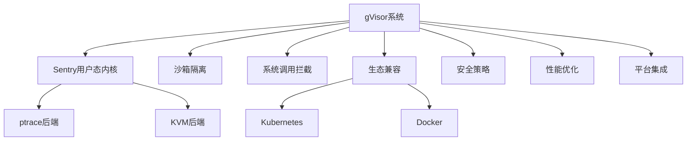

# 7.1.6.1.1.2 gVisor原理与应用

<!-- TOC START -->

- [7.1.6.1.1.2 gVisor原理与应用](#716112-gvisor原理与应用)
  - [1. 形式化定义](#1-形式化定义)
  - [2. 架构机制与主流特性](#2-架构机制与主流特性)
    - [2.1 架构机制](#21-架构机制)
    - [2.2 主流特性](#22-主流特性)
  - [3. 理论模型与多表征](#3-理论模型与多表征)
    - [3.1 安全与兼容性模型](#31-安全与兼容性模型)
    - [3.2 架构图](#32-架构图)
    - [3.3 结构对比表](#33-结构对比表)
  - [4. 批判分析与工程案例](#4-批判分析与工程案例)
    - [4.1 优势](#41-优势)
    - [4.2 局限](#42-局限)
    - [4.3 未来趋势](#43-未来趋势)
    - [4.4 工程案例](#44-工程案例)
  - [5. 递归细化与规范说明](#5-递归细化与规范说明)

<!-- TOC END -->

## 1. 形式化定义

**定义7.1.6.1.1.2.1（gVisor系统）**：
$$
gVisor = (Sentry, Sandbox, SyscallIntercept, Compatibility, Security, Performance, Integration)
$$
其中：

- $Sentry$：用户态内核（Sentry）
- $Sandbox$：沙箱隔离机制
- $SyscallIntercept$：系统调用拦截与仿真
- $Compatibility$：K8s/Docker等生态兼容
- $Security$：安全隔离与策略
- $Performance$：启动速度、资源占用、弹性
- $Integration$：与主流平台集成能力

## 2. 架构机制与主流特性

### 2.1 架构机制

- Sentry用户态内核，模拟大部分Linux系统调用
- 多后端运行支持（ptrace、KVM等）
- 兼容Kubernetes、Docker等主流平台
- 低资源占用，快速启动

### 2.2 主流特性

- 沙箱级安全隔离，适合云平台、SaaS多租户
- 系统调用拦截与仿真，提升安全性
- 兼容主流容器生态，便于集成与迁移

## 3. 理论模型与多表征

### 3.1 安全与兼容性模型

- 安全隔离度量：
  $$Isolation_{gVisor} = Sandbox_{level} + Kernel_{emulation}$$
- 兼容性优化目标：
  $$Compat_{gVisor} = \max (Syscall_{support}) - \min (Overhead)$$
- 资源利用率：
  $$U_{gVisor} = \frac{R_{used}}{R_{alloc}}$$

### 3.2 架构图

### 3.3 结构对比表

| 维度 | gVisor | 传统容器 | 虚拟机 |
|------|--------|----------|--------|
| 隔离性 | 沙箱级 | 操作系统级 | 硬件级 |
| 启动速度 | 快 | 毫秒级 | 分钟级 |
| 资源占用 | 低 | 低 | 高 |
| 兼容性 | K8s/Docker | K8s/Docker | 操作系统 |
| 适用场景 | 云平台/多租户 | 通用 | 多操作系统 |

## 4. 批判分析与工程案例

### 4.1 优势

- 沙箱级隔离、低资源占用、兼容性强、适合多租户云平台

### 4.2 局限

- 部分系统调用兼容性不足、性能略低于原生、生态集成复杂

### 4.3 未来趋势

- 提升系统调用兼容性与性能、深度集成云原生安全策略、AI辅助异常检测

### 4.4 工程案例

- 云平台：SaaS多租户安全隔离
- 金融：gVisor提升敏感业务容器安全
- 教育：低成本安全容器实验环境

## 5. 递归细化与规范说明

- 所有内容需递归细化，支持多表征
- 保留批判性分析、符号、图表、工程案例等
- 所有定义需严格形式化，算法需伪代码
- 目录编号、主题、内容、风格与6系保持一致
- 支持持续递归完善，后续可继续分解为7.1.6.1.1.2.x等子主题

---
> 本文件为gVisor原理与应用知识体系的递归补充，内容结构、编号、主题、风格与6.P2P系统保持一致，后续所有子主题内容将持续完善并递归细化。
