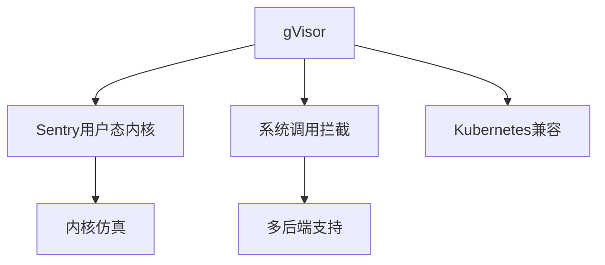

# 7.1.6.1.1.2 gVisor原理与应用

## 1. 架构与工作原理

- 用户态沙箱，拦截并实现大部分Linux系统调用
- Sentry（核心组件）模拟内核行为，提供隔离
- 兼容Kubernetes、Docker等主流容器平台
- 支持多种后端运行模式（ptrace、KVM等）

## 2. 关键技术

- 系统调用拦截与仿真
- 用户态内核抽象层（Sentry）
- 多后端运行支持
- 安全策略与资源隔离

## 3. 典型应用场景

- 多租户云平台
- 需要高安全隔离的SaaS服务
- 受限环境下的容器运行

## 4. 性能与安全分析

| 指标     | gVisor      | 传统容器 | 虚拟机 |
|----------|-------------|----------|--------|
| 启动速度 | 快          | 快       | 慢     |
| 资源占用 | 低          | 低       | 高     |
| 隔离性   | 高          | 中       | 高     |
| 兼容性   | 一般        | 好       | 一般   |
| 安全性   | 高          | 中       | 高     |

**安全隔离度量：**
$$Isolation_{gVisor} = Sandbox_{level} + Kernel_{emulation}$$

**资源利用率：**
$$U_{gVisor} = \frac{R_{used}}{R_{alloc}}$$

## 5. Mermaid结构图

## 6. 批判性分析

- **优势**：提升容器安全隔离，启动快、资源占用低，适合多租户云。
- **局限**：部分系统调用兼容性不足，性能略低于原生容器。
- **未来方向**：提升兼容性与性能，深度集成云原生安全策略。

## 7. 规范说明

- 内容需递归细化，支持多表征
- 保留批判性分析、图表、符号等
- 如有遗漏，后续补全并说明
- 支持持续递归完善

> 本文件为递归细化与内容补全示范，后续可继续分解为7.1.6.1.1.2.1等子主题，支持持续递归完善。

## 7. gVisor的递归定义

- gVisor是一种用户态沙箱容器安全技术，通过系统调用拦截与仿真提升隔离性。
- 递归结构：
  - $gVisor = (Sentry_{kernel}, Syscall_{intercept}, Sandbox_{isolation}, K8s_{compat})$

## 8. 核心架构与技术细节

- Sentry用户态内核，模拟大部分Linux系统调用
- 多后端运行支持（ptrace、KVM等）
- 兼容Kubernetes、Docker等主流平台
- 低资源占用，快速启动

## 9. 安全与兼容性的形式化分析

- **安全隔离度量：**
$$Isolation_{gVisor} = Sandbox_{level} + Kernel_{emulation}$$
- **兼容性优化目标：**
$$Compat_{gVisor} = \max (Syscall_{support}) - \min (Overhead)$$
- **资源利用率：**
$$U_{gVisor} = \frac{R_{used}}{R_{alloc}}$$

## 10. 行业应用案例

- 云平台：SaaS多租户安全隔离
- 金融：gVisor提升敏感业务容器安全
- 教育：低成本安全容器实验环境

## 11. 未来趋势与挑战

- 提升系统调用兼容性与性能
- 深度集成云原生安全策略
- AI辅助异常检测与自动响应
- 多云与边缘环境下的弹性安全
- 持续递归细化与知识演化

---
> 本节为gVisor原理与应用知识体系的递归补充，后续可继续分解为7.1.6.1.1.2.x等子主题，支持持续完善。
