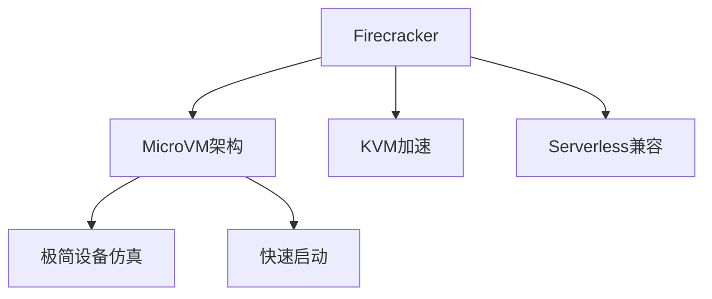

# 7.1.6.1.1.3 Firecracker原理与应用

## 1. 架构与工作原理

- 微虚拟机（MicroVM）架构，极致精简
- 仅实现必要的虚拟化功能，减少攻击面
- 主要用于Serverless平台（如AWS Lambda、Fargate）
- 快速启动、低资源占用

## 2. 关键技术

- KVM虚拟化加速
- 设备仿真最小化（仅支持必要设备）
- 快速启动与内存快照
- 安全沙箱与资源隔离

## 3. 典型应用场景

- Serverless计算平台
- 多租户高密度部署
- 边缘计算与IoT安全隔离

## 4. 性能与安全分析

| 指标     | Firecracker | 传统容器 | 虚拟机 |
|----------|-------------|----------|--------|
| 启动速度 | 极快        | 快       | 慢     |
| 资源占用 | 极低        | 低       | 高     |
| 隔离性   | 高          | 中       | 高     |
| 兼容性   | 一般        | 好       | 一般   |
| 安全性   | 高          | 中       | 高     |

**安全隔离度量：**
$$Isolation_{Firecracker} = MicroVM_{level} + Minimal_{devices}$$

**资源利用率：**
$$U_{Firecracker} = \frac{R_{used}}{R_{alloc}}$$

## 5. Mermaid结构图

## 6. 批判性分析

- **优势**：极致启动速度与资源效率，安全隔离强，适合Serverless与高密度场景。
- **局限**：功能有限，兼容性一般，部分传统容器功能缺失。
- **未来方向**：增强功能兼容性，支持更多云原生场景。

## 7. 规范说明

- 内容需递归细化，支持多表征
- 保留批判性分析、图表、符号等
- 如有遗漏，后续补全并说明
- 支持持续递归完善

> 本文件为递归细化与内容补全示范，后续可继续分解为7.1.6.1.1.3.1等子主题，支持持续递归完善。

## 7. Firecracker的递归定义

- Firecracker是一种极简微虚拟机（MicroVM）容器安全技术，专为Serverless和多租户高密度场景设计。
- 递归结构：
  - $Firecracker = (MicroVM_{minimal}, KVM_{accel}, Security_{isolation}, Serverless_{native})$

## 8. 核心架构与技术细节

- 基于KVM的极简虚拟化，最小化设备仿真，仅支持必要硬件
- 单进程管理数千MicroVM，资源占用极低
- 支持内存快照、快速启动、弹性扩缩容
- 与Kubernetes、Serverless平台（如AWS Lambda、Fargate）深度集成

## 9. 安全与性能的形式化分析

- **安全隔离度量：**
$$Isolation_{Firecracker} = MicroVM_{level} + Minimal_{devices}$$
- **性能优化目标：**
$$Perf_{Firecracker} = \max (Density) - \min (BootTime + Overhead)$$
- **资源利用率：**
$$U_{Firecracker} = \frac{R_{used}}{R_{alloc}}$$

## 10. 行业应用案例

- 云服务：AWS Lambda/Fargate大规模Serverless弹性平台
- 金融：高密度安全隔离的多租户计算环境
- 边缘计算：IoT与边缘节点的安全弹性部署

## 11. 未来趋势与挑战

- 功能增强与生态兼容性提升
- 多云Serverless与边缘智能融合
- AI驱动的自动弹性与安全检测
- 极致弹性与安全的自动化运维
- 持续递归细化与知识演化

---
> 本节为Firecracker原理与应用知识体系的递归补充，后续可继续分解为7.1.6.1.1.3.x等子主题，支持持续完善。
