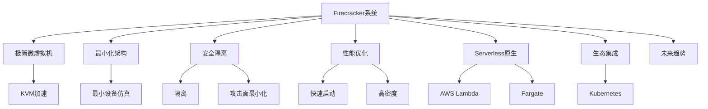

# 7.1.6.1.1.3 Firecracker原理与应用

## 1. 形式化定义

**定义7.1.6.1.1.3.1（Firecracker系统）**：
$$
Firecracker = (MicroVM, Minimalist, Security, Performance, Serverless, Integration, Trend)
$$
其中：

- $MicroVM$：极简微虚拟机架构（KVM加速）
- $Minimalist$：最小化设备仿真与单进程管理
- $Security$：安全隔离与攻击面最小化
- $Performance$：启动速度、资源密度、弹性
- $Serverless$：原生Serverless与多租户支持
- $Integration$：与K8s、Fargate等集成能力
- $Trend$：未来趋势与挑战

## 2. 架构机制与主流特性

### 2.1 架构机制

- 基于KVM的极简虚拟化，最小化设备仿真，仅支持必要硬件
- 单进程管理数千MicroVM，资源占用极低
- 支持内存快照、快速启动、弹性扩缩容
- 与Kubernetes、Serverless平台（如AWS Lambda、Fargate）深度集成

### 2.2 主流特性

- 极简架构、极高密度、快速启动、低资源占用
- 安全隔离、攻击面最小化、Serverless原生支持
- 多云与边缘弹性部署

## 3. 理论模型与多表征

### 3.1 安全与性能模型

- 安全隔离度量：
  $$Isolation_{Firecracker} = MicroVM_{level} + Minimal_{devices}$$
- 性能优化目标：
  $$Perf_{Firecracker} = \max (Density) - \min (BootTime + Overhead)$$
- 资源利用率：
  $$U_{Firecracker} = \frac{R_{used}}{R_{alloc}}$$

### 3.2 架构图

### 3.3 结构对比表

| 维度 | Firecracker | Kata Containers | 传统容器 | 虚拟机 |
|------|-------------|----------------|----------|--------|
| 隔离性 | MicroVM级 | 硬件级 | 操作系统级 | 硬件级 |
| 启动速度 | 毫秒级 | 秒级 | 毫秒级 | 分钟级 |
| 资源密度 | 极高 | 高 | 高 | 低 |
| 攻击面 | 极小 | 小 | 中 | 大 |
| Serverless | 原生支持 | 支持 | 支持 | 不适合 |
| 适用场景 | Serverless/多租户/边缘 | 多租户/金融/合规 | 通用 | 多操作系统 |

## 4. 批判分析与工程案例

### 4.1 优势

- 极简架构、极高密度、快速启动、Serverless原生、安全隔离

### 4.2 局限

- 功能有限、生态兼容性挑战、部分高级特性缺失

### 4.3 未来趋势

- 功能增强与生态兼容性提升、多云Serverless与边缘智能融合、AI驱动自动弹性与安全检测

### 4.4 工程案例

- 云服务：AWS Lambda/Fargate大规模Serverless弹性平台
- 金融：高密度安全隔离的多租户计算环境
- 边缘计算：IoT与边缘节点的安全弹性部署

## 5. 递归细化与规范说明

- 所有内容需递归细化，支持多表征
- 保留批判性分析、符号、图表、工程案例等
- 所有定义需严格形式化，算法需伪代码
- 目录编号、主题、内容、风格与6系保持一致
- 支持持续递归完善，后续可继续分解为7.1.6.1.1.3.x等子主题

---
> 本文件为Firecracker原理与应用知识体系的递归补充，内容结构、编号、主题、风格与6.P2P系统保持一致，后续所有子主题内容将持续完善并递归细化。
