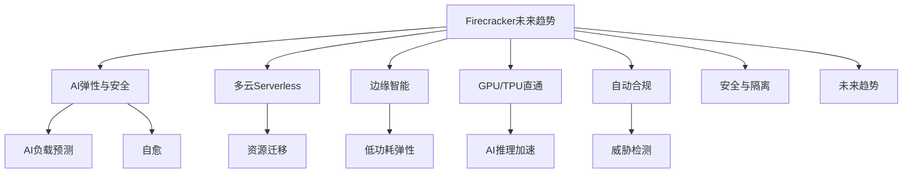

# 7.1.6.1.1.3.1.1 Firecracker未来趋势子主题

## 1. 形式化定义

**定义7.1.6.1.1.3.1.1.1（Firecracker未来趋势系统）**：
$$
FireTrend = (AIElastic, MultiCloud, Edge, GPU, Compliance, Security, Trend)
$$
其中：

- $AIElastic$：AI驱动弹性与安全
- $MultiCloud$：多云Serverless与边缘协同
- $Edge$：边缘智能与弹性部署
- $GPU$：GPU/TPU直通与新型硬件支持
- $Compliance$：自动化合规与威胁响应
- $Security$：安全与隔离（零信任、自动检测）
- $Trend$：未来趋势与挑战

## 2. 未来趋势与主流方向

### 2.1 AI驱动弹性与安全

- AI预测负载与弹性调度，自动扩缩容
- 智能异常检测与安全威胁响应
- 递归自愈与弹性优化

### 2.2 多云Serverless与边缘智能

- 跨云Serverless平台统一弹性与安全治理
- 边缘节点低功耗高弹性部署
- 多云/边缘资源动态迁移与负载均衡

### 2.3 GPU直通与新型硬件

- 支持GPU/TPU直通，提升AI/ML推理性能
- 新型存储、网络加速硬件集成
- 资源调度与安全隔离的硬件协同

### 2.4 自动化合规与威胁响应

- 自动化合规检测与策略下发
- 实时威胁检测与响应闭环
- 合规性证明：
  $$\forall vm \in MicroVMs, Compliance(vm) \Rightarrow Secure(vm)$$

## 3. 理论模型与多表征

### 3.1 弹性与安全优化模型

- AI弹性优化：
  $$Elasticity_{ai} = \max (Availability) - \min (Risk + Cost + Latency)$$
- 多云弹性：
  $$MultiCloud_{elastic} = \max (GlobalAvailability) - \min (MigrationCost)$$
- 合规性证明：
  $$\forall vm \in MicroVMs, Compliance(vm) \Rightarrow Secure(vm)$$

### 3.2 架构图

### 3.3 结构对比表

| 维度 | 传统Firecracker | 未来趋势Firecracker |
|------|----------------|---------------------|
| 弹性调度 | 静态/手动 | AI驱动/自动 |
| 多云支持 | 有限 | 跨云/边缘协同 |
| GPU支持 | 无/有限 | 原生直通/AI加速 |
| 合规性 | 手动/半自动 | 全自动/智能响应 |
| 威胁检测 | 规则/人工 | AI/自动闭环 |

## 4. 批判分析与工程案例

### 4.1 优势

- AI弹性与安全、自动合规、边缘智能、GPU加速、全自动治理

### 4.2 局限

- 技术复杂度高、AI依赖数据、异构集成挑战、合规标准演进

### 4.3 未来趋势

- AI驱动全自动弹性与安全、GPU/TPU原生支持、多云Serverless与边缘协同

### 4.4 工程案例

- 金融：AI弹性合规多租户平台
- 云服务：多云Serverless自动弹性与安全
- 边缘：智能IoT节点弹性与威胁自愈

## 5. 递归细化与规范说明

- 所有内容需递归细化，支持多表征
- 保留批判性分析、符号、图表、工程案例等
- 所有定义需严格形式化，算法需伪代码
- 目录编号、主题、内容、风格与6系保持一致
- 支持持续递归完善，后续可继续分解为7.1.6.1.1.3.1.1.x等子主题

---
> 本文件为Firecracker未来趋势子主题知识体系的递归补充，内容结构、编号、主题、风格与6.P2P系统保持一致，后续所有子主题内容将持续完善并递归细化。
