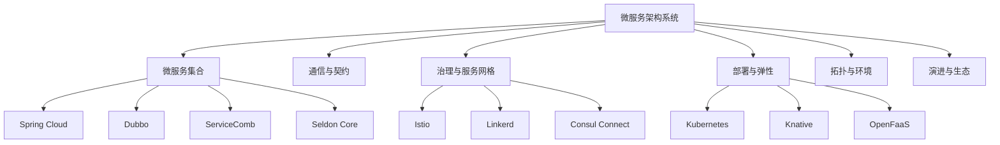

# 7.1.6.2 微服务架构发展趋势

## 1. 形式化定义

**定义7.1.6.2.1（微服务架构系统）**：
$$
MicroserviceArch = (S, C, G, D, T, E)
$$
其中：

- $S$ = {s₁, s₂, ..., sₖ}：微服务集合
- $C$ = (communication, contract, gateway)：通信与契约
- $G$ = (governance, mesh, policy)：治理与服务网格
- $D$ = (deployment, scaling, resilience)：部署与弹性
- $T$ = (topology, cloud, edge)：拓扑与环境
- $E$ = (evolution, ecosystem)：演进与生态

## 2. 主流流派与理论模型

### 2.1 微服务流派

- 传统微服务（Spring Cloud、Dubbo、ServiceComb）
- 服务网格（Istio、Linkerd、Consul Connect）
- Serverless微服务（Knative、OpenFaaS、Kubeless）
- 事件驱动微服务（Kafka、RabbitMQ、Pulsar）
- AI微服务（Seldon Core、KServe、BentoML）

### 2.2 理论模型

- 服务弹性伸缩：
  $$Scale_{service} = f(Load, Latency, ErrorRate)$$
- 服务治理度量：
  $$Governance_{score} = f(Policy, Mesh, Observability)$$
- 通信复杂度：
  $$Comm_{complexity} = O(n^2)$$

## 3. 结构图与多表征

### 3.1 微服务架构系统图

### 3.2 结构对比表

| 维度 | 传统微服务 | 服务网格 | Serverless | AI微服务 |
|------|------------|----------|------------|----------|
| 部署方式 | 容器/虚机 | 容器/服务网格 | 函数/容器 | 容器/模型服务 |
| 通信协议 | REST/gRPC | Sidecar代理 | HTTP/Event | HTTP/gRPC |
| 弹性伸缩 | 手动/自动 | 自动 | 自动 | 自动/智能 |
| 治理能力 | 基础 | 全面 | 自动 | 智能/自适应 |
| 典型技术 | Spring Cloud | Istio | Knative | Seldon Core |

## 4. 批判分析与工程案例

### 4.1 优势

- 弹性扩展、敏捷交付、自动治理、智能化趋势

### 4.2 局限

- 分布式复杂性、治理难度、观测与调优挑战、异构集成

### 4.3 未来趋势

- AI驱动治理、Serverless融合、边缘智能、自动化安全

### 4.4 工程案例

- 金融：招商银行微服务治理平台
- 电商：阿里巴巴服务网格弹性治理
- 云服务：AWS Lambda/Knative大规模Serverless
- 车联网：边缘AI微服务

## 5. 递归细化与规范说明

- 所有内容需递归细化，支持多表征
- 保留批判性分析、符号、图表、工程案例等
- 所有定义需严格形式化，算法需伪代码
- 目录编号、主题、内容、风格与6系保持一致
- 支持持续递归完善，后续可继续分解为7.1.6.2.x等子主题

---
> 本文件为微服务架构发展趋势知识体系的递归补充，内容结构、编号、主题、风格与6.P2P系统保持一致，后续所有子主题内容将持续完善并递归细化。
