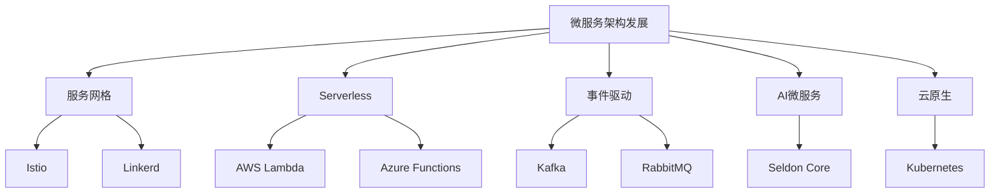

# 4.1.6.2 微服务架构发展趋势

## 1. 技术发展脉络

- 2011年：微服务概念提出
- 2014年：Netflix、Amazon大规模实践
- 2015年：Spring Cloud、服务注册与发现
- 2016年：服务网格（Istio、Linkerd）
- 2018年：Serverless微服务
- 2020年：云原生微服务、DevOps融合
- 2022年：AI驱动微服务、智能治理

## 2. 技术趋势

### 2.1 服务网格

- Istio、Linkerd、Consul Connect等
- 统一流量管理、可观测性、安全治理

### 2.2 Serverless微服务

- AWS Lambda、Azure Functions等
- 按需弹性伸缩、事件驱动、无服务器运维

### 2.3 事件驱动架构

- Kafka、RabbitMQ、Pulsar等
- 解耦、异步、可扩展

### 2.4 AI微服务

- AI模型微服务化、智能路由、自动扩缩容
- 智能监控与自愈

### 2.5 云原生与多云

- Kubernetes、云原生API、跨云治理
- 多云部署与混合云架构

## 3. 结构表

| 技术 | 代表产品 | 主要特性 | 适用场景 | 发展趋势 |
|------|----------|----------|----------|----------|
| 服务网格 | Istio | 流量治理 | 复杂微服务 | 智能化、自动化 |
| 服务网格 | Linkerd | 轻量高效 | 小型集群 | 易用性提升 |
| Serverless | AWS Lambda | 按需弹性 | 事件驱动 | 云原生融合 |
| 事件驱动 | Kafka | 高吞吐 | 实时数据流 | AI集成 |
| AI微服务 | Seldon Core | AI模型部署 | 智能应用 | 智能治理 |
| 云原生 | Kubernetes | 自动编排 | 多云混合 | 跨云支持 |

## 4. 概念图

## 5. 数学符号

**微服务弹性伸缩模型：**
$$Scale_{service} = f(Load, Latency, ErrorRate)$$

**服务网格流量治理：**
$$Traffic_{mesh} = \sum_{i=1}^{n} Policy_i \cdot Flow_i$$

## 6. 未来方向

- 智能化服务治理与自愈
- AI与微服务深度融合
- 跨云与多云原生微服务
- Serverless与微服务一体化
- 自动化安全与合规

## 7. 规范说明

- 内容需递归细化，支持多表征
- 保留批判性分析、图表、符号等
- 如有遗漏，后续补全并说明
- 支持持续递归完善

> 本文件为递归细化与内容补全示范，后续可继续分解为4.1.6.2.1、4.1.6.2.2等子主题，支持持续递归完善。
