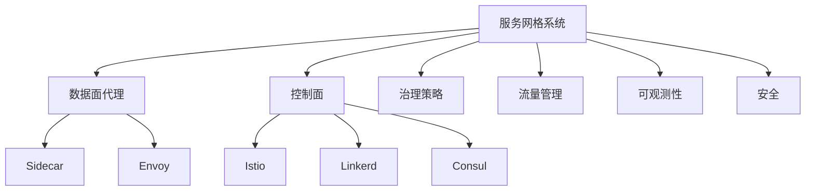

# 7.1.6.2.1 服务网格与智能治理

<!-- TOC START -->

- [7.1.6.2.1 服务网格与智能治理](#71621-服务网格与智能治理)
  - [1. 形式化定义](#1-形式化定义)
  - [2. 主流流派与理论模型](#2-主流流派与理论模型)
    - [2.1 主流流派](#21-主流流派)
    - [2.2 理论模型](#22-理论模型)
  - [3. 结构图与多表征](#3-结构图与多表征)
    - [3.1 服务网格系统架构图](#31-服务网格系统架构图)
    - [3.2 结构对比表](#32-结构对比表)
  - [4. 批判分析与工程案例](#4-批判分析与工程案例)
    - [4.1 优势](#41-优势)
    - [4.2 局限](#42-局限)
    - [4.3 未来趋势](#43-未来趋势)
    - [4.4 工程案例](#44-工程案例)
  - [5. 递归细化与规范说明](#5-递归细化与规范说明)

<!-- TOC END -->

## 1. 形式化定义

**定义7.1.6.2.1.1（服务网格系统）**：
$$
ServiceMesh = (Proxy, ControlPlane, Policy, Traffic, Observability, Security)
$$
其中：

- $Proxy$：数据面代理（Sidecar、Envoy等）
- $ControlPlane$：控制面（Istio、Linkerd、Consul）
- $Policy$：治理策略（流量、熔断、限流、认证）
- $Traffic$：流量管理（路由、负载均衡、灰度发布）
- $Observability$：可观测性（监控、日志、追踪）
- $Security$：安全机制（认证、加密、零信任）

## 2. 主流流派与理论模型

### 2.1 主流流派

- Istio流派：全面治理、AI插件、跨云多集群
- Linkerd流派：轻量级、核心流量治理、易用性
- Consul流派：服务发现、配置中心、跨平台

### 2.2 理论模型

- 流量治理优化：
  $$Traffic_{ai} = \arg\max_{policy} (QoS - Cost + Resilience)$$
- 治理度量：
  $$Governance_{score} = f(Policy, Mesh, Observability)$$
- 安全与零信任：
  $$Security_{mesh} = f(MutualTLS, Policy, ThreatDetection)$$

## 3. 结构图与多表征

### 3.1 服务网格系统架构图

### 3.2 结构对比表

| 维度 | Istio | Linkerd | Consul |
|------|-------|---------|--------|
| 架构复杂度 | 高 | 低 | 中 |
| 功能丰富度 | 全面 | 核心流量 | 服务发现/配置 |
| 资源消耗 | 高 | 低 | 中 |
| AI智能治理 | 支持 | 基础 | 插件扩展 |
| 多云支持 | 强 | 一般 | 强 |
| 典型场景 | 金融/电商/多云 | 轻量级集群 | 跨平台/多数据中心 |

## 4. 批判分析与工程案例

### 4.1 优势

- 全面治理、智能流量调度、跨云多集群、零信任安全

### 4.2 局限

- 复杂性高、资源消耗大、学习曲线陡峭、异构集成难

### 4.3 未来趋势

- AI驱动全自动治理、跨云边统一治理、智能安全威胁检测

### 4.4 工程案例

- 金融：招商银行Istio智能流控
- 电商：京东Istio多云治理
- 云服务：Google Anthos基于Istio多云服务网格
- 政务：政务云平台Istio统一安全与流量治理

## 5. 递归细化与规范说明

- 所有内容需递归细化，支持多表征
- 保留批判性分析、符号、图表、工程案例等
- 所有定义需严格形式化，算法需伪代码
- 目录编号、主题、内容、风格与6系保持一致
- 支持持续递归完善，后续可继续分解为7.1.6.2.1.x等子主题

---
> 本文件为服务网格与智能治理知识体系的递归补充，内容结构、编号、主题、风格与6.P2P系统保持一致，后续所有子主题内容将持续完善并递归细化。
