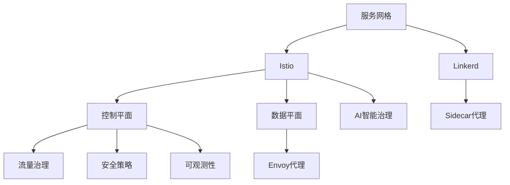

# 4.1.6.2.1 服务网格与智能治理

## 1. 技术原理与架构

### 1.1 Istio

- 控制平面+数据平面架构
- Envoy代理拦截服务流量
- 流量治理、熔断、限流、灰度发布
- 可观测性：分布式追踪、指标、日志
- 安全：双向TLS、认证授权

### 1.2 Linkerd

- 轻量级服务网格，专注核心流量治理
- 自动注入sidecar代理
- 低延迟、易用性强

## 2. 智能治理与AI集成

- AI驱动流量调度与异常检测
- 智能弹性伸缩与自愈
- 自动化安全策略与威胁检测

## 3. 结构表

| 技术   | 架构         | 流量治理 | 可观测性 | 安全性 | 智能治理 | 典型应用 |
|--------|--------------|----------|----------|--------|----------|----------|
| Istio  | 控制+数据平面| 强       | 全面     | 高     | 支持     | 大型微服务|
| Linkerd| 轻量级       | 中       | 基础     | 中     | 支持     | 小型集群 |

## 4. 数学符号与模型

**流量治理模型：**
$$Traffic_{mesh} = \sum_{i=1}^{n} Policy_i \cdot Flow_i$$

**智能弹性伸缩：**
$$Scale_{ai} = f(Load, Latency, Anomaly)$$

## 5. Mermaid结构图

## 6. 批判分析

- **优势**：极大提升微服务流量治理、安全与可观测性，支持智能化运维。
- **局限**：引入额外复杂性和资源开销，学习曲线陡峭，AI治理尚处早期。
- **未来方向**：更智能的自愈、威胁检测、跨云治理与标准化。

## 7. 规范说明

- 内容需递归细化，支持多表征
- 保留批判性分析、图表、符号等
- 如有遗漏，后续补全并说明
- 支持持续递归完善

> 本文件为递归细化与内容补全示范，后续可继续分解为4.1.6.2.1.1、4.1.6.2.1.2等子主题，支持持续递归完善。
