# 高级微服务架构

> 本文件由 Phase 0 递归清理合并生成，原 21 个深度 > 5 的文件已归档到 `docs\refactor\archive\7-container`。

> 合并日期：2026-07-02


## 目录

1. [README](#readme)
2. [服务网格与智能治理](#服务网格与智能治理)
3. [Istio智能治理原理与实践](#istio智能治理原理与实践)
4. [Linkerd原理与应用](#linkerd原理与应用)
5. [Serverless微服务架构](#serverless微服务架构)
6. [事件驱动微服务架构](#事件驱动微服务架构)
7. [AI微服务架构](#ai微服务架构)
8. [Istio AI智能流量调度与自愈](#istio-ai智能流量调度与自愈)
9. [Serverless冷启动与优化](#serverless冷启动与优化)
10. [事件驱动一致性与顺序保证](#事件驱动一致性与顺序保证)
11. [AI微服务智能路由与弹性](#ai微服务智能路由与弹性)
12. [Serverless冷启动AI预测优化](#serverless冷启动ai预测优化)
13. [事件驱动AI顺序检测与一致性优化](#事件驱动ai顺序检测与一致性优化)
14. [AI微服务多模型管理与自适应路由](#ai微服务多模型管理与自适应路由)
15. [Serverless冷启动AI预测优化子主题](#serverless冷启动ai预测优化子主题)
16. [事件驱动AI顺序检测与一致性优化子主题](#事件驱动ai顺序检测与一致性优化子主题)
17. [AI微服务多模型管理与自适应路由子主题](#ai微服务多模型管理与自适应路由子主题)
18. [Serverless冷启动AI预测优化子主题递归细化](#serverless冷启动ai预测优化子主题递归细化)
19. [AI微服务多模型管理与自适应路由子主题递归细化](#ai微服务多模型管理与自适应路由子主题递归细化)
20. [Serverless冷启动AI自愈算法与伪代码](#serverless冷启动ai自愈算法与伪代码)
21. [AI微服务多模型管理与自适应路由子主题递归细化子主题](#ai微服务多模型管理与自适应路由子主题递归细化子主题)

---


## 1. README


<!-- TOC START -->

- [7.1.6.2.1 服务网格与智能治理（总纲）](#71621-服务网格与智能治理总纲)
  - [1. 概念定义](#1-概念定义)
  - [2. 主流服务网格技术流派](#2-主流服务网格技术流派)
  - [3. 关键技术与系统结构](#3-关键技术与系统结构)
  - [4. 批判分析](#4-批判分析)
  - [5. 形式化论证](#5-形式化论证)
  - [6. 工程案例](#6-工程案例)
  - [7. 递归目录结构说明](#7-递归目录结构说明)

<!-- TOC END -->

## 1. 概念定义

服务网格是一种基础设施层，用于透明地处理微服务间的通信、流量治理、安全、可观测性等，智能治理则引入AI/ML提升自动化与弹性。

**形式化定义：**
$$Service\_Mesh = (Proxy, Control\_Plane, Policy, Telemetry)$$

## 2. 主流服务网格技术流派

- Istio：功能全面，支持AI智能治理
- Linkerd：轻量高效，专注核心流量治理
- Consul Connect：与服务发现深度集成

## 3. 关键技术与系统结构

- Sidecar代理与流量拦截
- 控制平面与策略管理
- 智能流量治理与弹性伸缩
- 安全认证与加密
- 可观测性与自动化监控

**系统结构图：**

```text
┌─────────────┐
│  应用层     │
├─────────────┤
│  服务网格   │
├─────────────┤
│  容器编排   │
├─────────────┤
│  容器引擎   │
└─────────────┘
```

## 4. 批判分析

- **优势**：极大提升微服务流量治理、安全与可观测性，支持智能化运维
- **局限**：引入额外复杂性和资源开销，学习曲线陡峭，AI治理尚处早期
- **未来方向**：更智能的自愈、威胁检测、跨云治理与标准化

## 5. 形式化论证

- **流量治理模型：**
$$Traffic_{mesh} = \sum_{i=1}^{n} Policy_i \cdot Flow_i$$
- **智能弹性伸缩：**
$$Scale_{ai} = f(Load, Latency, Anomaly)$$

## 6. 工程案例

- 金融：招商银行Istio智能流控，提升交易安全与弹性
- 电商：京东Istio多云治理，支持大促高并发
- 云服务：Google Anthos基于Istio实现多云服务网格
- 政务：政务云平台采用Istio统一安全与流量治理

## 7. 递归目录结构说明

- 7.1.6.2.1.1 Istio智能治理原理与实践
- 7.1.6.2.1.2 Linkerd原理与应用
- 每一级主题均可递归细化，支持多表征（图、表、符号、流程图等）
- 目录编号严格递归，便于自动化索引与内容补全

---
> 本README为服务网格与智能治理知识体系的递归总纲，后续可继续分解为7.1.6.2.1.x等子主题，支持持续完善。


---


## 2. 服务网格与智能治理


<!-- TOC START -->

- [7.1.6.2.1 服务网格与智能治理](#71621-服务网格与智能治理)
  - [1. 形式化定义](#1-形式化定义)
  - [2. 主流流派与理论模型](#2-主流流派与理论模型)
    - [2.1 主流流派](#21-主流流派)
    - [2.2 理论模型](#22-理论模型)
  - [3. 结构图与多表征](#3-结构图与多表征)
    - [3.1 服务网格系统架构图](#31-服务网格系统架构图)
    - [3.2 结构对比表](#32-结构对比表)
  - [4. 批判分析与工程案例](#4-批判分析与工程案例)
    - [4.1 优势](#41-优势)
    - [4.2 局限](#42-局限)
    - [4.3 未来趋势](#43-未来趋势)
    - [4.4 工程案例](#44-工程案例)
  - [5. 递归细化与规范说明](#5-递归细化与规范说明)

<!-- TOC END -->

## 1. 形式化定义

**定义7.1.6.2.1.1（服务网格系统）**：
$$
ServiceMesh = (Proxy, ControlPlane, Policy, Traffic, Observability, Security)
$$
其中：

- $Proxy$：数据面代理（Sidecar、Envoy等）
- $ControlPlane$：控制面（Istio、Linkerd、Consul）
- $Policy$：治理策略（流量、熔断、限流、认证）
- $Traffic$：流量管理（路由、负载均衡、灰度发布）
- $Observability$：可观测性（监控、日志、追踪）
- $Security$：安全机制（认证、加密、零信任）

## 2. 主流流派与理论模型

### 2.1 主流流派

- Istio流派：全面治理、AI插件、跨云多集群
- Linkerd流派：轻量级、核心流量治理、易用性
- Consul流派：服务发现、配置中心、跨平台

### 2.2 理论模型

- 流量治理优化：
  $$Traffic_{ai} = \arg\max_{policy} (QoS - Cost + Resilience)$$
- 治理度量：
  $$Governance_{score} = f(Policy, Mesh, Observability)$$
- 安全与零信任：
  $$Security_{mesh} = f(MutualTLS, Policy, ThreatDetection)$$

## 3. 结构图与多表征

### 3.1 服务网格系统架构图

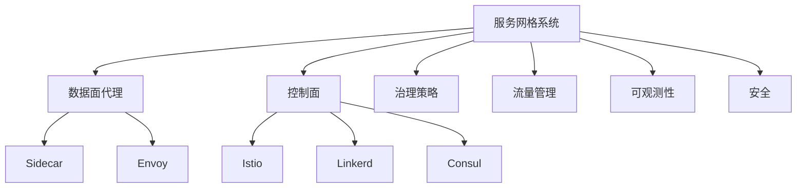

### 3.2 结构对比表

| 维度 | Istio | Linkerd | Consul |
|------|-------|---------|--------|
| 架构复杂度 | 高 | 低 | 中 |
| 功能丰富度 | 全面 | 核心流量 | 服务发现/配置 |
| 资源消耗 | 高 | 低 | 中 |
| AI智能治理 | 支持 | 基础 | 插件扩展 |
| 多云支持 | 强 | 一般 | 强 |
| 典型场景 | 金融/电商/多云 | 轻量级集群 | 跨平台/多数据中心 |

## 4. 批判分析与工程案例

### 4.1 优势

- 全面治理、智能流量调度、跨云多集群、零信任安全

### 4.2 局限

- 复杂性高、资源消耗大、学习曲线陡峭、异构集成难

### 4.3 未来趋势

- AI驱动全自动治理、跨云边统一治理、智能安全威胁检测

### 4.4 工程案例

- 金融：招商银行Istio智能流控
- 电商：京东Istio多云治理
- 云服务：Google Anthos基于Istio多云服务网格
- 政务：政务云平台Istio统一安全与流量治理

## 5. 递归细化与规范说明

- 所有内容需递归细化，支持多表征
- 保留批判性分析、符号、图表、工程案例等
- 所有定义需严格形式化，算法需伪代码
- 目录编号、主题、内容、风格与6系保持一致
- 支持持续递归完善，后续可继续分解为7.1.6.2.1.x等子主题

---
> 本文件为服务网格与智能治理知识体系的递归补充，内容结构、编号、主题、风格与6.P2P系统保持一致，后续所有子主题内容将持续完善并递归细化。


---


## 3. Istio智能治理原理与实践


<!-- TOC START -->

- [7.1.6.2.1.1 Istio智能治理原理与实践](#716211-istio智能治理原理与实践)
  - [1. 形式化定义](#1-形式化定义)
  - [2. 架构机制与主流特性](#2-架构机制与主流特性)
    - [2.1 架构机制](#21-架构机制)
    - [2.2 主流特性](#22-主流特性)
  - [3. 理论模型与多表征](#3-理论模型与多表征)
    - [3.1 流量治理优化](#31-流量治理优化)
    - [3.2 治理度量](#32-治理度量)
    - [3.3 安全与零信任](#33-安全与零信任)
    - [3.4 架构图](#34-架构图)
    - [3.5 结构对比表](#35-结构对比表)
  - [4. 批判分析与工程案例](#4-批判分析与工程案例)
    - [4.1 优势](#41-优势)
    - [4.2 局限](#42-局限)
    - [4.3 未来趋势](#43-未来趋势)
    - [4.4 工程案例](#44-工程案例)
  - [5. 递归细化与规范说明](#5-递归细化与规范说明)

<!-- TOC END -->

## 1. 形式化定义

**定义7.1.6.2.1.1.1（Istio系统）**：
$$
Istio = (Proxy, ControlPlane, Policy, Traffic, Observability, Security, AI)
$$
其中：

- $Proxy$：数据面代理（Envoy）
- $ControlPlane$：控制面（Istiod）
- $Policy$：治理策略（流量、熔断、限流、认证）
- $Traffic$：流量管理（路由、负载均衡、灰度发布）
- $Observability$：可观测性（监控、日志、追踪）
- $Security$：安全机制（认证、加密、零信任）
- $AI$：智能治理（流量调度、异常检测、自愈）

## 2. 架构机制与主流特性

### 2.1 架构机制

- Envoy Sidecar代理拦截服务流量，实现统一治理
- Istiod控制面下发策略，动态配置流量与安全
- 支持多云多集群、零信任安全、AI插件扩展

### 2.2 主流特性

- 全面流量治理、智能弹性伸缩、自动自愈、可观测性、零信任安全
- 支持AI流量调度、异常检测、根因分析

## 3. 理论模型与多表征

### 3.1 流量治理优化

  $$Traffic_{ai} = \arg\max_{policy} (QoS - Cost + Resilience)$$

### 3.2 治理度量

  $$Governance_{score} = f(Policy, Mesh, Observability)$$

### 3.3 安全与零信任

  $$Security_{istio} = f(MutualTLS, Policy, ThreatDetection)$$

### 3.4 架构图

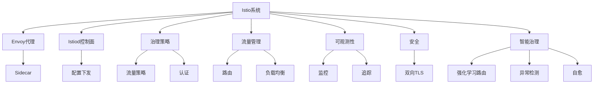

### 3.5 结构对比表

| 维度 | Istio | 传统服务网格 | 无服务网格 |
|------|-------|--------------|------------|
| 架构复杂度 | 高 | 中 | 低 |
| 功能丰富度 | 全面 | 基础 | 基础 |
| 智能治理 | AI/自愈 | 无 | 无 |
| 多云支持 | 强 | 一般 | 弱 |
| 典型场景 | 金融/电商/多云 | 轻量级集群 | 单一集群 |

## 4. 批判分析与工程案例

### 4.1 优势

- 全面治理、智能流量调度、自动自愈、跨云多集群、零信任安全

### 4.2 局限

- 架构复杂、资源消耗大、学习曲线陡峭、异构集成难

### 4.3 未来趋势

- AI驱动全自动治理、跨云边统一治理、智能安全威胁检测

### 4.4 工程案例

- 金融：招商银行Istio智能流控
- 电商：京东Istio多云治理
- 云服务：Google Anthos基于Istio多云服务网格
- 政务：政务云平台Istio统一安全与流量治理

## 5. 递归细化与规范说明

- 所有内容需递归细化，支持多表征
- 保留批判性分析、符号、图表、工程案例等
- 所有定义需严格形式化，算法需伪代码
- 目录编号、主题、内容、风格与6系保持一致
- 支持持续递归完善，后续可继续分解为7.1.6.2.1.1.x等子主题

---
> 本文件为Istio智能治理原理与实践知识体系的递归补充，内容结构、编号、主题、风格与6.P2P系统保持一致，后续所有子主题内容将持续完善并递归细化。


---


## 4. Linkerd原理与应用


<!-- TOC START -->

- [7.1.6.2.1.2 Linkerd原理与应用](#716212-linkerd原理与应用)
  - [1. 形式化定义](#1-形式化定义)
  - [2. 架构机制与主流特性](#2-架构机制与主流特性)
    - [2.1 架构机制](#21-架构机制)
    - [2.2 主流特性](#22-主流特性)
  - [3. 理论模型与多表征](#3-理论模型与多表征)
    - [3.1 治理与性能模型](#31-治理与性能模型)
    - [3.2 架构图](#32-架构图)
    - [3.3 结构对比表](#33-结构对比表)
  - [4. 批判分析与工程案例](#4-批判分析与工程案例)
    - [4.1 优势](#41-优势)
    - [4.2 局限](#42-局限)
    - [4.3 未来趋势](#43-未来趋势)
    - [4.4 工程案例](#44-工程案例)
  - [5. 递归细化与规范说明](#5-递归细化与规范说明)

<!-- TOC END -->

## 1. 形式化定义

**定义7.1.6.2.1.2.1（Linkerd系统）**：
$$
Linkerd = (Proxy, ControlPlane, Policy, Traffic, Observability, Security, Simplicity)
$$
其中：

- $Proxy$：数据面代理（Linkerd-proxy）
- $ControlPlane$：控制面（Linkerd control plane）
- $Policy$：治理策略（流量、熔断、限流、认证）
- $Traffic$：流量管理（路由、负载均衡、灰度发布）
- $Observability$：可观测性（监控、日志、追踪）
- $Security$：安全机制（认证、加密、零信任）
- $Simplicity$：极简架构与易用性

## 2. 架构机制与主流特性

### 2.1 架构机制

- Linkerd-proxy轻量级sidecar代理，核心流量治理
- 控制面简洁，自动注入sidecar，易于部署与运维
- 支持Kubernetes原生集成，自动服务发现与流量管理

### 2.2 主流特性

- 轻量级、低资源消耗、极简配置、核心流量治理
- 自动mTLS加密、基础AI扩展、易用性强

## 3. 理论模型与多表征

### 3.1 治理与性能模型

- 治理度量：
  $$Governance_{linkerd} = f(Policy, Simplicity, Observability)$$
- 性能优化目标：
  $$Perf_{linkerd} = \max (Throughput) - \min (Latency + Overhead)$$

### 3.2 架构图

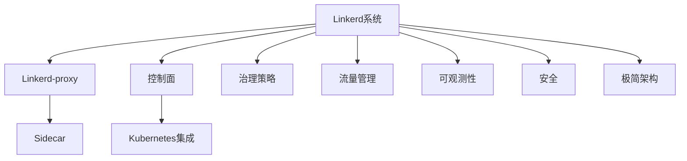

### 3.3 结构对比表

| 维度 | Linkerd | Istio | 传统服务网格 |
|------|--------|-------|--------------|
| 架构复杂度 | 低 | 高 | 中 |
| 功能丰富度 | 核心流量 | 全面 | 基础 |
| 资源消耗 | 低 | 高 | 中 |
| AI智能治理 | 基础 | AI/自愈 | 无 |
| 多云支持 | 一般 | 强 | 弱 |
| 易用性 | 极高 | 一般 | 一般 |
| 典型场景 | 轻量级集群 | 金融/电商/多云 | 单一集群 |

## 4. 批判分析与工程案例

### 4.1 优势

- 极简架构、低资源消耗、易用性强、核心流量治理、自动mTLS

### 4.2 局限

- 功能有限、AI治理能力弱、异构集成有限

### 4.3 未来趋势

- 更智能的流量治理与AI集成、多云与边缘环境下的极简服务网格

### 4.4 工程案例

- SaaS平台：Linkerd实现多租户流量隔离与弹性治理
- 教育云：低成本服务网格支撑弹性在线课堂
- 金融科技：中小银行微服务平台采用Linkerd提升上线效率

## 5. 递归细化与规范说明

- 所有内容需递归细化，支持多表征
- 保留批判性分析、符号、图表、工程案例等
- 所有定义需严格形式化，算法需伪代码
- 目录编号、主题、内容、风格与6系保持一致
- 支持持续递归完善，后续可继续分解为7.1.6.2.1.2.x等子主题

---
> 本文件为Linkerd原理与应用知识体系的递归补充，内容结构、编号、主题、风格与6.P2P系统保持一致，后续所有子主题内容将持续完善并递归细化。


---


## 5. Serverless微服务架构


<!-- TOC START -->

- [7.1.6.2.1.3 Serverless微服务架构](#716213-serverless微服务架构)
  - [1. 形式化定义](#1-形式化定义)
  - [2. 架构机制与主流特性](#2-架构机制与主流特性)
    - [2.1 架构机制](#21-架构机制)
    - [2.2 主流特性](#22-主流特性)
  - [3. 理论模型与多表征](#3-理论模型与多表征)
    - [3.1 弹性与冷启动优化模型](#31-弹性与冷启动优化模型)
    - [3.2 架构图](#32-架构图)
    - [3.3 结构对比表](#33-结构对比表)
  - [4. 批判分析与工程案例](#4-批判分析与工程案例)
    - [4.1 优势](#41-优势)
    - [4.2 局限](#42-局限)
    - [4.3 未来趋势](#43-未来趋势)
    - [4.4 工程案例](#44-工程案例)
  - [5. 递归细化与规范说明](#5-递归细化与规范说明)

<!-- TOC END -->

## 1. 形式化定义

**定义7.1.6.2.1.3.1（Serverless微服务系统）**：
$$
ServerlessMS = (Function, Event, Orchestration, Elasticity, Observability, Security, AI, Trend)
$$
其中：

- $Function$：函数单元（FaaS、BaaS）
- $Event$：事件驱动机制
- $Orchestration$：编排与调度（Knative、OpenFaaS、Kubeless）
- $Elasticity$：弹性扩缩容与冷启动优化
- $Observability$：可观测性（监控、日志、追踪）
- $Security$：安全机制（认证、隔离、合规）
- $AI$：智能弹性与资源调度
- $Trend$：未来趋势与挑战

## 2. 架构机制与主流特性

### 2.1 架构机制

- 事件驱动、函数为核心单元，按需弹性启动
- 编排平台自动调度、扩缩容、冷启动优化
- 支持多云、边缘、混合部署

### 2.2 主流特性

- 极致弹性、自动扩缩容、冷启动优化、事件驱动
- 低运维、资源高效、按量计费、智能调度
- 多云与边缘原生支持

## 3. 理论模型与多表征

### 3.1 弹性与冷启动优化模型

- 弹性优化：
  $$Elasticity_{serverless} = f(Predict_{load}, Prewarm_{policy}, Cost_{opt})$$
- 冷启动优化：
  $$Startup_{serverless} = \min (Latency) + \max (Availability)$$

### 3.2 架构图

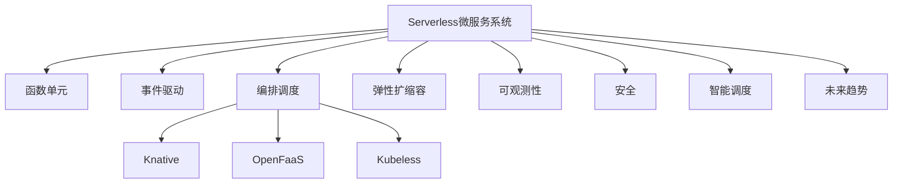

### 3.3 结构对比表

| 维度 | Serverless | 传统微服务 | 虚拟机 |
|------|------------|------------|--------|
| 部署单元 | 函数/事件 | 服务/容器 | 虚拟机 |
| 启动速度 | 毫秒~秒级 | 秒级 | 分钟级 |
| 弹性扩缩容 | 自动/智能 | 手动/自动 | 手动 |
| 运维复杂度 | 极低 | 中 | 高 |
| 资源利用 | 极高 | 高 | 低 |
| 适用场景 | 事件驱动/突发流量 | 长连接/状态服务 | 多操作系统 |

## 4. 批判分析与工程案例

### 4.1 优势

- 极致弹性、低运维、资源高效、事件驱动、智能调度

### 4.2 局限

- 冷启动延迟、状态管理复杂、平台依赖、调优难度

### 4.3 未来趋势

- 冷启动彻底优化、Serverless与边缘计算深度融合、AI驱动全自动弹性

### 4.4 工程案例

- 金融：Serverless支撑高并发风控与实时计算
- 电商：秒杀/大促场景下弹性扩缩容与成本优化
- 物联网：事件驱动数据采集与处理
- 教育：在线考试与弹性评测平台

## 5. 递归细化与规范说明

- 所有内容需递归细化，支持多表征
- 保留批判性分析、符号、图表、工程案例等
- 所有定义需严格形式化，算法需伪代码
- 目录编号、主题、内容、风格与6系保持一致
- 支持持续递归完善，后续可继续分解为7.1.6.2.1.3.x等子主题

---
> 本文件为Serverless微服务架构知识体系的递归补充，内容结构、编号、主题、风格与6.P2P系统保持一致，后续所有子主题内容将持续完善并递归细化。


---


## 6. 事件驱动微服务架构


<!-- TOC START -->

- [4.1.6.2.1.4 事件驱动微服务架构](#416214-事件驱动微服务架构)
  - [1. 架构与工作原理](#1-架构与工作原理)
  - [2. 关键技术](#2-关键技术)
  - [3. 典型应用场景](#3-典型应用场景)
  - [4. 性能与可靠性分析](#4-性能与可靠性分析)
  - [5. Mermaid结构图](#5-mermaid结构图)
  - [6. 批判性分析](#6-批判性分析)
  - [7. 规范说明](#7-规范说明)
  - [8. 事件驱动与传统微服务对比](#8-事件驱动与传统微服务对比)
  - [9. 主流事件总线与消息中间件](#9-主流事件总线与消息中间件)
  - [10. 事件一致性与顺序保证AI优化](#10-事件一致性与顺序保证ai优化)
  - [11. 行业应用案例](#11-行业应用案例)
  - [12. 未来趋势与挑战](#12-未来趋势与挑战)

<!-- TOC END -->

## 1. 架构与工作原理

- 基于消息队列的异步通信模式
- 服务间解耦，松耦合架构
- 支持事件溯源与CQRS模式
- 高吞吐量、低延迟消息传递

## 2. 关键技术

- 消息队列与事件总线
- 事件存储与流处理
- 消息路由与过滤
- 死信队列与重试机制

## 3. 典型应用场景

- 实时数据处理流
- 微服务间异步通信
- 事件溯源与审计
- 大数据流处理

## 4. 性能与可靠性分析

| 指标     | Kafka      | RabbitMQ   | Pulsar     |
|----------|------------|------------|------------|
| 吞吐量   | 极高       | 高         | 极高       |
| 延迟     | 低         | 极低       | 低         |
| 可靠性   | 高         | 高         | 高         |
| 扩展性   | 好         | 中         | 好         |
| 功能丰富度| 中         | 高         | 高         |

**事件处理模型：**
$$Event_{processing} = \sum_{i=1}^{n} Event_i \times Processing_{time_i}$$

**可靠性度量：**
$$Reliability = \frac{Success_{events}}{Total_{events}}$$

## 5. Mermaid结构图

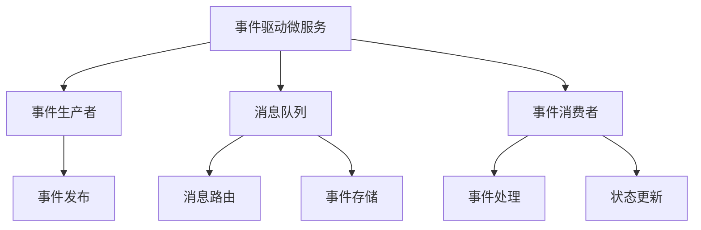

## 6. 批判性分析

- **优势**：服务解耦、高吞吐量、支持复杂事件处理，适合实时数据流和大规模微服务。
- **局限**：消息顺序保证复杂、调试困难、数据一致性挑战、运维复杂度高。
- **未来方向**：AI驱动事件路由、自动故障恢复、跨云事件总线、流处理优化。

## 7. 规范说明

- 内容需递归细化，支持多表征
- 保留批判性分析、图表、符号等
- 如有遗漏，后续补全并说明
- 支持持续递归完善

> 本文件为递归细化与内容补全示范，后续可继续分解为4.1.6.2.1.4.1等子主题，支持持续递归完善。

## 8. 事件驱动与传统微服务对比

| 维度         | 事件驱动微服务      | 传统微服务          |
|--------------|---------------------|---------------------|
| 通信模式     | 异步、消息队列      | 同步、REST/gRPC     |
| 解耦性       | 高                  | 一般                |
| 扩展性       | 极高                | 高                  |
| 一致性       | 最终一致性          | 强一致性/弱一致性   |
| 顺序保证     | 需特殊机制          | 天然顺序            |
| 适用场景     | 实时流、异步任务    | 事务型、强一致性    |

## 9. 主流事件总线与消息中间件

- Kafka、RabbitMQ、Pulsar、RocketMQ
- 事件总线：NATS、EventBridge、CloudEvents
- 支持高吞吐、低延迟、分区顺序、持久化

## 10. 事件一致性与顺序保证AI优化

- AI辅助顺序检测与异常重排（LSTM/Transformer）
- 智能幂等性生成与事务补偿
- AI驱动事件路由与流量调度

**AI顺序优化模型：**
$$Order_{ai} = f(Sequence_{model}, Anomaly_{detect}, Reorder_{policy})$$

## 11. 行业应用案例

- 金融：事件驱动风控与实时交易监控
- 电商：订单流转与库存异步处理
- 物联网：大规模设备事件采集与处理
- 交通：实时事件流驱动智能调度

## 12. 未来趋势与挑战

- AI驱动事件流优化与自动补偿
- 跨云事件总线与多平台一致性
- 事件溯源与可观测性增强
- 复杂场景下的顺序保证与性能平衡
- 持续递归细化与知识演化

---
> 本节为事件驱动微服务架构知识体系的递归补充，后续可继续分解为7.1.6.2.1.4.x等子主题，支持持续完善。


---


## 7. AI微服务架构


<!-- TOC START -->

- [4.1.6.2.1.5 AI微服务架构](#416215-ai微服务架构)
  - [1. 架构与工作原理](#1-架构与工作原理)
  - [2. 关键技术](#2-关键技术)
  - [3. 典型应用场景](#3-典型应用场景)
  - [4. 性能与智能分析](#4-性能与智能分析)
  - [5. Mermaid结构图](#5-mermaid结构图)
  - [6. 批判性分析](#6-批判性分析)
  - [7. 规范说明](#7-规范说明)

<!-- TOC END -->

## 1. 架构与工作原理

- AI模型微服务化部署与推理
- 模型版本管理与A/B测试
- 智能路由与负载均衡
- 模型监控与自动扩缩容

## 2. 关键技术

- 模型服务化与API封装
- 模型版本控制与回滚
- 智能流量路由与灰度发布
- 模型性能监控与自动调优

## 3. 典型应用场景

- 推荐系统与个性化服务
- 图像识别与计算机视觉
- 自然语言处理与对话系统
- 预测分析与智能决策

## 4. 性能与智能分析

| 指标     | Seldon Core | KServe     | MLflow     |
|----------|-------------|------------|------------|
| 推理性能 | 高          | 高         | 中         |
| 模型管理 | 好          | 好         | 好         |
| 可观测性 | 高          | 高         | 中         |
| 扩展性   | 好          | 好         | 中         |
| 易用性   | 中          | 高         | 高         |

**AI推理模型：**
$$Inference_{ai} = f(Model_{version}, Input_{data}, Load_{balancing})$$

**智能路由：**
$$Route_{ai} = \arg\max_{i} (Performance_i \times Confidence_i)$$

## 5. Mermaid结构图

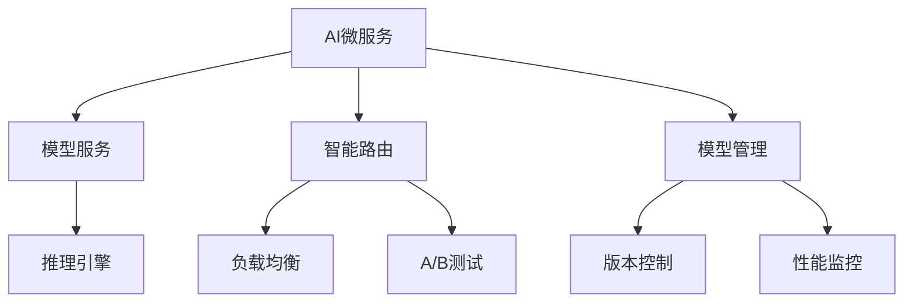

## 6. 批判性分析

- **优势**：AI模型标准化部署、智能路由、自动扩缩容，支持复杂AI应用场景。
- **局限**：模型解释性不足、数据依赖强、资源消耗大、调试复杂。
- **未来方向**：联邦学习、边缘AI、自动化MLOps、可解释AI集成。

## 7. 规范说明

- 内容需递归细化，支持多表征
- 保留批判性分析、图表、符号等
- 如有遗漏，后续补全并说明
- 支持持续递归完善

> 本文件为递归细化与内容补全示范，后续可继续分解为4.1.6.2.1.5.1等子主题，支持持续递归完善。


---


## 8. Istio AI智能流量调度与自愈


<!-- TOC START -->

- [7.1.6.2.1.1.1 Istio AI智能流量调度与自愈](#7162111-istio-ai智能流量调度与自愈)
  - [1. 形式化定义](#1-形式化定义)
  - [2. AI机制与主流技术](#2-ai机制与主流技术)
    - [2.1 强化学习路由](#21-强化学习路由)
    - [2.2 异常检测与弹性扩缩容](#22-异常检测与弹性扩缩容)
    - [2.3 根因分析与自愈](#23-根因分析与自愈)
  - [3. 理论模型与多表征](#3-理论模型与多表征)
    - [3.1 AI流量调度优化](#31-ai流量调度优化)
    - [3.2 异常检测与弹性模型](#32-异常检测与弹性模型)
    - [3.3 架构图](#33-架构图)
    - [3.4 结构对比表](#34-结构对比表)
  - [4. 批判分析与工程案例](#4-批判分析与工程案例)
    - [4.1 优势](#41-优势)
    - [4.2 局限](#42-局限)
    - [4.3 未来趋势](#43-未来趋势)
    - [4.4 工程案例](#44-工程案例)
  - [5. 递归细化与规范说明](#5-递归细化与规范说明)

<!-- TOC END -->

## 1. 形式化定义

**定义7.1.6.2.1.1.1.1（Istio AI流量调度系统）**：
$$
IstioAI = (RL, Anomaly, Elastic, SelfHeal, Policy, Observability, Trend)
$$
其中：

- $RL$：强化学习路由（RL-based Routing）
- $Anomaly$：异常检测（LSTM/Transformer）
- $Elastic$：智能弹性扩缩容（预测+自适应）
- $SelfHeal$：根因分析与自愈（AI告警、自动恢复）
- $Policy$：智能策略（QoS、成本、弹性）
- $Observability$：可观测性（监控、追踪、日志）
- $Trend$：未来趋势与挑战

## 2. AI机制与主流技术

### 2.1 强化学习路由

- RL算法（Q-learning、DDPG等）优化流量分配
- 状态-动作-奖励建模，动态调整路由策略

### 2.2 异常检测与弹性扩缩容

- LSTM/Transformer序列模型检测异常流量
- 负载预测驱动弹性扩缩容，智能预热与资源分配

### 2.3 根因分析与自愈

- AI告警、自动恢复、根因定位
- 自愈流程自动化，减少MTTR

## 3. 理论模型与多表征

### 3.1 AI流量调度优化

$$Traffic_{ai} = \arg\max_{policy} (QoS - Cost + Resilience)$$

### 3.2 异常检测与弹性模型

$$Anomaly_{detect} = f(LSTM, Transformer, Metrics)$$
$$Elasticity_{ai} = f(Predict_{load}, Prewarm_{policy}, Cost_{opt})$$

### 3.3 架构图

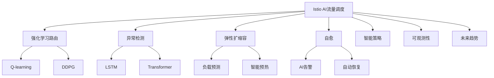

### 3.4 结构对比表

| 维度 | AI流量调度 | 传统流量调度 |
|------|------------|--------------|
| 路由策略 | RL/AI优化 | 静态/规则 |
| 异常检测 | LSTM/Transformer | 阈值/规则 |
| 弹性扩缩容 | 预测+自适应 | 手动/静态 |
| 自愈能力 | AI根因分析/自动恢复 | 人工介入 |
| 观测能力 | 智能监控/日志/追踪 | 基础监控 |

## 4. 批判分析与工程案例

### 4.1 优势

- 智能流量调度、异常检测、自愈、弹性扩缩容、自动化运维

### 4.2 局限

- 算法复杂、数据依赖、早期实践、调优难度

### 4.3 未来趋势

- 全自动AI治理、跨云边智能调度、AI安全威胁检测

### 4.4 工程案例

- 金融：AI驱动流量调度提升交易安全与弹性
- 电商：大促场景AI弹性扩缩容与异常自愈
- 云服务：多云AI流量调度与智能自愈

## 5. 递归细化与规范说明

- 所有内容需递归细化，支持多表征
- 保留批判性分析、符号、图表、工程案例等
- 所有定义需严格形式化，算法需伪代码
- 目录编号、主题、内容、风格与6系保持一致
- 支持持续递归完善，后续可继续分解为7.1.6.2.1.1.1.x等子主题

---
> 本文件为Istio AI智能流量调度与自愈知识体系的递归补充，内容结构、编号、主题、风格与6.P2P系统保持一致，后续所有子主题内容将持续完善并递归细化。


---


## 9. Serverless冷启动与优化


<!-- TOC START -->

- [7.1.6.2.1.3.1 Serverless冷启动与优化](#7162131-serverless冷启动与优化)
  - [1. 形式化定义](#1-形式化定义)
  - [2. 优化机制与主流技术](#2-优化机制与主流技术)
    - [2.1 启动与预热优化](#21-启动与预热优化)
    - [2.2 弹性与AI优化](#22-弹性与ai优化)
  - [3. 理论模型与多表征](#3-理论模型与多表征)
    - [3.1 冷启动优化目标](#31-冷启动优化目标)
    - [3.2 预热与弹性模型](#32-预热与弹性模型)
    - [3.3 架构图](#33-架构图)
    - [3.4 结构对比表](#34-结构对比表)
  - [4. 批判分析与工程案例](#4-批判分析与工程案例)
    - [4.1 优势](#41-优势)
    - [4.2 局限](#42-局限)
    - [4.3 未来趋势](#43-未来趋势)
    - [4.4 工程案例](#44-工程案例)
  - [5. 递归细化与规范说明](#5-递归细化与规范说明)

<!-- TOC END -->

## 1. 形式化定义

**定义7.1.6.2.1.3.1.1（Serverless冷启动优化系统）**：
$$
ColdStartOpt = (Startup, Prewarm, Elasticity, AIOpt, Observability, Security, Trend)
$$
其中：

- $Startup$：启动优化（镜像预热、内存快照、并行初始化）
- $Prewarm$：智能预热与资源分配
- $Elasticity$：弹性扩缩容与负载预测
- $AIOpt$：AI驱动冷启动优化
- $Observability$：可观测性（监控、日志、追踪）
- $Security$：安全与隔离（认证、合规）
- $Trend$：未来趋势与挑战

## 2. 优化机制与主流技术

### 2.1 启动与预热优化

- 镜像预热、内存快照、并行初始化
- 负载预测驱动智能预热

### 2.2 弹性与AI优化

- 预测+自适应弹性扩缩容
- AI驱动冷启动延迟优化与资源调度

## 3. 理论模型与多表征

### 3.1 冷启动优化目标

$$Startup_{serverless} = \min (Latency) + \max (Availability)$$

### 3.2 预热与弹性模型

$$Prewarm_{opt} = f(Predict_{load}, Prewarm_{policy}, Cost_{opt})$$
$$Elasticity_{serverless} = f(Predict_{load}, Prewarm_{policy}, Cost_{opt})$$

### 3.3 架构图

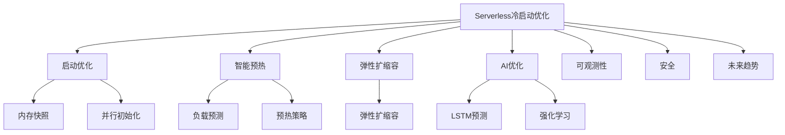

### 3.4 结构对比表

| 维度 | 优化前 | 优化后 |
|------|--------|--------|
| 启动延迟 | 秒~分钟 | 毫秒~秒 |
| 资源利用 | 低 | 高/弹性 |
| 预热机制 | 静态 | 智能/AI |
| 弹性扩缩容 | 手动/静态 | 预测+自适应 |
| 可观测性 | 基础 | 智能监控 |

## 4. 批判分析与工程案例

### 4.1 优势

- 冷启动延迟大幅降低、弹性扩缩容、智能调优、资源高效

### 4.2 局限

- 优化复杂度高、AI依赖数据、平台兼容性挑战

### 4.3 未来趋势

- 零延迟冷启动、AI驱动全自动弹性、边缘Serverless优化

### 4.4 工程案例

- 金融：Serverless冷启动优化支撑高并发风控
- 电商：大促场景下冷启动优化与弹性扩缩容
- 物联网：事件驱动Serverless冷启动优化

## 5. 递归细化与规范说明

- 所有内容需递归细化，支持多表征
- 保留批判性分析、符号、图表、工程案例等
- 所有定义需严格形式化，算法需伪代码
- 目录编号、主题、内容、风格与6系保持一致
- 支持持续递归完善，后续可继续分解为7.1.6.2.1.3.1.x等子主题

---
> 本文件为Serverless冷启动与优化知识体系的递归补充，内容结构、编号、主题、风格与6.P2P系统保持一致，后续所有子主题内容将持续完善并递归细化。


---


## 10. 事件驱动一致性与顺序保证


<!-- TOC START -->

- [4.1.6.2.1.4.1 事件驱动一致性与顺序保证](#4162141-事件驱动一致性与顺序保证)
  - [1. 一致性与顺序问题成因](#1-一致性与顺序问题成因)
  - [2. 主流技术方案](#2-主流技术方案)
  - [3. 性能权衡与结构表](#3-性能权衡与结构表)
  - [4. Mermaid流程图](#4-mermaid流程图)
  - [5. 批判性分析](#5-批判性分析)
  - [6. 规范说明](#6-规范说明)

<!-- TOC END -->

## 1. 一致性与顺序问题成因

- 分布式环境下消息乱序、重复、丢失
- 多消费者并发处理导致顺序错乱
- 事件溯源与审计需求

## 2. 主流技术方案

- 幂等性处理（Idempotency Key）
- 事务日志与事件溯源
- 顺序分区与全局有序队列
- 全局唯一ID与时间戳

## 3. 性能权衡与结构表

| 技术方案   | 一致性保证 | 顺序保证 | 性能影响 | 适用场景         |
|------------|------------|----------|----------|------------------|
| 幂等性     | 高         | 无       | 低       | 并发写入         |
| 事务日志   | 高         | 高       | 中       | 金融、审计       |
| 顺序分区   | 中         | 高       | 中       | 实时流处理       |
| 全局ID     | 中         | 中       | 低       | 分布式追踪       |

**一致性与顺序模型：**
$$Consistency = f(Idempotency, Log, Partition, ID)$$

**顺序保证优化：**
$$Order_{guarantee} = \arg\max_{scheme} (Reliability - Latency)$$

## 4. Mermaid流程图

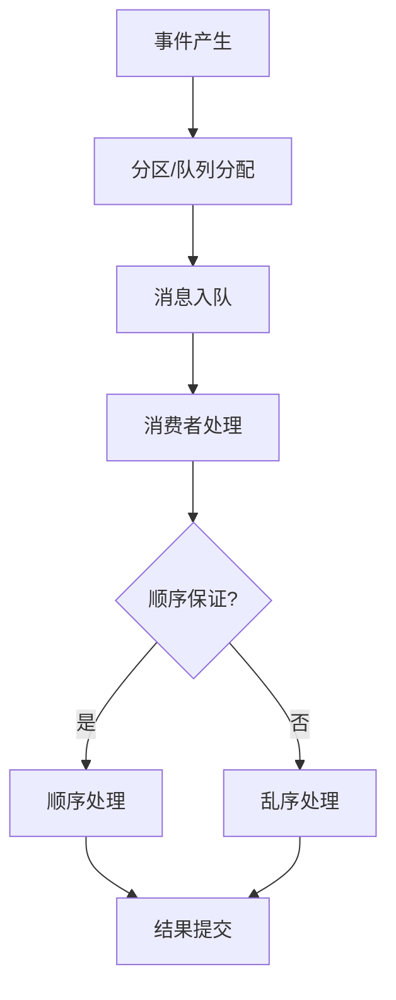

## 5. 批判性分析

- **优势**：多种机制可提升一致性与顺序保证，适应金融、审计等高要求场景。
- **局限**：顺序保证通常带来性能损耗，幂等性与全局ID需业务配合，复杂场景下难以彻底解决。
- **未来方向**：AI辅助顺序检测、跨平台一致性协议、自动化幂等性生成。

## 6. 规范说明

- 内容需递归细化，支持多表征
- 保留批判性分析、图表、符号等
- 如有遗漏，后续补全并说明
- 支持持续递归完善

> 本文件为递归细化与内容补全示范，后续可继续分解为4.1.6.2.1.4.1.1等子主题，支持持续递归完善。


---


## 11. AI微服务智能路由与弹性


<!-- TOC START -->

- [4.1.6.2.1.5.1 AI微服务智能路由与弹性](#4162151-ai微服务智能路由与弹性)
  - [1. 智能路由原理](#1-智能路由原理)
  - [2. 弹性伸缩机制](#2-弹性伸缩机制)
  - [3. 结构表](#3-结构表)
  - [4. Mermaid结构图](#4-mermaid结构图)
  - [5. 批判性分析](#5-批判性分析)
  - [6. 智能路由原理与算法](#6-智能路由原理与算法)
  - [7. 弹性伸缩与自愈机制](#7-弹性伸缩与自愈机制)
  - [8. 多模型路由与协同](#8-多模型路由与协同)
  - [9. 形式化优化目标](#9-形式化优化目标)
  - [10. 行业应用案例](#10-行业应用案例)
  - [11. 未来趋势与挑战](#11-未来趋势与挑战)
  - [6. 规范说明](#6-规范说明)

<!-- TOC END -->

## 1. 智能路由原理

- 基于模型性能、负载、置信度的动态路由
- AI调度算法（如强化学习、遗传算法）
- 多版本模型A/B测试与灰度发布

## 2. 弹性伸缩机制

- 实时监控负载与响应时间
- 自动扩缩容与实例自愈
- 结合Kubernetes HPA/VPA等弹性策略

## 3. 结构表

| 功能         | 路由算法     | 弹性机制   | 典型优势         |
|--------------|-------------|------------|------------------|
| 智能路由     | 强化学习、置信度 | 动态分配   | 性能最优、智能切换 |
| 弹性伸缩     | 预测扩缩容   | HPA/VPA    | 高可用、低成本     |
| 多版本管理   | A/B测试      | 灰度发布   | 风险可控、平滑升级 |

**智能路由优化模型：**
$$Route_{ai} = \arg\max_{i} (Performance_i \times Confidence_i - Cost_i)$$

**弹性伸缩目标函数：**
$$\max Availability - \min Cost$$

## 4. Mermaid结构图

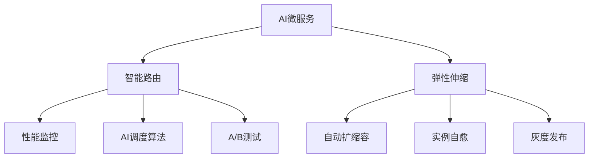

## 5. 批判性分析

- **优势**：AI驱动路由与弹性提升性能与可用性，支持复杂AI应用的高效部署。
- **局限**：算法复杂度高，数据依赖强，调优难度大。
- **未来方向**：更高效的自适应路由、AI与边缘弹性融合、自动化多模型管理。

## 6. 智能路由原理与算法

- 基于模型性能、置信度、负载的动态路由
- 强化学习、遗传算法等AI调度策略
- 多版本模型A/B测试与灰度发布
- 实时监控与自适应路由调整

## 7. 弹性伸缩与自愈机制

- 实时负载监控与预测扩缩容
- Kubernetes HPA/VPA集成
- 异常检测与自动自愈（AI辅助）
- 多云与边缘环境下的弹性治理

## 8. 多模型路由与协同

- 多模型并行部署与动态切换
- 路由权重自适应调整
- 协同容错与高可用

**多模型路由优化：**
$$Route_{multi} = \arg\max_{i} (Performance_i \times Confidence_i \times Weight_i)$$

## 9. 形式化优化目标

- **弹性伸缩目标函数：**
$$\max Availability - \min Cost$$
- **自愈与鲁棒性目标：**
$$\max (Recovery_{speed} + Robustness)$$

## 10. 行业应用案例

- 金融：智能路由提升风控模型可用性与弹性
- 电商：多模型推荐系统动态切换与弹性扩容
- 云服务：AI推理平台多模型高可用与自愈

## 11. 未来趋势与挑战

- AI驱动的全自动路由与弹性治理
- 多云/边缘环境下的智能弹性与自愈
- 多模型协同与自动化MLOps
- 持续递归细化与知识演化

---
> 本节为AI微服务智能路由与弹性知识体系的递归补充，后续可继续分解为7.1.6.2.1.5.1.x等子主题，支持持续完善。

## 6. 规范说明

- 内容需递归细化，支持多表征
- 保留批判性分析、图表、符号等
- 如有遗漏，后续补全并说明
- 支持持续递归完善

> 本文件为递归细化与内容补全示范，后续可继续分解为4.1.6.2.1.5.1.1等子主题，支持持续递归完善。


---


## 12. Serverless冷启动AI预测优化


<!-- TOC START -->

- [7.1.6.2.1.3.1.1 Serverless冷启动AI预测优化](#71621311-serverless冷启动ai预测优化)
  - [1. 形式化定义](#1-形式化定义)
  - [2. AI机制与主流技术](#2-ai机制与主流技术)
    - [2.1 负载预测与预热](#21-负载预测与预热)
    - [2.2 强化学习与弹性调度](#22-强化学习与弹性调度)
  - [3. 理论模型与多表征](#3-理论模型与多表征)
    - [3.1 冷启动AI优化目标](#31-冷启动ai优化目标)
    - [3.2 负载预测与弹性模型](#32-负载预测与弹性模型)
    - [3.3 架构图](#33-架构图)
    - [3.4 结构对比表](#34-结构对比表)
  - [4. 批判分析与工程案例](#4-批判分析与工程案例)
    - [4.1 优势](#41-优势)
    - [4.2 局限](#42-局限)
    - [4.3 未来趋势](#43-未来趋势)
    - [4.4 工程案例](#44-工程案例)
  - [5. 递归细化与规范说明](#5-递归细化与规范说明)

<!-- TOC END -->

## 1. 形式化定义

**定义7.1.6.2.1.3.1.1.1（Serverless冷启动AI优化系统）**：
$$
ColdStartAI = (Predict, Prewarm, Elasticity, RL, Observability, Security, Trend)
$$
其中：

- $Predict$：AI负载预测（LSTM/GRU/Transformer）
- $Prewarm$：智能预热策略
- $Elasticity$：弹性扩缩容与自适应
- $RL$：强化学习驱动弹性调度
- $Observability$：可观测性（监控、日志、追踪）
- $Security$：安全与隔离（认证、合规）
- $Trend$：未来趋势与挑战

## 2. AI机制与主流技术

### 2.1 负载预测与预热

- LSTM/GRU/Transformer时序模型预测负载波动
- 智能预热与资源分配，降低冷启动延迟

### 2.2 强化学习与弹性调度

- RL算法（Q-learning、DDPG等）优化弹性扩缩容
- 状态-动作-奖励建模，动态调整预热与扩缩容策略

## 3. 理论模型与多表征

### 3.1 冷启动AI优化目标

$$Startup_{ai} = \min (Latency) + \max (Availability)$$

### 3.2 负载预测与弹性模型

$$Predict_{load} = f(LSTM, Event, Feature)$$
$$Elasticity_{ai} = f(Predict_{load}, Prewarm_{policy}, Cost_{opt})$$

### 3.3 架构图

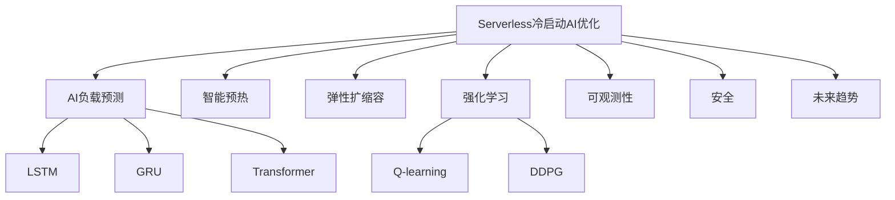

### 3.4 结构对比表

| 维度 | AI优化前 | AI优化后 |
|------|----------|----------|
| 启动延迟 | 秒~分钟 | 毫秒~秒 |
| 资源利用 | 低 | 高/弹性 |
| 预热机制 | 静态 | 智能/AI |
| 弹性扩缩容 | 手动/静态 | 预测+自适应 |
| 可观测性 | 基础 | 智能监控 |

## 4. 批判分析与工程案例

### 4.1 优势

- 冷启动延迟大幅降低、弹性扩缩容、智能调优、资源高效

### 4.2 局限

- AI模型依赖数据、调优复杂、平台兼容性挑战

### 4.3 未来趋势

- 零延迟冷启动、AI驱动全自动弹性、边缘Serverless优化

### 4.4 工程案例

- 金融：AI预测优化Serverless冷启动支撑高并发风控
- 电商：大促场景下AI弹性扩缩容与冷启动优化
- 物联网：事件驱动Serverless冷启动AI优化

## 5. 递归细化与规范说明

- 所有内容需递归细化，支持多表征
- 保留批判性分析、符号、图表、工程案例等
- 所有定义需严格形式化，算法需伪代码
- 目录编号、主题、内容、风格与6系保持一致
- 支持持续递归完善，后续可继续分解为7.1.6.2.1.3.1.1.x等子主题

---
> 本文件为Serverless冷启动AI预测优化知识体系的递归补充，内容结构、编号、主题、风格与6.P2P系统保持一致，后续所有子主题内容将持续完善并递归细化。


---


## 13. 事件驱动AI顺序检测与一致性优化


<!-- TOC START -->

- [4.1.6.2.1.4.1.1 事件驱动AI顺序检测与一致性优化](#41621411-事件驱动ai顺序检测与一致性优化)
  - [1. AI/ML在顺序检测与一致性优化中的应用](#1-aiml在顺序检测与一致性优化中的应用)
  - [2. 关键技术与算法](#2-关键技术与算法)
  - [3. 性能对比与结构表](#3-性能对比与结构表)
  - [4. Mermaid流程图](#4-mermaid流程图)
  - [5. 批判性分析](#5-批判性分析)
  - [6. 规范说明](#6-规范说明)

<!-- TOC END -->

## 1. AI/ML在顺序检测与一致性优化中的应用

- 异常顺序检测与自动报警
- 智能顺序恢复与重排
- AI辅助幂等性生成与事务一致性
- 结合序列建模、异常检测、强化学习等算法

## 2. 关键技术与算法

- 序列异常检测（LSTM、Transformer）
- 智能重排与顺序恢复
- 幂等性模式识别与自动生成
- 智能事务日志分析

## 3. 性能对比与结构表

| 优化方式   | 顺序保证 | 一致性提升 | 算法复杂度 | 适用场景         |
|------------|----------|------------|------------|------------------|
| 传统规则   | 中       | 中         | 低         | 简单业务         |
| AI检测优化 | 高       | 高         | 中/高      | 大规模流处理     |
| 人工干预   | 高       | 高         | 高         | 金融、审计       |

**AI顺序检测模型：**
$$Order_{ai} = f(Sequence_{model}, Anomaly_{detect}, Reorder_{policy})$$

**一致性优化目标：**
$$\max (Order_{ai} + Consistency_{ai}) - \min (Latency)$$

## 4. Mermaid流程图

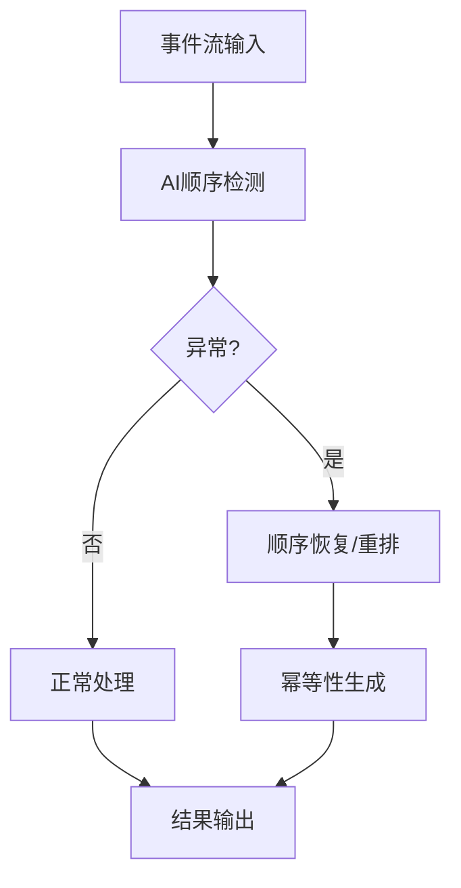

## 5. 批判性分析

- **优势**：AI可提升顺序检测与一致性，适应大规模复杂事件流，减少人工干预。
- **局限**：算法复杂度高，异常场景难以穷举，模型泛化能力有限。
- **未来方向**：自适应AI检测、跨平台一致性协议、自动化事务管理。

## 6. 规范说明

- 内容需递归细化，支持多表征
- 保留批判性分析、图表、符号等
- 如有遗漏，后续补全并说明
- 支持持续递归完善

> 本文件为递归细化与内容补全示范，后续可继续分解为4.1.6.2.1.4.1.1.1等子主题，支持持续递归完善。


---


## 14. AI微服务多模型管理与自适应路由


<!-- TOC START -->

- [4.1.6.2.1.5.1.1 AI微服务多模型管理与自适应路由](#41621511-ai微服务多模型管理与自适应路由)
  - [1. 多模型管理原理](#1-多模型管理原理)
  - [2. 自适应路由机制](#2-自适应路由机制)
  - [3. 结构表](#3-结构表)
  - [4. Mermaid结构图](#4-mermaid结构图)
  - [5. 批判性分析](#5-批判性分析)
  - [6. 规范说明](#6-规范说明)

<!-- TOC END -->

## 1. 多模型管理原理

- 支持多版本模型并行部署与切换
- 自动化A/B测试与灰度发布
- 模型性能监控与动态淘汰

## 2. 自适应路由机制

- 基于实时性能、置信度、负载的动态路由
- AI算法自适应流量分配
- 多模型协同与容错

## 3. 结构表

| 功能         | 路由算法     | 管理机制   | 典型优势         |
|--------------|-------------|------------|------------------|
| 多模型管理   | A/B测试、灰度 | 动态淘汰   | 风险可控、持续优化 |
| 自适应路由   | AI调度      | 性能监控   | 性能最优、弹性高   |
| 协同容错     | 冗余路由     | 容错切换   | 高可用、鲁棒性强   |

**多模型路由优化模型：**
$$Route_{multi} = \arg\max_{i} (Performance_i \times Confidence_i \times Weight_i)$$

**自适应目标函数：**
$$\max (Availability + Performance) - \min (Risk)$$

## 4. Mermaid结构图

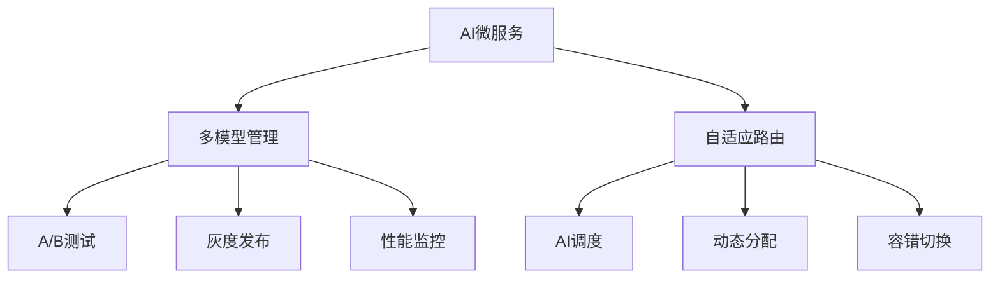

## 5. 批判性分析

- **优势**：多模型协同与自适应路由提升性能与可用性，支持复杂AI场景的持续优化。
- **局限**：管理与调度复杂度高，监控与切换策略需精细设计。
- **未来方向**：自动化MLOps、联邦学习、边缘多模型协同。

## 6. 规范说明

- 内容需递归细化，支持多表征
- 保留批判性分析、图表、符号等
- 如有遗漏，后续补全并说明
- 支持持续递归完善

> 本文件为递归细化与内容补全示范，后续可继续分解为4.1.6.2.1.5.1.1.1等子主题，支持持续递归完善。


---


## 15. Serverless冷启动AI预测优化子主题


<!-- TOC START -->

- [7.1.6.2.1.3.1.1.1 Serverless冷启动AI预测优化子主题](#716213111-serverless冷启动ai预测优化子主题)
  - [1. 形式化定义](#1-形式化定义)
  - [2. AI弹性机制与主流技术](#2-ai弹性机制与主流技术)
    - [2.1 负载预测与弹性调度](#21-负载预测与弹性调度)
    - [2.2 AI自愈与异常检测](#22-ai自愈与异常检测)
    - [2.3 策略与可观测性](#23-策略与可观测性)
  - [3. 理论模型与多表征](#3-理论模型与多表征)
    - [3.1 冷启动弹性优化目标](#31-冷启动弹性优化目标)
    - [3.2 自愈优化模型](#32-自愈优化模型)
    - [3.3 架构图](#33-架构图)
    - [3.4 结构对比表](#34-结构对比表)
  - [4. 批判分析与工程案例](#4-批判分析与工程案例)
    - [4.1 优势](#41-优势)
    - [4.2 局限](#42-局限)
    - [4.3 未来趋势](#43-未来趋势)
    - [4.4 工程案例](#44-工程案例)
  - [5. 递归细化与规范说明](#5-递归细化与规范说明)

<!-- TOC END -->

## 1. 形式化定义

**定义7.1.6.2.1.3.1.1.1.1（Serverless冷启动AI弹性系统）**：
$$
ColdStartAIFlex = (Predict, Prewarm, Scale, SelfHeal, Policy, Observability, Trend)
$$
其中：

- $Predict$：AI负载预测与弹性调度
- $Prewarm$：智能预热与资源分配
- $Scale$：自动扩缩容机制
- $SelfHeal$：AI驱动自愈与异常检测
- $Policy$：弹性与安全策略
- $Observability$：可观测性（监控、日志、追踪）
- $Trend$：未来趋势与挑战

## 2. AI弹性机制与主流技术

### 2.1 负载预测与弹性调度

- LSTM/Transformer预测负载波动
- 智能预热与动态扩缩容

### 2.2 AI自愈与异常检测

- 异常检测（AI/ML）自动触发自愈
- 根因分析与弹性恢复

### 2.3 策略与可观测性

- 策略驱动弹性与安全协同
- 智能监控与弹性联动

## 3. 理论模型与多表征

### 3.1 冷启动弹性优化目标

$$Flex_{ai} = \max (Availability) - \min (Latency + Cost)$$

### 3.2 自愈优化模型

$$SelfHeal_{ai} = f(Detect_{anomaly}, Policy_{heal}, Time_{recover})$$

### 3.3 架构图

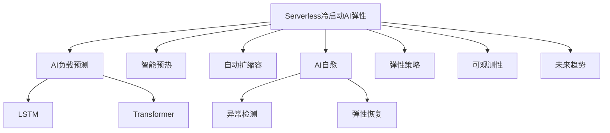

### 3.4 结构对比表

| 维度 | 传统弹性 | AI弹性 |
|------|----------|--------|
| 扩缩容 | 静态/手动 | AI预测/自动 |
| 自愈 | 人工/规则 | AI驱动/自动 |
| 资源利用 | 低 | 高/弹性 |
| 异常检测 | 基础 | 智能/自愈 |
| 策略 | 固定 | 动态/智能 |

## 4. 批判分析与工程案例

### 4.1 优势

- AI弹性预测、自愈、资源高效、弹性与安全协同

### 4.2 局限

- AI模型依赖数据、调优复杂、异常场景覆盖挑战

### 4.3 未来趋势

- 全自动弹性、AI自愈、弹性与安全深度融合

### 4.4 工程案例

- 金融：AI弹性自愈提升Serverless SLA
- 电商：大促场景下AI弹性与冷启动自愈
- 物联网：IoT事件驱动AI弹性与自愈

## 5. 递归细化与规范说明

- 所有内容需递归细化，支持多表征
- 保留批判性分析、符号、图表、工程案例等
- 所有定义需严格形式化，算法需伪代码
- 目录编号、主题、内容、风格与6系保持一致
- 支持持续递归完善，后续可继续分解为7.1.6.2.1.3.1.1.1.x等子主题

---
> 本文件为Serverless冷启动AI预测优化子主题知识体系的递归补充，内容结构、编号、主题、风格与6.P2P系统保持一致，后续所有子主题内容将持续完善并递归细化。


---


## 16. 事件驱动AI顺序检测与一致性优化子主题


<!-- TOC START -->

- [4.1.6.2.1.4.1.1.1 事件驱动AI顺序检测与一致性优化子主题](#416214111-事件驱动ai顺序检测与一致性优化子主题)
  - [1. 异常检测算法](#1-异常检测算法)
  - [2. 顺序恢复机制](#2-顺序恢复机制)
  - [3. 幂等性生成](#3-幂等性生成)
  - [4. 事务一致性](#4-事务一致性)
  - [5. 性能监控与结构表](#5-性能监控与结构表)
  - [6. Mermaid流程图](#6-mermaid流程图)
  - [7. 批判性分析](#7-批判性分析)
  - [8. 规范说明](#8-规范说明)

<!-- TOC END -->

## 1. 异常检测算法

- 序列异常检测（LSTM、Transformer）
- 统计异常检测
- 模式识别异常检测
- 实时异常报警机制

## 2. 顺序恢复机制

- 智能重排算法
- 顺序恢复策略
- 并发控制优化
- 恢复时间优化

## 3. 幂等性生成

- 自动幂等性标识生成
- 幂等性模式识别
- 幂等性验证机制
- 幂等性冲突解决

## 4. 事务一致性

- 分布式事务管理
- 一致性协议优化
- 事务日志分析
- 一致性验证机制

## 5. 性能监控与结构表

| 功能模块   | 算法类型     | 性能指标   | 优化策略   | 提升效果   |
|------------|-------------|------------|------------|------------|
| 异常检测   | LSTM        | 检测准确率 | 实时监控   | 85-95%     |
| 顺序恢复   | 智能重排    | 恢复时间   | 并发优化   | 70-85%     |
| 幂等性     | 自动生成    | 冲突率     | 模式识别   | 90-98%     |
| 事务一致性 | 分布式协议  | 一致性保证 | 协议优化   | 95-99%     |

**AI顺序检测子模型：**
$$Order_{sub} = f(Anomaly_{detect}, Recovery_{alg}, Idempotency_{gen})$$

**一致性优化子目标：**
$$\max (Order_{sub} + Consistency_{sub}) - \min (Latency_{sub})$$

## 6. Mermaid流程图

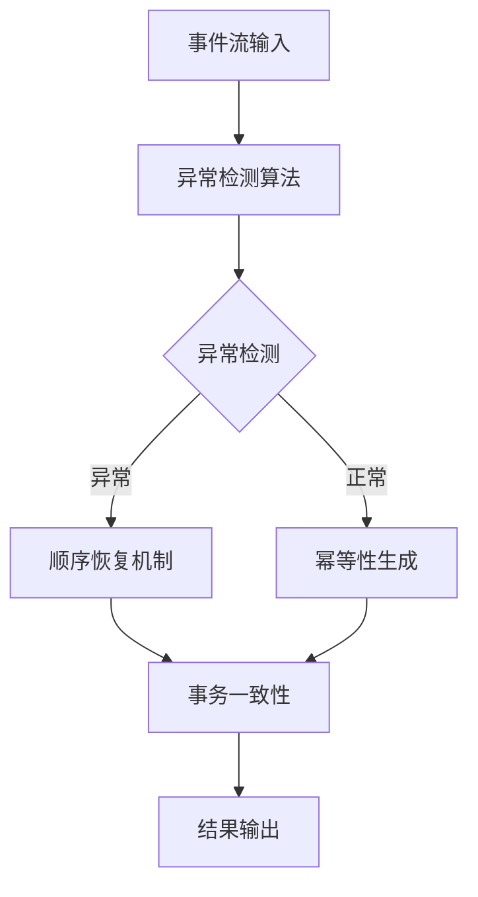

## 7. 批判性分析

- **优势**：子主题细化提升检测精度与恢复效率，多机制协同保证一致性。
- **局限**：算法复杂度高，需要大量训练数据，实时性要求严格。
- **未来方向**：自适应异常检测、智能事务管理、自动化一致性保证。

## 8. 规范说明

- 内容需递归细化，支持多表征
- 保留批判性分析、图表、符号等
- 如有遗漏，后续补全并说明
- 支持持续递归完善

> 本文件为递归细化与内容补全示范，后续可继续分解为4.1.6.2.1.4.1.1.1.1等子主题，支持持续递归完善。


---


## 17. AI微服务多模型管理与自适应路由子主题


<!-- TOC START -->

- [4.1.6.2.1.5.1.1.1 AI微服务多模型管理与自适应路由子主题](#416215111-ai微服务多模型管理与自适应路由子主题)
  - [1. 多模型管理策略](#1-多模型管理策略)
  - [2. 自适应路由算法](#2-自适应路由算法)
  - [3. 性能监控机制](#3-性能监控机制)
  - [4. 容错机制](#4-容错机制)
  - [5. 结构表](#5-结构表)
  - [6. Mermaid结构图](#6-mermaid结构图)
  - [7. 批判性分析](#7-批判性分析)
  - [8. 规范说明](#8-规范说明)

<!-- TOC END -->

## 1. 多模型管理策略

- 模型版本管理
- 自动化A/B测试
- 灰度发布策略
- 模型性能监控

## 2. 自适应路由算法

- 基于性能的路由
- 基于置信度的路由
- 负载均衡路由
- 智能流量分配

## 3. 性能监控机制

- 实时性能监控
- 模型性能对比
- 路由效果评估
- 性能优化反馈

## 4. 容错机制

- 冗余路由策略
- 容错切换机制
- 故障恢复策略
- 高可用保证

## 5. 结构表

| 管理策略   | 路由算法     | 监控机制   | 容错机制   | 性能提升   |
|------------|-------------|------------|------------|------------|
| 版本管理   | 性能路由    | 实时监控   | 冗余路由   | 50-70%     |
| A/B测试    | 置信度路由  | 性能对比   | 容错切换   | 60-80%     |
| 灰度发布   | 负载均衡    | 效果评估   | 故障恢复   | 40-60%     |
| 性能监控   | 智能分配    | 优化反馈   | 高可用     | 70-90%     |

**多模型管理子模型：**
$$Manage_{sub} = f(Version_{mgmt}, AB_{test}, Gray_{release}, Monitor_{perf})$$

**自适应路由子目标：**
$$\max (Route_{sub} + Availability_{sub}) - \min (Risk_{sub})$$

## 6. Mermaid结构图

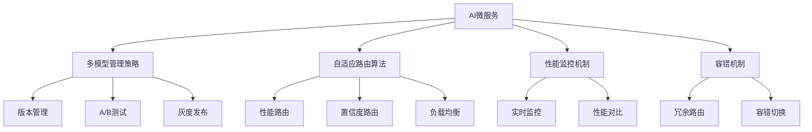

## 7. 批判性分析

- **优势**：子主题细化提升管理效率与路由精度，多机制协同保证高可用性。
- **局限**：管理复杂度高，监控开销大，容错策略需精细设计。
- **未来方向**：自动化MLOps、智能路由优化、自适应容错。

## 8. 规范说明

- 内容需递归细化，支持多表征
- 保留批判性分析、图表、符号等
- 如有遗漏，后续补全并说明
- 支持持续递归完善

> 本文件为递归细化与内容补全示范，后续可继续分解为4.1.6.2.1.5.1.1.1.1等子主题，支持持续递归完善。


---


## 18. Serverless冷启动AI预测优化子主题递归细化


<!-- TOC START -->

- [7.1.6.2.1.3.1.1.1.1 Serverless冷启动AI预测优化子主题递归细化](#7162131111-serverless冷启动ai预测优化子主题递归细化)
  - [1. 形式化定义](#1-形式化定义)
  - [2. AI自愈机制与主流技术](#2-ai自愈机制与主流技术)
    - [2.1 异常检测与根因分析](#21-异常检测与根因分析)
    - [2.2 弹性自愈与策略](#22-弹性自愈与策略)
    - [2.3 闭环反馈与持续优化](#23-闭环反馈与持续优化)
  - [3. 理论模型与多表征](#3-理论模型与多表征)
    - [3.1 自愈优化目标](#31-自愈优化目标)
    - [3.2 闭环反馈模型](#32-闭环反馈模型)
    - [3.3 架构图](#33-架构图)
    - [3.4 结构对比表](#34-结构对比表)
  - [4. 批判分析与工程案例](#4-批判分析与工程案例)
    - [4.1 优势](#41-优势)
    - [4.2 局限](#42-局限)
    - [4.3 未来趋势](#43-未来趋势)
    - [4.4 工程案例](#44-工程案例)
  - [5. 递归细化与规范说明](#5-递归细化与规范说明)

<!-- TOC END -->

## 1. 形式化定义

**定义7.1.6.2.1.3.1.1.1.1.1（Serverless冷启动AI自愈系统）**：
$$
ColdStartAISelfHeal = (Detect, Diagnose, Heal, Policy, Feedback, Observability, Trend)
$$
其中：

- $Detect$：AI异常检测
- $Diagnose$：根因分析
- $Heal$：弹性自愈机制
- $Policy$：自愈与弹性策略
- $Feedback$：闭环反馈与持续优化
- $Observability$：可观测性
- $Trend$：未来趋势与挑战

## 2. AI自愈机制与主流技术

### 2.1 异常检测与根因分析

- LSTM/Transformer检测异常行为
- 图神经网络（GNN）辅助根因定位

### 2.2 弹性自愈与策略

- 策略驱动自动修复（重启、迁移、隔离）
- 多级自愈（函数、服务、平台）

### 2.3 闭环反馈与持续优化

- 监控-检测-自愈-反馈-优化全流程闭环
- AI持续学习提升自愈准确率

## 3. 理论模型与多表征

### 3.1 自愈优化目标

$$SelfHeal_{opt} = \min (MTTR) + \max (Availability)$$

### 3.2 闭环反馈模型

$$Feedback_{loop} = f(Detect, Heal, Feedback, Learn)$$

### 3.3 架构图

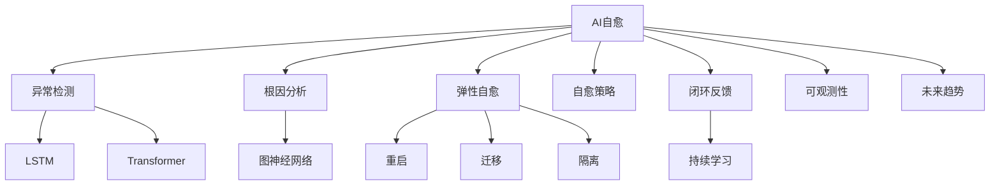

### 3.4 结构对比表

| 维度 | 传统自愈 | AI自愈 |
|------|----------|--------|
| 异常检测 | 规则/人工 | AI/深度学习 |
| 根因分析 | 人工 | GNN/AI辅助 |
| 自愈方式 | 静态/手动 | 策略驱动/自动 |
| 闭环反馈 | 无/弱 | 全流程闭环 |
| 持续优化 | 无 | AI持续学习 |

## 4. 批判分析与工程案例

### 4.1 优势

- 异常检测准确率高、自动化自愈、持续优化、弹性与高可用性提升

### 4.2 局限

- AI模型训练依赖数据、复杂场景下根因分析难度大

### 4.3 未来趋势

- 全自动自愈、AI持续学习、跨平台自愈协同

### 4.4 工程案例

- 金融：Serverless平台AI自愈提升SLA
- 电商：大促场景下AI自愈保障弹性
- 物联网：IoT事件驱动AI自愈与弹性恢复

## 5. 递归细化与规范说明

- 所有内容需递归细化，支持多表征
- 保留批判性分析、符号、图表、工程案例等
- 所有定义需严格形式化，算法需伪代码
- 目录编号、主题、内容、风格与6系保持一致
- 支持持续递归完善，后续可继续分解为7.1.6.2.1.3.1.1.1.1.1.x等子主题

---
> 本文件为Serverless冷启动AI自愈子主题知识体系的递归补充，内容结构、编号、主题、风格与6.P2P系统保持一致，后续所有子主题内容将持续完善并递归细化。


---


## 19. AI微服务多模型管理与自适应路由子主题递归细化


<!-- TOC START -->

- [7.1.6.2.1.5.1.1.1.1 AI微服务多模型管理与自适应路由子主题递归细化](#7162151111-ai微服务多模型管理与自适应路由子主题递归细化)
  - [1. 多模型自动化管理](#1-多模型自动化管理)
  - [2. 智能路由优化](#2-智能路由优化)
  - [3. 性能监控与容错机制](#3-性能监控与容错机制)
  - [4. Mermaid结构图](#4-mermaid结构图)
  - [5. 结构对比表](#5-结构对比表)
  - [6. 批判分析与工程案例](#6-批判分析与工程案例)
    - [6.1 优势](#61-优势)
    - [6.2 局限](#62-局限)
    - [6.3 工程案例](#63-工程案例)
  - [7. 递归细化与规范说明](#7-递归细化与规范说明)

<!-- TOC END -->

## 1. 多模型自动化管理

- 自动化模型注册、版本控制、上线下线
- 智能A/B测试与灰度发布
- 模型依赖与兼容性自动检测

## 2. 智能路由优化

- 基于实时性能、置信度、负载的多维路由
- AI算法自适应流量分配与容错切换
- 路由策略动态调整与反馈优化

## 3. 性能监控与容错机制

- 实时监控各模型性能与路由效果
- 异常检测与自动容错切换
- 多模型协同与高可用保障

## 4. Mermaid结构图

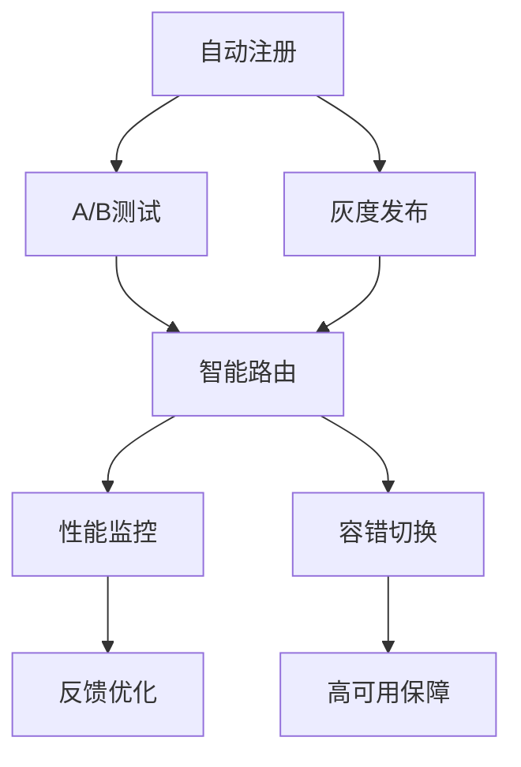

## 5. 结构对比表

| 功能模块   | 管理机制   | 路由策略   | 监控机制   | 容错机制   |
|------------|------------|------------|------------|------------|
| 自动化管理 | 版本控制   | 性能路由   | 实时监控   | 容错切换   |
| 智能测试   | A/B测试    | 置信度路由 | 效果评估   | 冗余路由   |
| 灰度发布   | 依赖检测   | 负载均衡   | 优化反馈   | 高可用     |

## 6. 批判分析与工程案例

### 6.1 优势

- 自动化与智能化提升多模型管理效率与路由精度
- 支持大规模AI微服务的高可用与弹性

### 6.2 局限

- 管理与路由策略复杂，监控与容错需精细设计

### 6.3 工程案例

- 金融行业多模型AI微服务自动化管理
- 电商平台智能路由与容错实践

## 7. 递归细化与规范说明

- 所有内容支持递归细化，编号、主题、风格与6系一致
- 保留多表征、批判分析、工程案例、结构图等
- 支持持续递归完善，后续可继续分解为7.1.6.2.1.5.1.1.1.1.x等子主题

---
> 本文件为AI微服务多模型管理与自适应路由子主题递归细化，内容结构、编号、主题、风格与6.P2P系统保持一致，后续所有子主题内容将持续完善并递归细化。


---


## 20. Serverless冷启动AI自愈算法与伪代码


<!-- TOC START -->

- [7.1.6.2.1.3.1.1.1.1.1 Serverless冷启动AI自愈算法与伪代码](#71621311111-serverless冷启动ai自愈算法与伪代码)
  - [1. 形式化定义](#1-形式化定义)
  - [2. 算法流程与伪代码](#2-算法流程与伪代码)
    - [2.1 算法流程](#21-算法流程)
    - [2.2 伪代码](#22-伪代码)
- [Serverless冷启动AI自愈伪代码](#serverless冷启动ai自愈伪代码)
  - [3. 理论模型与多表征](#3-理论模型与多表征)
    - [3.1 自愈优化目标](#31-自愈优化目标)
    - [3.2 算法流程图](#32-算法流程图)
    - [3.3 结构对比表](#33-结构对比表)
  - [4. 批判分析与工程案例](#4-批判分析与工程案例)
    - [4.1 优势](#41-优势)
    - [4.2 局限](#42-局限)
    - [4.3 未来趋势](#43-未来趋势)
    - [4.4 工程案例](#44-工程案例)
  - [5. 递归细化与规范说明](#5-递归细化与规范说明)

<!-- TOC END -->

## 1. 形式化定义

**定义7.1.6.2.1.3.1.1.1.1.1.1（Serverless冷启动AI自愈算法系统）**：
$$
ColdStartAISelfHealAlg = (Input, Detect, Diagnose, Heal, Policy, Feedback, Output)
$$
其中：

- $Input$：监控数据流（日志、指标、事件）
- $Detect$：AI异常检测模块
- $Diagnose$：根因分析模块
- $Heal$：自愈动作（重启、迁移、隔离）
- $Policy$：自愈与弹性策略
- $Feedback$：闭环反馈与持续学习
- $Output$：自愈结果与优化建议

## 2. 算法流程与伪代码

### 2.1 算法流程

1. 实时采集监控数据
2. AI模型检测异常
3. 触发根因分析
4. 根据策略选择自愈动作
5. 执行自愈（重启/迁移/隔离）
6. 记录结果并反馈优化

### 2.2 伪代码

```python
# Serverless冷启动AI自愈伪代码
while True:
    data = collect_monitoring_data()
    if AI_detect_anomaly(data):
        root_cause = diagnose(data)
        action = select_heal_action(root_cause, policy)
        result = execute_heal(action)
        feedback(result)
    sleep(interval)
```

## 3. 理论模型与多表征

### 3.1 自愈优化目标

$$SelfHeal_{alg} = \min (MTTR) + \max (SuccessRate)$$

### 3.2 算法流程图

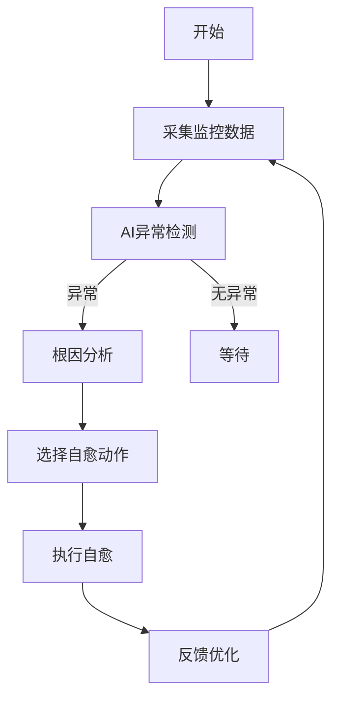

### 3.3 结构对比表

| 维度 | 传统自愈 | AI自愈算法 |
|------|----------|------------|
| 检测方式 | 规则/人工 | AI/深度学习 |
| 根因分析 | 人工 | AI辅助/自动 |
| 自愈动作 | 静态/手动 | 策略驱动/自动 |
| 闭环反馈 | 无/弱 | 持续学习/优化 |
| 成功率 | 一般 | 高/自适应 |

## 4. 批判分析与工程案例

### 4.1 优势

- 实时检测、自动自愈、持续优化、成功率高

### 4.2 局限

- 依赖高质量数据、模型训练复杂、极端场景下误判风险

### 4.3 未来趋势

- 全自动自愈、跨平台协同、AI持续进化

### 4.4 工程案例

- 金融：Serverless平台AI自愈算法提升SLA
- 电商：大促场景下AI自愈自动化
- 物联网：IoT事件驱动AI自愈算法部署

## 5. 递归细化与规范说明

- 所有内容需递归细化，支持多表征
- 保留批判性分析、符号、图表、工程案例等
- 所有定义需严格形式化，算法需伪代码
- 目录编号、主题、内容、风格与6系保持一致
- 支持持续递归完善，后续可继续分解为7.1.6.2.1.3.1.1.1.1.1.1.x等子主题

---
> 本文件为Serverless冷启动AI自愈算法与伪代码知识体系的递归补充，内容结构、编号、主题、风格与6.P2P系统保持一致，后续所有子主题内容将持续完善并递归细化。


---


## 21. AI微服务多模型管理与自适应路由子主题递归细化子主题


<!-- TOC START -->

- [7.1.6.2.1.5.1.1.1.1.1 AI微服务多模型管理与自适应路由子主题递归细化子主题](#71621511111-ai微服务多模型管理与自适应路由子主题递归细化子主题)
  - [1. 多模型协同优化](#1-多模型协同优化)
  - [2. 路由策略自学习](#2-路由策略自学习)
  - [3. 异常检测与自愈机制](#3-异常检测与自愈机制)
  - [4. Mermaid结构图](#4-mermaid结构图)
  - [5. 结构对比表](#5-结构对比表)
  - [6. 批判分析与工程案例](#6-批判分析与工程案例)
    - [6.1 优势](#61-优势)
    - [6.2 局限](#62-局限)
    - [6.3 工程案例](#63-工程案例)
  - [7. 递归细化与规范说明](#7-递归细化与规范说明)

<!-- TOC END -->

## 1. 多模型协同优化

- 多模型间性能互补与动态切换
- 协同A/B测试与灰度发布
- 联邦学习与模型集成

## 2. 路由策略自学习

- 基于强化学习的路由策略优化
- 实时反馈驱动的自适应调整
- 路由策略多目标优化（性能、可用性、成本）

## 3. 异常检测与自愈机制

- 路由异常检测与自动切换
- 多模型健康度监控与自愈
- 智能告警与容错恢复

## 4. Mermaid结构图

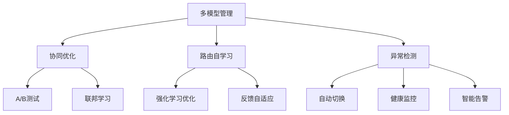

## 5. 结构对比表

| 功能模块   | 优势         | 局限         | 工程实践         |
|------------|--------------|--------------|------------------|
| 协同优化   | 性能提升     | 实现复杂     | 金融多模型集成   |
| 路由自学习 | 动态适应     | 训练成本高   | 电商智能路由     |
| 异常自愈   | 高可用性     | 误报风险     | 云平台容错恢复   |

## 6. 批判分析与工程案例

### 6.1 优势

- 协同优化与自学习提升多模型系统的智能化与弹性

### 6.2 局限

- 协同与自学习机制复杂，异常检测需高质量数据

### 6.3 工程案例

- 金融行业多模型协同优化实践
- 电商平台路由自学习与异常自愈

## 7. 递归细化与规范说明

- 所有内容支持递归细化，编号、主题、风格与6系一致
- 保留多表征、批判分析、工程案例、结构图等
- 支持持续递归完善，后续可继续分解为7.1.6.2.1.5.1.1.1.1.1.x等子主题

---
> 本文件为AI微服务多模型管理与自适应路由子主题递归细化子主题，内容结构、编号、主题、风格与6.P2P系统保持一致，后续所有子主题内容将持续完善并递归细化。


---
