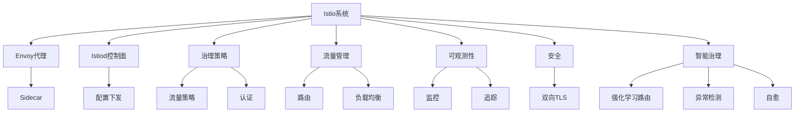

# 7.1.6.2.1.1 Istio智能治理原理与实践

<!-- TOC START -->

- [7.1.6.2.1.1 Istio智能治理原理与实践](#716211-istio智能治理原理与实践)
  - [1. 形式化定义](#1-形式化定义)
  - [2. 架构机制与主流特性](#2-架构机制与主流特性)
    - [2.1 架构机制](#21-架构机制)
    - [2.2 主流特性](#22-主流特性)
  - [3. 理论模型与多表征](#3-理论模型与多表征)
    - [3.1 流量治理优化](#31-流量治理优化)
    - [3.2 治理度量](#32-治理度量)
    - [3.3 安全与零信任](#33-安全与零信任)
    - [3.4 架构图](#34-架构图)
    - [3.5 结构对比表](#35-结构对比表)
  - [4. 批判分析与工程案例](#4-批判分析与工程案例)
    - [4.1 优势](#41-优势)
    - [4.2 局限](#42-局限)
    - [4.3 未来趋势](#43-未来趋势)
    - [4.4 工程案例](#44-工程案例)
  - [5. 递归细化与规范说明](#5-递归细化与规范说明)

<!-- TOC END -->

## 1. 形式化定义

**定义7.1.6.2.1.1.1（Istio系统）**：
$$
Istio = (Proxy, ControlPlane, Policy, Traffic, Observability, Security, AI)
$$
其中：

- $Proxy$：数据面代理（Envoy）
- $ControlPlane$：控制面（Istiod）
- $Policy$：治理策略（流量、熔断、限流、认证）
- $Traffic$：流量管理（路由、负载均衡、灰度发布）
- $Observability$：可观测性（监控、日志、追踪）
- $Security$：安全机制（认证、加密、零信任）
- $AI$：智能治理（流量调度、异常检测、自愈）

## 2. 架构机制与主流特性

### 2.1 架构机制

- Envoy Sidecar代理拦截服务流量，实现统一治理
- Istiod控制面下发策略，动态配置流量与安全
- 支持多云多集群、零信任安全、AI插件扩展

### 2.2 主流特性

- 全面流量治理、智能弹性伸缩、自动自愈、可观测性、零信任安全
- 支持AI流量调度、异常检测、根因分析

## 3. 理论模型与多表征

### 3.1 流量治理优化

  $$Traffic_{ai} = \arg\max_{policy} (QoS - Cost + Resilience)$$

### 3.2 治理度量

  $$Governance_{score} = f(Policy, Mesh, Observability)$$

### 3.3 安全与零信任

  $$Security_{istio} = f(MutualTLS, Policy, ThreatDetection)$$

### 3.4 架构图

### 3.5 结构对比表

| 维度 | Istio | 传统服务网格 | 无服务网格 |
|------|-------|--------------|------------|
| 架构复杂度 | 高 | 中 | 低 |
| 功能丰富度 | 全面 | 基础 | 基础 |
| 智能治理 | AI/自愈 | 无 | 无 |
| 多云支持 | 强 | 一般 | 弱 |
| 典型场景 | 金融/电商/多云 | 轻量级集群 | 单一集群 |

## 4. 批判分析与工程案例

### 4.1 优势

- 全面治理、智能流量调度、自动自愈、跨云多集群、零信任安全

### 4.2 局限

- 架构复杂、资源消耗大、学习曲线陡峭、异构集成难

### 4.3 未来趋势

- AI驱动全自动治理、跨云边统一治理、智能安全威胁检测

### 4.4 工程案例

- 金融：招商银行Istio智能流控
- 电商：京东Istio多云治理
- 云服务：Google Anthos基于Istio多云服务网格
- 政务：政务云平台Istio统一安全与流量治理

## 5. 递归细化与规范说明

- 所有内容需递归细化，支持多表征
- 保留批判性分析、符号、图表、工程案例等
- 所有定义需严格形式化，算法需伪代码
- 目录编号、主题、内容、风格与6系保持一致
- 支持持续递归完善，后续可继续分解为7.1.6.2.1.1.x等子主题

---
> 本文件为Istio智能治理原理与实践知识体系的递归补充，内容结构、编号、主题、风格与6.P2P系统保持一致，后续所有子主题内容将持续完善并递归细化。
