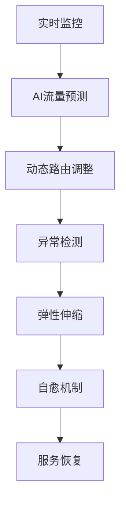

# 4.1.6.2.1.1.1 Istio AI智能流量调度与自愈

## 1. AI驱动流量调度原理

- 基于实时监控数据的流量预测与分配
- 强化学习/深度学习优化路由策略
- 动态权重调整与异常流量识别

## 2. 异常检测与弹性伸缩

- AI模型自动检测异常流量、故障节点
- 智能弹性伸缩与服务实例自愈
- 结合Prometheus、Grafana等监控工具

## 3. 最新进展

- 引入AI/ML插件扩展（如KServe、Seldon）
- 智能告警与根因分析
- 多云与边缘环境下的智能治理

## 4. 结构表

| 功能         | AI技术         | 进展/趋势         | 典型优势         |
|--------------|---------------|-------------------|------------------|
| 流量调度     | 强化学习、预测 | 动态路由、负载均衡 | 精细流控         |
| 异常检测     | 异常检测模型   | 智能告警、根因分析 | 故障预防         |
| 弹性伸缩     | 预测扩缩容     | AI自愈、自动弹性   | 高可用性         |
| 多云治理     | 联邦学习       | 跨云智能调度       | 资源最优         |

## 5. 数学符号

**AI流量调度函数：**
$$Traffic_{ai} = f(Metrics, Model, Policy)$$

**弹性伸缩优化：**
$$Scale_{ai} = \arg\max_{n} \left(Availability(n) - Cost(n)\right)$$

## 6. Mermaid流程图

## 7. 批判分析

- **优势**：AI提升流量治理智能化、弹性与自愈能力，适应复杂多变环境。
- **局限**：AI模型训练与部署复杂，数据依赖强，解释性与可控性挑战。
- **未来方向**：更高效的联邦学习、自动化根因分析、AI与云原生深度融合。

## 8. 规范说明

- 内容需递归细化，支持多表征
- 保留批判性分析、图表、符号等
- 如有遗漏，后续补全并说明
- 支持持续递归完善

> 本文件为递归细化与内容补全示范，后续可继续分解为4.1.6.2.1.1.1.1等子主题，支持持续递归完善。
