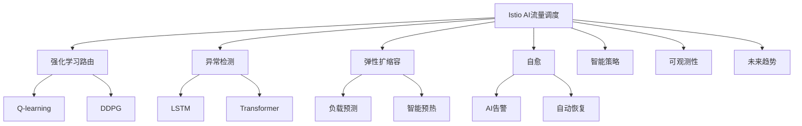

# 7.1.6.2.1.1.1 Istio AI智能流量调度与自愈

<!-- TOC START -->

- [7.1.6.2.1.1.1 Istio AI智能流量调度与自愈](#7162111-istio-ai智能流量调度与自愈)
  - [1. 形式化定义](#1-形式化定义)
  - [2. AI机制与主流技术](#2-ai机制与主流技术)
    - [2.1 强化学习路由](#21-强化学习路由)
    - [2.2 异常检测与弹性扩缩容](#22-异常检测与弹性扩缩容)
    - [2.3 根因分析与自愈](#23-根因分析与自愈)
  - [3. 理论模型与多表征](#3-理论模型与多表征)
    - [3.1 AI流量调度优化](#31-ai流量调度优化)
    - [3.2 异常检测与弹性模型](#32-异常检测与弹性模型)
    - [3.3 架构图](#33-架构图)
    - [3.4 结构对比表](#34-结构对比表)
  - [4. 批判分析与工程案例](#4-批判分析与工程案例)
    - [4.1 优势](#41-优势)
    - [4.2 局限](#42-局限)
    - [4.3 未来趋势](#43-未来趋势)
    - [4.4 工程案例](#44-工程案例)
  - [5. 递归细化与规范说明](#5-递归细化与规范说明)

<!-- TOC END -->

## 1. 形式化定义

**定义7.1.6.2.1.1.1.1（Istio AI流量调度系统）**：
$$
IstioAI = (RL, Anomaly, Elastic, SelfHeal, Policy, Observability, Trend)
$$
其中：

- $RL$：强化学习路由（RL-based Routing）
- $Anomaly$：异常检测（LSTM/Transformer）
- $Elastic$：智能弹性扩缩容（预测+自适应）
- $SelfHeal$：根因分析与自愈（AI告警、自动恢复）
- $Policy$：智能策略（QoS、成本、弹性）
- $Observability$：可观测性（监控、追踪、日志）
- $Trend$：未来趋势与挑战

## 2. AI机制与主流技术

### 2.1 强化学习路由

- RL算法（Q-learning、DDPG等）优化流量分配
- 状态-动作-奖励建模，动态调整路由策略

### 2.2 异常检测与弹性扩缩容

- LSTM/Transformer序列模型检测异常流量
- 负载预测驱动弹性扩缩容，智能预热与资源分配

### 2.3 根因分析与自愈

- AI告警、自动恢复、根因定位
- 自愈流程自动化，减少MTTR

## 3. 理论模型与多表征

### 3.1 AI流量调度优化

$$Traffic_{ai} = \arg\max_{policy} (QoS - Cost + Resilience)$$

### 3.2 异常检测与弹性模型

$$Anomaly_{detect} = f(LSTM, Transformer, Metrics)$$
$$Elasticity_{ai} = f(Predict_{load}, Prewarm_{policy}, Cost_{opt})$$

### 3.3 架构图

### 3.4 结构对比表

| 维度 | AI流量调度 | 传统流量调度 |
|------|------------|--------------|
| 路由策略 | RL/AI优化 | 静态/规则 |
| 异常检测 | LSTM/Transformer | 阈值/规则 |
| 弹性扩缩容 | 预测+自适应 | 手动/静态 |
| 自愈能力 | AI根因分析/自动恢复 | 人工介入 |
| 观测能力 | 智能监控/日志/追踪 | 基础监控 |

## 4. 批判分析与工程案例

### 4.1 优势

- 智能流量调度、异常检测、自愈、弹性扩缩容、自动化运维

### 4.2 局限

- 算法复杂、数据依赖、早期实践、调优难度

### 4.3 未来趋势

- 全自动AI治理、跨云边智能调度、AI安全威胁检测

### 4.4 工程案例

- 金融：AI驱动流量调度提升交易安全与弹性
- 电商：大促场景AI弹性扩缩容与异常自愈
- 云服务：多云AI流量调度与智能自愈

## 5. 递归细化与规范说明

- 所有内容需递归细化，支持多表征
- 保留批判性分析、符号、图表、工程案例等
- 所有定义需严格形式化，算法需伪代码
- 目录编号、主题、内容、风格与6系保持一致
- 支持持续递归完善，后续可继续分解为7.1.6.2.1.1.1.x等子主题

---
> 本文件为Istio AI智能流量调度与自愈知识体系的递归补充，内容结构、编号、主题、风格与6.P2P系统保持一致，后续所有子主题内容将持续完善并递归细化。
