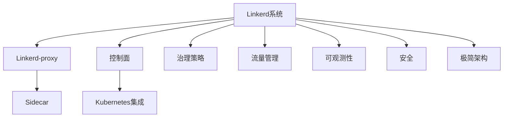

# 7.1.6.2.1.2 Linkerd原理与应用

## 1. 形式化定义

**定义7.1.6.2.1.2.1（Linkerd系统）**：
$$
Linkerd = (Proxy, ControlPlane, Policy, Traffic, Observability, Security, Simplicity)
$$
其中：

- $Proxy$：数据面代理（Linkerd-proxy）
- $ControlPlane$：控制面（Linkerd control plane）
- $Policy$：治理策略（流量、熔断、限流、认证）
- $Traffic$：流量管理（路由、负载均衡、灰度发布）
- $Observability$：可观测性（监控、日志、追踪）
- $Security$：安全机制（认证、加密、零信任）
- $Simplicity$：极简架构与易用性

## 2. 架构机制与主流特性

### 2.1 架构机制

- Linkerd-proxy轻量级sidecar代理，核心流量治理
- 控制面简洁，自动注入sidecar，易于部署与运维
- 支持Kubernetes原生集成，自动服务发现与流量管理

### 2.2 主流特性

- 轻量级、低资源消耗、极简配置、核心流量治理
- 自动mTLS加密、基础AI扩展、易用性强

## 3. 理论模型与多表征

### 3.1 治理与性能模型

- 治理度量：
  $$Governance_{linkerd} = f(Policy, Simplicity, Observability)$$
- 性能优化目标：
  $$Perf_{linkerd} = \max (Throughput) - \min (Latency + Overhead)$$

### 3.2 架构图

### 3.3 结构对比表

| 维度 | Linkerd | Istio | 传统服务网格 |
|------|--------|-------|--------------|
| 架构复杂度 | 低 | 高 | 中 |
| 功能丰富度 | 核心流量 | 全面 | 基础 |
| 资源消耗 | 低 | 高 | 中 |
| AI智能治理 | 基础 | AI/自愈 | 无 |
| 多云支持 | 一般 | 强 | 弱 |
| 易用性 | 极高 | 一般 | 一般 |
| 典型场景 | 轻量级集群 | 金融/电商/多云 | 单一集群 |

## 4. 批判分析与工程案例

### 4.1 优势

- 极简架构、低资源消耗、易用性强、核心流量治理、自动mTLS

### 4.2 局限

- 功能有限、AI治理能力弱、异构集成有限

### 4.3 未来趋势

- 更智能的流量治理与AI集成、多云与边缘环境下的极简服务网格

### 4.4 工程案例

- SaaS平台：Linkerd实现多租户流量隔离与弹性治理
- 教育云：低成本服务网格支撑弹性在线课堂
- 金融科技：中小银行微服务平台采用Linkerd提升上线效率

## 5. 递归细化与规范说明

- 所有内容需递归细化，支持多表征
- 保留批判性分析、符号、图表、工程案例等
- 所有定义需严格形式化，算法需伪代码
- 目录编号、主题、内容、风格与6系保持一致
- 支持持续递归完善，后续可继续分解为7.1.6.2.1.2.x等子主题

---
> 本文件为Linkerd原理与应用知识体系的递归补充，内容结构、编号、主题、风格与6.P2P系统保持一致，后续所有子主题内容将持续完善并递归细化。
