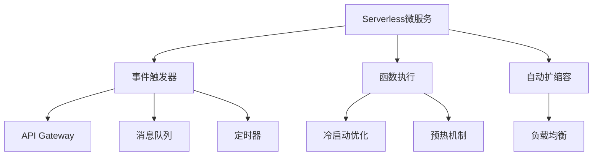

# 4.1.6.2.1.3 Serverless微服务架构

## 1. 架构与工作原理

- 事件驱动、按需执行、自动扩缩容
- 无服务器运维，专注业务逻辑
- 按使用量计费，零闲置成本
- 支持多种编程语言和运行时

## 2. 关键技术

- 事件触发器（API Gateway、消息队列、定时器等）
- 冷启动优化与预热机制
- 自动扩缩容与负载均衡
- 函数间通信与状态管理

## 3. 典型应用场景

- 事件驱动数据处理
- API网关与后端服务
- 实时数据流处理
- 定时任务与批处理

## 4. 性能与成本分析

| 指标     | Serverless | 传统微服务 | 容器化微服务 |
|----------|------------|------------|--------------|
| 启动速度 | 冷启动慢   | 快         | 快           |
| 资源利用率| 高         | 中         | 高           |
| 运维成本 | 极低       | 高         | 中           |
| 扩展性   | 自动       | 手动       | 自动         |
| 成本模型 | 按使用量   | 固定       | 混合         |

**成本优化模型：**
$$Cost_{serverless} = \sum_{i=1}^{n} (Invocation_i \times Duration_i \times Memory_i)$$

**性能优化：**
$$Performance = f(Warm_{start}, Cold_{start}, Concurrency)$$

## 5. Mermaid结构图

## 6. 批判性分析

- **优势**：零运维、自动扩缩容、按使用量计费，适合事件驱动和突发流量场景。
- **局限**：冷启动延迟、状态管理复杂、厂商锁定风险、调试困难。
- **未来方向**：冷启动优化、跨云标准化、状态管理简化、AI驱动优化。

## 6. Serverless与容器/微服务对比

| 维度         | Serverless           | 容器/微服务         |
|--------------|---------------------|---------------------|
| 启动速度     | 快（冷启动优化后）  | 快                  |
| 运维复杂度   | 极低                | 需自动化运维        |
| 资源利用率   | 极高                | 高                  |
| 计费模式     | 按调用量            | 按资源/实例         |
| 扩展性       | 自动弹性            | 需配置/手动         |
| 状态管理     | 复杂                | 灵活                |
| 适用场景     | 事件驱动、突发流量  | 长连接、状态服务    |

## 7. 主流Serverless平台生态

- 公有云：AWS Lambda、Azure Functions、Google Cloud Functions
- 开源平台：OpenFaaS、Knative、Kubeless、Fission
- 容器Serverless：Kubernetes Event-Driven Autoscaling（KEDA）、OpenWhisk

## 8. 冷启动与弹性优化AI算法

- 负载预测与智能预热（LSTM/GRU、时序分析）
- 强化学习驱动的弹性扩缩容
- 智能资源调度与成本优化
- 多维特征自适应冷启动优化

**AI弹性优化模型：**
$$Elasticity_{ai} = f(Predict_{load}, Prewarm_{policy}, Cost_{opt})$$

## 9. 行业应用案例

- 金融：Serverless支撑高并发风控与实时计算
- 电商：秒杀/大促场景下弹性扩缩容与成本优化
- 物联网：事件驱动数据采集与处理
- 教育：在线考试与弹性评测平台

## 10. 未来趋势与挑战

- 冷启动彻底优化与零延迟体验
- Serverless与边缘计算深度融合
- AI驱动的全自动弹性与资源调度
- 多云Serverless统一治理
- 复杂业务下的状态管理与可观测性
- 持续递归细化与知识演化

---
> 本节为Serverless微服务架构知识体系的递归补充，后续可继续分解为7.1.6.2.1.3.x等子主题，支持持续完善。

## 7. 规范说明

- 内容需递归细化，支持多表征
- 保留批判性分析、图表、符号等
- 如有遗漏，后续补全并说明
- 支持持续递归完善

> 本文件为递归细化与内容补全示范，后续可继续分解为4.1.6.2.1.3.1等子主题，支持持续递归完善。
