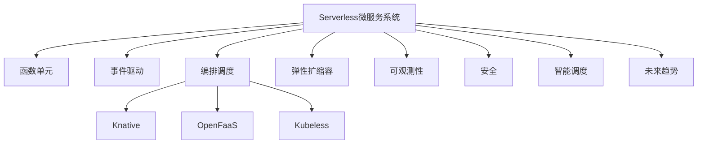

# 7.1.6.2.1.3 Serverless微服务架构

<!-- TOC START -->

- [7.1.6.2.1.3 Serverless微服务架构](#716213-serverless微服务架构)
  - [1. 形式化定义](#1-形式化定义)
  - [2. 架构机制与主流特性](#2-架构机制与主流特性)
    - [2.1 架构机制](#21-架构机制)
    - [2.2 主流特性](#22-主流特性)
  - [3. 理论模型与多表征](#3-理论模型与多表征)
    - [3.1 弹性与冷启动优化模型](#31-弹性与冷启动优化模型)
    - [3.2 架构图](#32-架构图)
    - [3.3 结构对比表](#33-结构对比表)
  - [4. 批判分析与工程案例](#4-批判分析与工程案例)
    - [4.1 优势](#41-优势)
    - [4.2 局限](#42-局限)
    - [4.3 未来趋势](#43-未来趋势)
    - [4.4 工程案例](#44-工程案例)
  - [5. 递归细化与规范说明](#5-递归细化与规范说明)

<!-- TOC END -->

## 1. 形式化定义

**定义7.1.6.2.1.3.1（Serverless微服务系统）**：
$$
ServerlessMS = (Function, Event, Orchestration, Elasticity, Observability, Security, AI, Trend)
$$
其中：

- $Function$：函数单元（FaaS、BaaS）
- $Event$：事件驱动机制
- $Orchestration$：编排与调度（Knative、OpenFaaS、Kubeless）
- $Elasticity$：弹性扩缩容与冷启动优化
- $Observability$：可观测性（监控、日志、追踪）
- $Security$：安全机制（认证、隔离、合规）
- $AI$：智能弹性与资源调度
- $Trend$：未来趋势与挑战

## 2. 架构机制与主流特性

### 2.1 架构机制

- 事件驱动、函数为核心单元，按需弹性启动
- 编排平台自动调度、扩缩容、冷启动优化
- 支持多云、边缘、混合部署

### 2.2 主流特性

- 极致弹性、自动扩缩容、冷启动优化、事件驱动
- 低运维、资源高效、按量计费、智能调度
- 多云与边缘原生支持

## 3. 理论模型与多表征

### 3.1 弹性与冷启动优化模型

- 弹性优化：
  $$Elasticity_{serverless} = f(Predict_{load}, Prewarm_{policy}, Cost_{opt})$$
- 冷启动优化：
  $$Startup_{serverless} = \min (Latency) + \max (Availability)$$

### 3.2 架构图

### 3.3 结构对比表

| 维度 | Serverless | 传统微服务 | 虚拟机 |
|------|------------|------------|--------|
| 部署单元 | 函数/事件 | 服务/容器 | 虚拟机 |
| 启动速度 | 毫秒~秒级 | 秒级 | 分钟级 |
| 弹性扩缩容 | 自动/智能 | 手动/自动 | 手动 |
| 运维复杂度 | 极低 | 中 | 高 |
| 资源利用 | 极高 | 高 | 低 |
| 适用场景 | 事件驱动/突发流量 | 长连接/状态服务 | 多操作系统 |

## 4. 批判分析与工程案例

### 4.1 优势

- 极致弹性、低运维、资源高效、事件驱动、智能调度

### 4.2 局限

- 冷启动延迟、状态管理复杂、平台依赖、调优难度

### 4.3 未来趋势

- 冷启动彻底优化、Serverless与边缘计算深度融合、AI驱动全自动弹性

### 4.4 工程案例

- 金融：Serverless支撑高并发风控与实时计算
- 电商：秒杀/大促场景下弹性扩缩容与成本优化
- 物联网：事件驱动数据采集与处理
- 教育：在线考试与弹性评测平台

## 5. 递归细化与规范说明

- 所有内容需递归细化，支持多表征
- 保留批判性分析、符号、图表、工程案例等
- 所有定义需严格形式化，算法需伪代码
- 目录编号、主题、内容、风格与6系保持一致
- 支持持续递归完善，后续可继续分解为7.1.6.2.1.3.x等子主题

---
> 本文件为Serverless微服务架构知识体系的递归补充，内容结构、编号、主题、风格与6.P2P系统保持一致，后续所有子主题内容将持续完善并递归细化。
