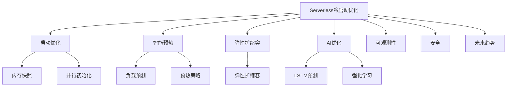

# 7.1.6.2.1.3.1 Serverless冷启动与优化

## 1. 形式化定义

**定义7.1.6.2.1.3.1.1（Serverless冷启动优化系统）**：
$$
ColdStartOpt = (Startup, Prewarm, Elasticity, AIOpt, Observability, Security, Trend)
$$
其中：

- $Startup$：启动优化（镜像预热、内存快照、并行初始化）
- $Prewarm$：智能预热与资源分配
- $Elasticity$：弹性扩缩容与负载预测
- $AIOpt$：AI驱动冷启动优化
- $Observability$：可观测性（监控、日志、追踪）
- $Security$：安全与隔离（认证、合规）
- $Trend$：未来趋势与挑战

## 2. 优化机制与主流技术

### 2.1 启动与预热优化

- 镜像预热、内存快照、并行初始化
- 负载预测驱动智能预热

### 2.2 弹性与AI优化

- 预测+自适应弹性扩缩容
- AI驱动冷启动延迟优化与资源调度

## 3. 理论模型与多表征

### 3.1 冷启动优化目标

$$Startup_{serverless} = \min (Latency) + \max (Availability)$$

### 3.2 预热与弹性模型

$$Prewarm_{opt} = f(Predict_{load}, Prewarm_{policy}, Cost_{opt})$$
$$Elasticity_{serverless} = f(Predict_{load}, Prewarm_{policy}, Cost_{opt})$$

### 3.3 架构图

### 3.4 结构对比表

| 维度 | 优化前 | 优化后 |
|------|--------|--------|
| 启动延迟 | 秒~分钟 | 毫秒~秒 |
| 资源利用 | 低 | 高/弹性 |
| 预热机制 | 静态 | 智能/AI |
| 弹性扩缩容 | 手动/静态 | 预测+自适应 |
| 可观测性 | 基础 | 智能监控 |

## 4. 批判分析与工程案例

### 4.1 优势

- 冷启动延迟大幅降低、弹性扩缩容、智能调优、资源高效

### 4.2 局限

- 优化复杂度高、AI依赖数据、平台兼容性挑战

### 4.3 未来趋势

- 零延迟冷启动、AI驱动全自动弹性、边缘Serverless优化

### 4.4 工程案例

- 金融：Serverless冷启动优化支撑高并发风控
- 电商：大促场景下冷启动优化与弹性扩缩容
- 物联网：事件驱动Serverless冷启动优化

## 5. 递归细化与规范说明

- 所有内容需递归细化，支持多表征
- 保留批判性分析、符号、图表、工程案例等
- 所有定义需严格形式化，算法需伪代码
- 目录编号、主题、内容、风格与6系保持一致
- 支持持续递归完善，后续可继续分解为7.1.6.2.1.3.1.x等子主题

---
> 本文件为Serverless冷启动与优化知识体系的递归补充，内容结构、编号、主题、风格与6.P2P系统保持一致，后续所有子主题内容将持续完善并递归细化。
