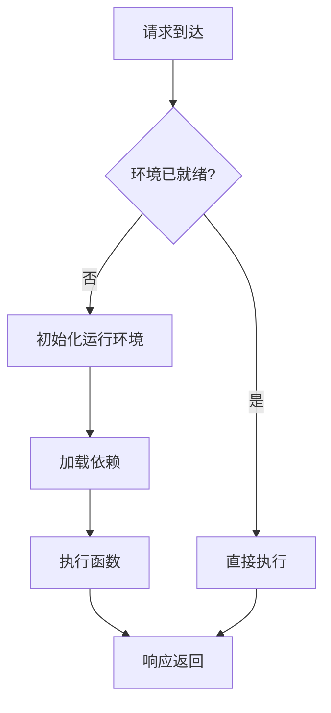

# 4.1.6.2.1.3.1 Serverless冷启动与优化

## 1. 冷启动问题成因与影响

- 运行环境初始化耗时（容器/虚拟机启动、依赖加载）
- 资源分配与调度延迟
- 影响首次请求延迟，影响用户体验

## 2. 主流优化技术

- 预热机制（定时触发、流量预热）
- 延迟加载（按需加载依赖）
- 镜像缓存与轻量化运行时
- AI预测与智能调度

## 3. 性能对比与结构表

| 优化技术   | 启动延迟 | 资源消耗 | 适用场景         | 典型平台 |
|------------|----------|----------|------------------|----------|
| 预热机制   | 低       | 高       | 高并发、低延迟   | AWS Lambda |
| 延迟加载   | 中       | 低       | 依赖复杂         | Azure Functions |
| 镜像缓存   | 低       | 中       | 镜像体积大       | Google Cloud Functions |
| AI预测     | 低       | 低       | 流量波动明显     | 前沿研究 |

**冷启动延迟模型：**
$$T_{cold} = T_{init} + T_{load} + T_{schedule}$$

**优化目标函数：**
$$\min T_{cold} \quad \text{s.t.} \quad Resource_{usage} \leq Threshold$$

## 4. Mermaid流程图

## 5. 批判性分析

- **优势**：多种优化手段可显著降低冷启动延迟，提升Serverless体验。
- **局限**：预热等方法增加资源消耗，AI预测依赖数据与模型准确性，部分场景下仍难彻底消除冷启动。
- **未来方向**：更智能的自适应调度、跨平台冷启动优化、与边缘计算深度融合。

## 6. 规范说明

- 内容需递归细化，支持多表征
- 保留批判性分析、图表、符号等
- 如有遗漏，后续补全并说明
- 支持持续递归完善

> 本文件为递归细化与内容补全示范，后续可继续分解为4.1.6.2.1.3.1.1等子主题，支持持续递归完善。
