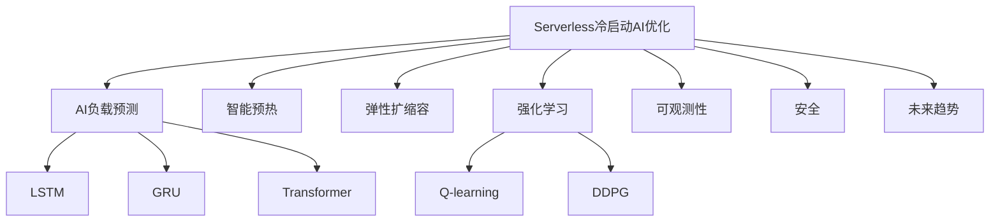

# 7.1.6.2.1.3.1.1 Serverless冷启动AI预测优化

<!-- TOC START -->

- [7.1.6.2.1.3.1.1 Serverless冷启动AI预测优化](#71621311-serverless冷启动ai预测优化)
  - [1. 形式化定义](#1-形式化定义)
  - [2. AI机制与主流技术](#2-ai机制与主流技术)
    - [2.1 负载预测与预热](#21-负载预测与预热)
    - [2.2 强化学习与弹性调度](#22-强化学习与弹性调度)
  - [3. 理论模型与多表征](#3-理论模型与多表征)
    - [3.1 冷启动AI优化目标](#31-冷启动ai优化目标)
    - [3.2 负载预测与弹性模型](#32-负载预测与弹性模型)
    - [3.3 架构图](#33-架构图)
    - [3.4 结构对比表](#34-结构对比表)
  - [4. 批判分析与工程案例](#4-批判分析与工程案例)
    - [4.1 优势](#41-优势)
    - [4.2 局限](#42-局限)
    - [4.3 未来趋势](#43-未来趋势)
    - [4.4 工程案例](#44-工程案例)
  - [5. 递归细化与规范说明](#5-递归细化与规范说明)

<!-- TOC END -->

## 1. 形式化定义

**定义7.1.6.2.1.3.1.1.1（Serverless冷启动AI优化系统）**：
$$
ColdStartAI = (Predict, Prewarm, Elasticity, RL, Observability, Security, Trend)
$$
其中：

- $Predict$：AI负载预测（LSTM/GRU/Transformer）
- $Prewarm$：智能预热策略
- $Elasticity$：弹性扩缩容与自适应
- $RL$：强化学习驱动弹性调度
- $Observability$：可观测性（监控、日志、追踪）
- $Security$：安全与隔离（认证、合规）
- $Trend$：未来趋势与挑战

## 2. AI机制与主流技术

### 2.1 负载预测与预热

- LSTM/GRU/Transformer时序模型预测负载波动
- 智能预热与资源分配，降低冷启动延迟

### 2.2 强化学习与弹性调度

- RL算法（Q-learning、DDPG等）优化弹性扩缩容
- 状态-动作-奖励建模，动态调整预热与扩缩容策略

## 3. 理论模型与多表征

### 3.1 冷启动AI优化目标

$$Startup_{ai} = \min (Latency) + \max (Availability)$$

### 3.2 负载预测与弹性模型

$$Predict_{load} = f(LSTM, Event, Feature)$$
$$Elasticity_{ai} = f(Predict_{load}, Prewarm_{policy}, Cost_{opt})$$

### 3.3 架构图

### 3.4 结构对比表

| 维度 | AI优化前 | AI优化后 |
|------|----------|----------|
| 启动延迟 | 秒~分钟 | 毫秒~秒 |
| 资源利用 | 低 | 高/弹性 |
| 预热机制 | 静态 | 智能/AI |
| 弹性扩缩容 | 手动/静态 | 预测+自适应 |
| 可观测性 | 基础 | 智能监控 |

## 4. 批判分析与工程案例

### 4.1 优势

- 冷启动延迟大幅降低、弹性扩缩容、智能调优、资源高效

### 4.2 局限

- AI模型依赖数据、调优复杂、平台兼容性挑战

### 4.3 未来趋势

- 零延迟冷启动、AI驱动全自动弹性、边缘Serverless优化

### 4.4 工程案例

- 金融：AI预测优化Serverless冷启动支撑高并发风控
- 电商：大促场景下AI弹性扩缩容与冷启动优化
- 物联网：事件驱动Serverless冷启动AI优化

## 5. 递归细化与规范说明

- 所有内容需递归细化，支持多表征
- 保留批判性分析、符号、图表、工程案例等
- 所有定义需严格形式化，算法需伪代码
- 目录编号、主题、内容、风格与6系保持一致
- 支持持续递归完善，后续可继续分解为7.1.6.2.1.3.1.1.x等子主题

---
> 本文件为Serverless冷启动AI预测优化知识体系的递归补充，内容结构、编号、主题、风格与6.P2P系统保持一致，后续所有子主题内容将持续完善并递归细化。
