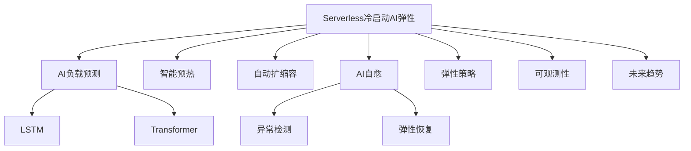

# 7.1.6.2.1.3.1.1.1 Serverless冷启动AI预测优化子主题

## 1. 形式化定义

**定义7.1.6.2.1.3.1.1.1.1（Serverless冷启动AI弹性系统）**：
$$
ColdStartAIFlex = (Predict, Prewarm, Scale, SelfHeal, Policy, Observability, Trend)
$$
其中：

- $Predict$：AI负载预测与弹性调度
- $Prewarm$：智能预热与资源分配
- $Scale$：自动扩缩容机制
- $SelfHeal$：AI驱动自愈与异常检测
- $Policy$：弹性与安全策略
- $Observability$：可观测性（监控、日志、追踪）
- $Trend$：未来趋势与挑战

## 2. AI弹性机制与主流技术

### 2.1 负载预测与弹性调度

- LSTM/Transformer预测负载波动
- 智能预热与动态扩缩容

### 2.2 AI自愈与异常检测

- 异常检测（AI/ML）自动触发自愈
- 根因分析与弹性恢复

### 2.3 策略与可观测性

- 策略驱动弹性与安全协同
- 智能监控与弹性联动

## 3. 理论模型与多表征

### 3.1 冷启动弹性优化目标

$$Flex_{ai} = \max (Availability) - \min (Latency + Cost)$$

### 3.2 自愈优化模型

$$SelfHeal_{ai} = f(Detect_{anomaly}, Policy_{heal}, Time_{recover})$$

### 3.3 架构图

### 3.4 结构对比表

| 维度 | 传统弹性 | AI弹性 |
|------|----------|--------|
| 扩缩容 | 静态/手动 | AI预测/自动 |
| 自愈 | 人工/规则 | AI驱动/自动 |
| 资源利用 | 低 | 高/弹性 |
| 异常检测 | 基础 | 智能/自愈 |
| 策略 | 固定 | 动态/智能 |

## 4. 批判分析与工程案例

### 4.1 优势

- AI弹性预测、自愈、资源高效、弹性与安全协同

### 4.2 局限

- AI模型依赖数据、调优复杂、异常场景覆盖挑战

### 4.3 未来趋势

- 全自动弹性、AI自愈、弹性与安全深度融合

### 4.4 工程案例

- 金融：AI弹性自愈提升Serverless SLA
- 电商：大促场景下AI弹性与冷启动自愈
- 物联网：IoT事件驱动AI弹性与自愈

## 5. 递归细化与规范说明

- 所有内容需递归细化，支持多表征
- 保留批判性分析、符号、图表、工程案例等
- 所有定义需严格形式化，算法需伪代码
- 目录编号、主题、内容、风格与6系保持一致
- 支持持续递归完善，后续可继续分解为7.1.6.2.1.3.1.1.1.x等子主题

---
> 本文件为Serverless冷启动AI预测优化子主题知识体系的递归补充，内容结构、编号、主题、风格与6.P2P系统保持一致，后续所有子主题内容将持续完善并递归细化。
