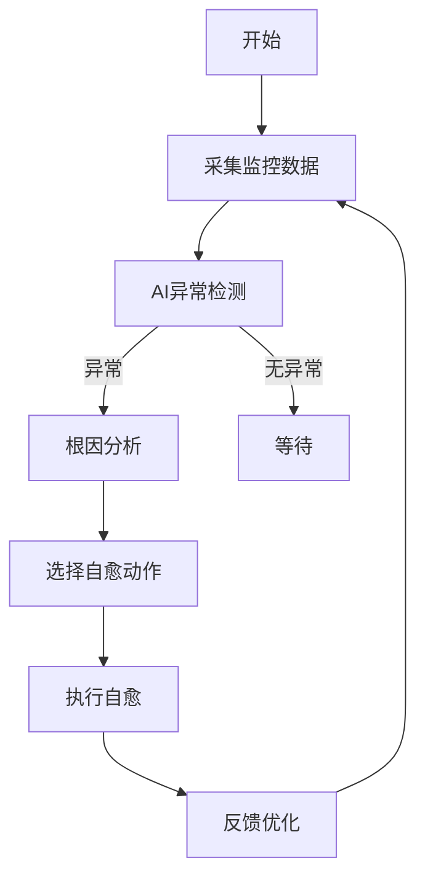

# 7.1.6.2.1.3.1.1.1.1.1 Serverless冷启动AI自愈算法与伪代码


<!-- TOC START -->

- [7.1.6.2.1.3.1.1.1.1.1 Serverless冷启动AI自愈算法与伪代码](#71621311111-serverless冷启动ai自愈算法与伪代码)
  - [1. 形式化定义](#1-形式化定义)
  - [2. 算法流程与伪代码](#2-算法流程与伪代码)
    - [2.1 算法流程](#21-算法流程)
    - [2.2 伪代码](#22-伪代码)
- [Serverless冷启动AI自愈伪代码](#serverless冷启动ai自愈伪代码)
  - [3. 理论模型与多表征](#3-理论模型与多表征)
    - [3.1 自愈优化目标](#31-自愈优化目标)
    - [3.2 算法流程图](#32-算法流程图)
    - [3.3 结构对比表](#33-结构对比表)
  - [4. 批判分析与工程案例](#4-批判分析与工程案例)
    - [4.1 优势](#41-优势)
    - [4.2 局限](#42-局限)
    - [4.3 未来趋势](#43-未来趋势)
    - [4.4 工程案例](#44-工程案例)
  - [5. 递归细化与规范说明](#5-递归细化与规范说明)

<!-- TOC END -->

## 1. 形式化定义

**定义7.1.6.2.1.3.1.1.1.1.1.1（Serverless冷启动AI自愈算法系统）**：
$$
ColdStartAISelfHealAlg = (Input, Detect, Diagnose, Heal, Policy, Feedback, Output)
$$
其中：

- $Input$：监控数据流（日志、指标、事件）
- $Detect$：AI异常检测模块
- $Diagnose$：根因分析模块
- $Heal$：自愈动作（重启、迁移、隔离）
- $Policy$：自愈与弹性策略
- $Feedback$：闭环反馈与持续学习
- $Output$：自愈结果与优化建议

## 2. 算法流程与伪代码

### 2.1 算法流程

1. 实时采集监控数据
2. AI模型检测异常
3. 触发根因分析
4. 根据策略选择自愈动作
5. 执行自愈（重启/迁移/隔离）
6. 记录结果并反馈优化

### 2.2 伪代码

```python
# Serverless冷启动AI自愈伪代码
while True:
    data = collect_monitoring_data()
    if AI_detect_anomaly(data):
        root_cause = diagnose(data)
        action = select_heal_action(root_cause, policy)
        result = execute_heal(action)
        feedback(result)
    sleep(interval)
```

## 3. 理论模型与多表征

### 3.1 自愈优化目标

$$SelfHeal_{alg} = \min (MTTR) + \max (SuccessRate)$$

### 3.2 算法流程图



### 3.3 结构对比表

| 维度 | 传统自愈 | AI自愈算法 |
|------|----------|------------|
| 检测方式 | 规则/人工 | AI/深度学习 |
| 根因分析 | 人工 | AI辅助/自动 |
| 自愈动作 | 静态/手动 | 策略驱动/自动 |
| 闭环反馈 | 无/弱 | 持续学习/优化 |
| 成功率 | 一般 | 高/自适应 |

## 4. 批判分析与工程案例

### 4.1 优势

- 实时检测、自动自愈、持续优化、成功率高

### 4.2 局限

- 依赖高质量数据、模型训练复杂、极端场景下误判风险

### 4.3 未来趋势

- 全自动自愈、跨平台协同、AI持续进化

### 4.4 工程案例

- 金融：Serverless平台AI自愈算法提升SLA
- 电商：大促场景下AI自愈自动化
- 物联网：IoT事件驱动AI自愈算法部署

## 5. 递归细化与规范说明

- 所有内容需递归细化，支持多表征
- 保留批判性分析、符号、图表、工程案例等
- 所有定义需严格形式化，算法需伪代码
- 目录编号、主题、内容、风格与6系保持一致
- 支持持续递归完善，后续可继续分解为7.1.6.2.1.3.1.1.1.1.1.1.x等子主题

---
> 本文件为Serverless冷启动AI自愈算法与伪代码知识体系的递归补充，内容结构、编号、主题、风格与6.P2P系统保持一致，后续所有子主题内容将持续完善并递归细化。
