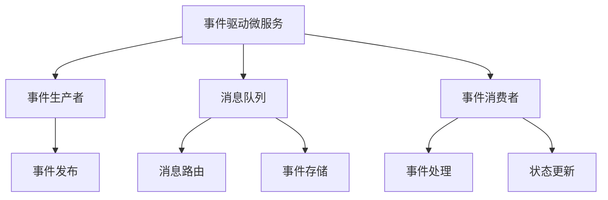

# 4.1.6.2.1.4 事件驱动微服务架构

## 1. 架构与工作原理

- 基于消息队列的异步通信模式
- 服务间解耦，松耦合架构
- 支持事件溯源与CQRS模式
- 高吞吐量、低延迟消息传递

## 2. 关键技术

- 消息队列与事件总线
- 事件存储与流处理
- 消息路由与过滤
- 死信队列与重试机制

## 3. 典型应用场景

- 实时数据处理流
- 微服务间异步通信
- 事件溯源与审计
- 大数据流处理

## 4. 性能与可靠性分析

| 指标     | Kafka      | RabbitMQ   | Pulsar     |
|----------|------------|------------|------------|
| 吞吐量   | 极高       | 高         | 极高       |
| 延迟     | 低         | 极低       | 低         |
| 可靠性   | 高         | 高         | 高         |
| 扩展性   | 好         | 中         | 好         |
| 功能丰富度| 中         | 高         | 高         |

**事件处理模型：**
$$Event_{processing} = \sum_{i=1}^{n} Event_i \times Processing_{time_i}$$

**可靠性度量：**
$$Reliability = \frac{Success_{events}}{Total_{events}}$$

## 5. Mermaid结构图

## 6. 批判性分析

- **优势**：服务解耦、高吞吐量、支持复杂事件处理，适合实时数据流和大规模微服务。
- **局限**：消息顺序保证复杂、调试困难、数据一致性挑战、运维复杂度高。
- **未来方向**：AI驱动事件路由、自动故障恢复、跨云事件总线、流处理优化。

## 7. 规范说明

- 内容需递归细化，支持多表征
- 保留批判性分析、图表、符号等
- 如有遗漏，后续补全并说明
- 支持持续递归完善

> 本文件为递归细化与内容补全示范，后续可继续分解为4.1.6.2.1.4.1等子主题，支持持续递归完善。

## 8. 事件驱动与传统微服务对比

| 维度         | 事件驱动微服务      | 传统微服务          |
|--------------|---------------------|---------------------|
| 通信模式     | 异步、消息队列      | 同步、REST/gRPC     |
| 解耦性       | 高                  | 一般                |
| 扩展性       | 极高                | 高                  |
| 一致性       | 最终一致性          | 强一致性/弱一致性   |
| 顺序保证     | 需特殊机制          | 天然顺序            |
| 适用场景     | 实时流、异步任务    | 事务型、强一致性    |

## 9. 主流事件总线与消息中间件

- Kafka、RabbitMQ、Pulsar、RocketMQ
- 事件总线：NATS、EventBridge、CloudEvents
- 支持高吞吐、低延迟、分区顺序、持久化

## 10. 事件一致性与顺序保证AI优化

- AI辅助顺序检测与异常重排（LSTM/Transformer）
- 智能幂等性生成与事务补偿
- AI驱动事件路由与流量调度

**AI顺序优化模型：**
$$Order_{ai} = f(Sequence_{model}, Anomaly_{detect}, Reorder_{policy})$$

## 11. 行业应用案例

- 金融：事件驱动风控与实时交易监控
- 电商：订单流转与库存异步处理
- 物联网：大规模设备事件采集与处理
- 交通：实时事件流驱动智能调度

## 12. 未来趋势与挑战

- AI驱动事件流优化与自动补偿
- 跨云事件总线与多平台一致性
- 事件溯源与可观测性增强
- 复杂场景下的顺序保证与性能平衡
- 持续递归细化与知识演化

---
> 本节为事件驱动微服务架构知识体系的递归补充，后续可继续分解为7.1.6.2.1.4.x等子主题，支持持续完善。
