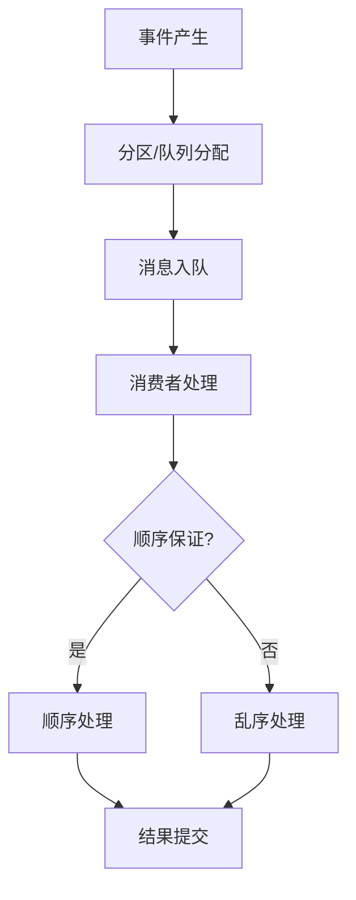

# 4.1.6.2.1.4.1 事件驱动一致性与顺序保证

## 1. 一致性与顺序问题成因

- 分布式环境下消息乱序、重复、丢失
- 多消费者并发处理导致顺序错乱
- 事件溯源与审计需求

## 2. 主流技术方案

- 幂等性处理（Idempotency Key）
- 事务日志与事件溯源
- 顺序分区与全局有序队列
- 全局唯一ID与时间戳

## 3. 性能权衡与结构表

| 技术方案   | 一致性保证 | 顺序保证 | 性能影响 | 适用场景         |
|------------|------------|----------|----------|------------------|
| 幂等性     | 高         | 无       | 低       | 并发写入         |
| 事务日志   | 高         | 高       | 中       | 金融、审计       |
| 顺序分区   | 中         | 高       | 中       | 实时流处理       |
| 全局ID     | 中         | 中       | 低       | 分布式追踪       |

**一致性与顺序模型：**
$$Consistency = f(Idempotency, Log, Partition, ID)$$

**顺序保证优化：**
$$Order_{guarantee} = \arg\max_{scheme} (Reliability - Latency)$$

## 4. Mermaid流程图

## 5. 批判性分析

- **优势**：多种机制可提升一致性与顺序保证，适应金融、审计等高要求场景。
- **局限**：顺序保证通常带来性能损耗，幂等性与全局ID需业务配合，复杂场景下难以彻底解决。
- **未来方向**：AI辅助顺序检测、跨平台一致性协议、自动化幂等性生成。

## 6. 规范说明

- 内容需递归细化，支持多表征
- 保留批判性分析、图表、符号等
- 如有遗漏，后续补全并说明
- 支持持续递归完善

> 本文件为递归细化与内容补全示范，后续可继续分解为4.1.6.2.1.4.1.1等子主题，支持持续递归完善。
