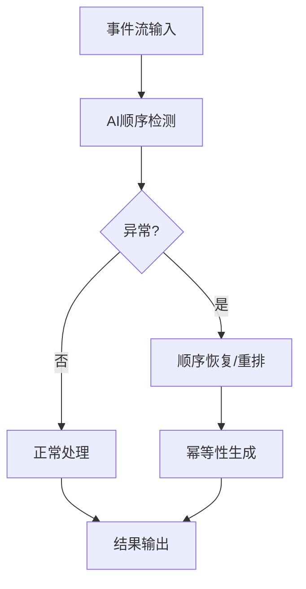

# 4.1.6.2.1.4.1.1 事件驱动AI顺序检测与一致性优化

## 1. AI/ML在顺序检测与一致性优化中的应用

- 异常顺序检测与自动报警
- 智能顺序恢复与重排
- AI辅助幂等性生成与事务一致性
- 结合序列建模、异常检测、强化学习等算法

## 2. 关键技术与算法

- 序列异常检测（LSTM、Transformer）
- 智能重排与顺序恢复
- 幂等性模式识别与自动生成
- 智能事务日志分析

## 3. 性能对比与结构表

| 优化方式   | 顺序保证 | 一致性提升 | 算法复杂度 | 适用场景         |
|------------|----------|------------|------------|------------------|
| 传统规则   | 中       | 中         | 低         | 简单业务         |
| AI检测优化 | 高       | 高         | 中/高      | 大规模流处理     |
| 人工干预   | 高       | 高         | 高         | 金融、审计       |

**AI顺序检测模型：**
$$Order_{ai} = f(Sequence_{model}, Anomaly_{detect}, Reorder_{policy})$$

**一致性优化目标：**
$$\max (Order_{ai} + Consistency_{ai}) - \min (Latency)$$

## 4. Mermaid流程图

## 5. 批判性分析

- **优势**：AI可提升顺序检测与一致性，适应大规模复杂事件流，减少人工干预。
- **局限**：算法复杂度高，异常场景难以穷举，模型泛化能力有限。
- **未来方向**：自适应AI检测、跨平台一致性协议、自动化事务管理。

## 6. 规范说明

- 内容需递归细化，支持多表征
- 保留批判性分析、图表、符号等
- 如有遗漏，后续补全并说明
- 支持持续递归完善

> 本文件为递归细化与内容补全示范，后续可继续分解为4.1.6.2.1.4.1.1.1等子主题，支持持续递归完善。
