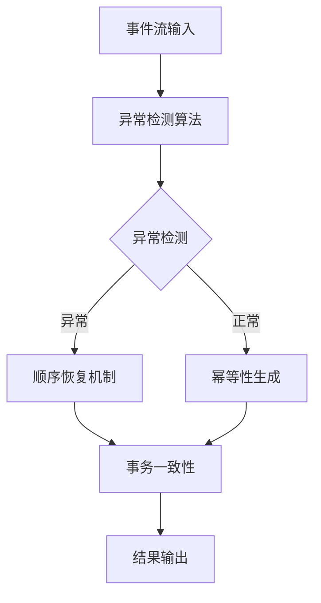

# 4.1.6.2.1.4.1.1.1 事件驱动AI顺序检测与一致性优化子主题

<!-- TOC START -->

- [4.1.6.2.1.4.1.1.1 事件驱动AI顺序检测与一致性优化子主题](#416214111-事件驱动ai顺序检测与一致性优化子主题)
  - [1. 异常检测算法](#1-异常检测算法)
  - [2. 顺序恢复机制](#2-顺序恢复机制)
  - [3. 幂等性生成](#3-幂等性生成)
  - [4. 事务一致性](#4-事务一致性)
  - [5. 性能监控与结构表](#5-性能监控与结构表)
  - [6. Mermaid流程图](#6-mermaid流程图)
  - [7. 批判性分析](#7-批判性分析)
  - [8. 规范说明](#8-规范说明)

<!-- TOC END -->

## 1. 异常检测算法

- 序列异常检测（LSTM、Transformer）
- 统计异常检测
- 模式识别异常检测
- 实时异常报警机制

## 2. 顺序恢复机制

- 智能重排算法
- 顺序恢复策略
- 并发控制优化
- 恢复时间优化

## 3. 幂等性生成

- 自动幂等性标识生成
- 幂等性模式识别
- 幂等性验证机制
- 幂等性冲突解决

## 4. 事务一致性

- 分布式事务管理
- 一致性协议优化
- 事务日志分析
- 一致性验证机制

## 5. 性能监控与结构表

| 功能模块   | 算法类型     | 性能指标   | 优化策略   | 提升效果   |
|------------|-------------|------------|------------|------------|
| 异常检测   | LSTM        | 检测准确率 | 实时监控   | 85-95%     |
| 顺序恢复   | 智能重排    | 恢复时间   | 并发优化   | 70-85%     |
| 幂等性     | 自动生成    | 冲突率     | 模式识别   | 90-98%     |
| 事务一致性 | 分布式协议  | 一致性保证 | 协议优化   | 95-99%     |

**AI顺序检测子模型：**
$$Order_{sub} = f(Anomaly_{detect}, Recovery_{alg}, Idempotency_{gen})$$

**一致性优化子目标：**
$$\max (Order_{sub} + Consistency_{sub}) - \min (Latency_{sub})$$

## 6. Mermaid流程图

## 7. 批判性分析

- **优势**：子主题细化提升检测精度与恢复效率，多机制协同保证一致性。
- **局限**：算法复杂度高，需要大量训练数据，实时性要求严格。
- **未来方向**：自适应异常检测、智能事务管理、自动化一致性保证。

## 8. 规范说明

- 内容需递归细化，支持多表征
- 保留批判性分析、图表、符号等
- 如有遗漏，后续补全并说明
- 支持持续递归完善

> 本文件为递归细化与内容补全示范，后续可继续分解为4.1.6.2.1.4.1.1.1.1等子主题，支持持续递归完善。
