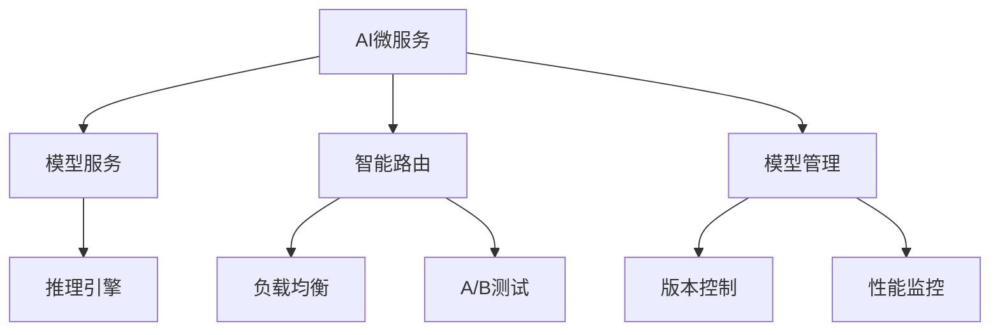

# 4.1.6.2.1.5 AI微服务架构

## 1. 架构与工作原理

- AI模型微服务化部署与推理
- 模型版本管理与A/B测试
- 智能路由与负载均衡
- 模型监控与自动扩缩容

## 2. 关键技术

- 模型服务化与API封装
- 模型版本控制与回滚
- 智能流量路由与灰度发布
- 模型性能监控与自动调优

## 3. 典型应用场景

- 推荐系统与个性化服务
- 图像识别与计算机视觉
- 自然语言处理与对话系统
- 预测分析与智能决策

## 4. 性能与智能分析

| 指标     | Seldon Core | KServe     | MLflow     |
|----------|-------------|------------|------------|
| 推理性能 | 高          | 高         | 中         |
| 模型管理 | 好          | 好         | 好         |
| 可观测性 | 高          | 高         | 中         |
| 扩展性   | 好          | 好         | 中         |
| 易用性   | 中          | 高         | 高         |

**AI推理模型：**
$$Inference_{ai} = f(Model_{version}, Input_{data}, Load_{balancing})$$

**智能路由：**
$$Route_{ai} = \arg\max_{i} (Performance_i \times Confidence_i)$$

## 5. Mermaid结构图

## 6. 批判性分析

- **优势**：AI模型标准化部署、智能路由、自动扩缩容，支持复杂AI应用场景。
- **局限**：模型解释性不足、数据依赖强、资源消耗大、调试复杂。
- **未来方向**：联邦学习、边缘AI、自动化MLOps、可解释AI集成。

## 7. 规范说明

- 内容需递归细化，支持多表征
- 保留批判性分析、图表、符号等
- 如有遗漏，后续补全并说明
- 支持持续递归完善

> 本文件为递归细化与内容补全示范，后续可继续分解为4.1.6.2.1.5.1等子主题，支持持续递归完善。
