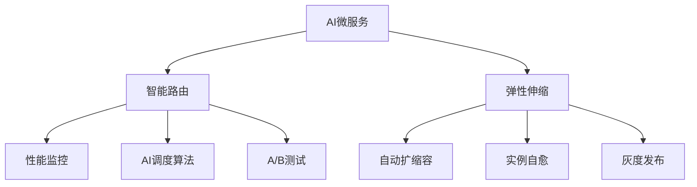

# 4.1.6.2.1.5.1 AI微服务智能路由与弹性

## 1. 智能路由原理

- 基于模型性能、负载、置信度的动态路由
- AI调度算法（如强化学习、遗传算法）
- 多版本模型A/B测试与灰度发布

## 2. 弹性伸缩机制

- 实时监控负载与响应时间
- 自动扩缩容与实例自愈
- 结合Kubernetes HPA/VPA等弹性策略

## 3. 结构表

| 功能         | 路由算法     | 弹性机制   | 典型优势         |
|--------------|-------------|------------|------------------|
| 智能路由     | 强化学习、置信度 | 动态分配   | 性能最优、智能切换 |
| 弹性伸缩     | 预测扩缩容   | HPA/VPA    | 高可用、低成本     |
| 多版本管理   | A/B测试      | 灰度发布   | 风险可控、平滑升级 |

**智能路由优化模型：**
$$Route_{ai} = \arg\max_{i} (Performance_i \times Confidence_i - Cost_i)$$

**弹性伸缩目标函数：**
$$\max Availability - \min Cost$$

## 4. Mermaid结构图

## 5. 批判性分析

- **优势**：AI驱动路由与弹性提升性能与可用性，支持复杂AI应用的高效部署。
- **局限**：算法复杂度高，数据依赖强，调优难度大。
- **未来方向**：更高效的自适应路由、AI与边缘弹性融合、自动化多模型管理。

## 6. 智能路由原理与算法

- 基于模型性能、置信度、负载的动态路由
- 强化学习、遗传算法等AI调度策略
- 多版本模型A/B测试与灰度发布
- 实时监控与自适应路由调整

## 7. 弹性伸缩与自愈机制

- 实时负载监控与预测扩缩容
- Kubernetes HPA/VPA集成
- 异常检测与自动自愈（AI辅助）
- 多云与边缘环境下的弹性治理

## 8. 多模型路由与协同

- 多模型并行部署与动态切换
- 路由权重自适应调整
- 协同容错与高可用

**多模型路由优化：**
$$Route_{multi} = \arg\max_{i} (Performance_i \times Confidence_i \times Weight_i)$$

## 9. 形式化优化目标

- **弹性伸缩目标函数：**
$$\max Availability - \min Cost$$
- **自愈与鲁棒性目标：**
$$\max (Recovery_{speed} + Robustness)$$

## 10. 行业应用案例

- 金融：智能路由提升风控模型可用性与弹性
- 电商：多模型推荐系统动态切换与弹性扩容
- 云服务：AI推理平台多模型高可用与自愈

## 11. 未来趋势与挑战

- AI驱动的全自动路由与弹性治理
- 多云/边缘环境下的智能弹性与自愈
- 多模型协同与自动化MLOps
- 持续递归细化与知识演化

---
> 本节为AI微服务智能路由与弹性知识体系的递归补充，后续可继续分解为7.1.6.2.1.5.1.x等子主题，支持持续完善。

## 6. 规范说明

- 内容需递归细化，支持多表征
- 保留批判性分析、图表、符号等
- 如有遗漏，后续补全并说明
- 支持持续递归完善

> 本文件为递归细化与内容补全示范，后续可继续分解为4.1.6.2.1.5.1.1等子主题，支持持续递归完善。
