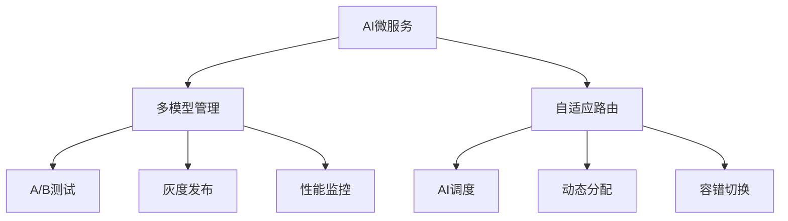

# 4.1.6.2.1.5.1.1 AI微服务多模型管理与自适应路由

<!-- TOC START -->

- [4.1.6.2.1.5.1.1 AI微服务多模型管理与自适应路由](#41621511-ai微服务多模型管理与自适应路由)
  - [1. 多模型管理原理](#1-多模型管理原理)
  - [2. 自适应路由机制](#2-自适应路由机制)
  - [3. 结构表](#3-结构表)
  - [4. Mermaid结构图](#4-mermaid结构图)
  - [5. 批判性分析](#5-批判性分析)
  - [6. 规范说明](#6-规范说明)

<!-- TOC END -->

## 1. 多模型管理原理

- 支持多版本模型并行部署与切换
- 自动化A/B测试与灰度发布
- 模型性能监控与动态淘汰

## 2. 自适应路由机制

- 基于实时性能、置信度、负载的动态路由
- AI算法自适应流量分配
- 多模型协同与容错

## 3. 结构表

| 功能         | 路由算法     | 管理机制   | 典型优势         |
|--------------|-------------|------------|------------------|
| 多模型管理   | A/B测试、灰度 | 动态淘汰   | 风险可控、持续优化 |
| 自适应路由   | AI调度      | 性能监控   | 性能最优、弹性高   |
| 协同容错     | 冗余路由     | 容错切换   | 高可用、鲁棒性强   |

**多模型路由优化模型：**
$$Route_{multi} = \arg\max_{i} (Performance_i \times Confidence_i \times Weight_i)$$

**自适应目标函数：**
$$\max (Availability + Performance) - \min (Risk)$$

## 4. Mermaid结构图

## 5. 批判性分析

- **优势**：多模型协同与自适应路由提升性能与可用性，支持复杂AI场景的持续优化。
- **局限**：管理与调度复杂度高，监控与切换策略需精细设计。
- **未来方向**：自动化MLOps、联邦学习、边缘多模型协同。

## 6. 规范说明

- 内容需递归细化，支持多表征
- 保留批判性分析、图表、符号等
- 如有遗漏，后续补全并说明
- 支持持续递归完善

> 本文件为递归细化与内容补全示范，后续可继续分解为4.1.6.2.1.5.1.1.1等子主题，支持持续递归完善。
