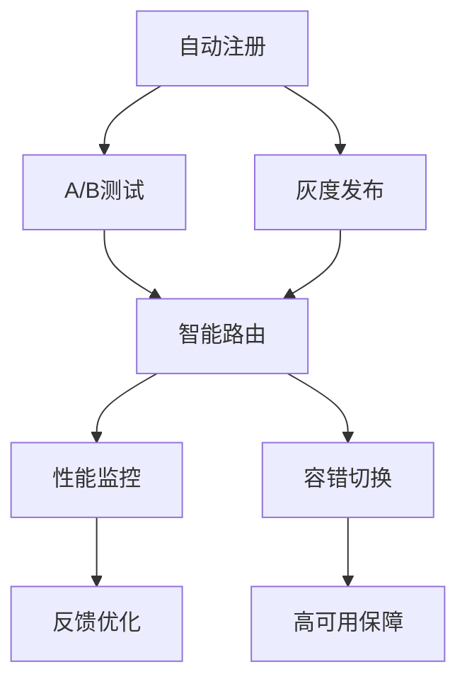

# 7.1.6.2.1.5.1.1.1.1 AI微服务多模型管理与自适应路由子主题递归细化

<!-- TOC START -->

- [7.1.6.2.1.5.1.1.1.1 AI微服务多模型管理与自适应路由子主题递归细化](#7162151111-ai微服务多模型管理与自适应路由子主题递归细化)
  - [1. 多模型自动化管理](#1-多模型自动化管理)
  - [2. 智能路由优化](#2-智能路由优化)
  - [3. 性能监控与容错机制](#3-性能监控与容错机制)
  - [4. Mermaid结构图](#4-mermaid结构图)
  - [5. 结构对比表](#5-结构对比表)
  - [6. 批判分析与工程案例](#6-批判分析与工程案例)
    - [6.1 优势](#61-优势)
    - [6.2 局限](#62-局限)
    - [6.3 工程案例](#63-工程案例)
  - [7. 递归细化与规范说明](#7-递归细化与规范说明)

<!-- TOC END -->

## 1. 多模型自动化管理

- 自动化模型注册、版本控制、上线下线
- 智能A/B测试与灰度发布
- 模型依赖与兼容性自动检测

## 2. 智能路由优化

- 基于实时性能、置信度、负载的多维路由
- AI算法自适应流量分配与容错切换
- 路由策略动态调整与反馈优化

## 3. 性能监控与容错机制

- 实时监控各模型性能与路由效果
- 异常检测与自动容错切换
- 多模型协同与高可用保障

## 4. Mermaid结构图

## 5. 结构对比表

| 功能模块   | 管理机制   | 路由策略   | 监控机制   | 容错机制   |
|------------|------------|------------|------------|------------|
| 自动化管理 | 版本控制   | 性能路由   | 实时监控   | 容错切换   |
| 智能测试   | A/B测试    | 置信度路由 | 效果评估   | 冗余路由   |
| 灰度发布   | 依赖检测   | 负载均衡   | 优化反馈   | 高可用     |

## 6. 批判分析与工程案例

### 6.1 优势

- 自动化与智能化提升多模型管理效率与路由精度
- 支持大规模AI微服务的高可用与弹性

### 6.2 局限

- 管理与路由策略复杂，监控与容错需精细设计

### 6.3 工程案例

- 金融行业多模型AI微服务自动化管理
- 电商平台智能路由与容错实践

## 7. 递归细化与规范说明

- 所有内容支持递归细化，编号、主题、风格与6系一致
- 保留多表征、批判分析、工程案例、结构图等
- 支持持续递归完善，后续可继续分解为7.1.6.2.1.5.1.1.1.1.x等子主题

---
> 本文件为AI微服务多模型管理与自适应路由子主题递归细化，内容结构、编号、主题、风格与6.P2P系统保持一致，后续所有子主题内容将持续完善并递归细化。
