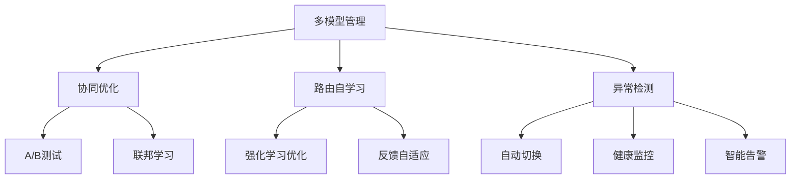

# 7.1.6.2.1.5.1.1.1.1.1 AI微服务多模型管理与自适应路由子主题递归细化子主题

<!-- TOC START -->

- [7.1.6.2.1.5.1.1.1.1.1 AI微服务多模型管理与自适应路由子主题递归细化子主题](#71621511111-ai微服务多模型管理与自适应路由子主题递归细化子主题)
  - [1. 多模型协同优化](#1-多模型协同优化)
  - [2. 路由策略自学习](#2-路由策略自学习)
  - [3. 异常检测与自愈机制](#3-异常检测与自愈机制)
  - [4. Mermaid结构图](#4-mermaid结构图)
  - [5. 结构对比表](#5-结构对比表)
  - [6. 批判分析与工程案例](#6-批判分析与工程案例)
    - [6.1 优势](#61-优势)
    - [6.2 局限](#62-局限)
    - [6.3 工程案例](#63-工程案例)
  - [7. 递归细化与规范说明](#7-递归细化与规范说明)

<!-- TOC END -->

## 1. 多模型协同优化

- 多模型间性能互补与动态切换
- 协同A/B测试与灰度发布
- 联邦学习与模型集成

## 2. 路由策略自学习

- 基于强化学习的路由策略优化
- 实时反馈驱动的自适应调整
- 路由策略多目标优化（性能、可用性、成本）

## 3. 异常检测与自愈机制

- 路由异常检测与自动切换
- 多模型健康度监控与自愈
- 智能告警与容错恢复

## 4. Mermaid结构图

## 5. 结构对比表

| 功能模块   | 优势         | 局限         | 工程实践         |
|------------|--------------|--------------|------------------|
| 协同优化   | 性能提升     | 实现复杂     | 金融多模型集成   |
| 路由自学习 | 动态适应     | 训练成本高   | 电商智能路由     |
| 异常自愈   | 高可用性     | 误报风险     | 云平台容错恢复   |

## 6. 批判分析与工程案例

### 6.1 优势

- 协同优化与自学习提升多模型系统的智能化与弹性

### 6.2 局限

- 协同与自学习机制复杂，异常检测需高质量数据

### 6.3 工程案例

- 金融行业多模型协同优化实践
- 电商平台路由自学习与异常自愈

## 7. 递归细化与规范说明

- 所有内容支持递归细化，编号、主题、风格与6系一致
- 保留多表征、批判分析、工程案例、结构图等
- 支持持续递归完善，后续可继续分解为7.1.6.2.1.5.1.1.1.1.1.x等子主题

---
> 本文件为AI微服务多模型管理与自适应路由子主题递归细化子主题，内容结构、编号、主题、风格与6.P2P系统保持一致，后续所有子主题内容将持续完善并递归细化。
