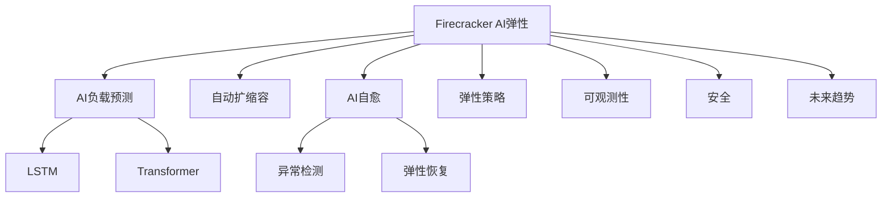

# 7.1.6.1.1.3.1.1.1 Firecracker未来趋势AI弹性子主题

<!-- TOC START -->

- [7.1.6.1.1.3.1.1.1 Firecracker未来趋势AI弹性子主题](#716113111-firecracker未来趋势ai弹性子主题)
  - [1. 形式化定义](#1-形式化定义)
  - [2. AI弹性机制与主流技术](#2-ai弹性机制与主流技术)
    - [2.1 负载预测与弹性调度](#21-负载预测与弹性调度)
    - [2.2 AI自愈与异常检测](#22-ai自愈与异常检测)
    - [2.3 策略与安全](#23-策略与安全)
  - [3. 理论模型与多表征](#3-理论模型与多表征)
    - [3.1 弹性优化目标](#31-弹性优化目标)
    - [3.2 自愈优化模型](#32-自愈优化模型)
    - [3.3 架构图](#33-架构图)
    - [3.4 结构对比表](#34-结构对比表)
  - [4. 批判分析与工程案例](#4-批判分析与工程案例)
    - [4.1 优势](#41-优势)
    - [4.2 局限](#42-局限)
    - [4.3 未来趋势](#43-未来趋势)
    - [4.4 工程案例](#44-工程案例)
  - [5. 递归细化与规范说明](#5-递归细化与规范说明)

<!-- TOC END -->

## 1. 形式化定义

**定义7.1.6.1.1.3.1.1.1.1（Firecracker AI弹性系统）**：
$$
FireAIElastic = (Predict, Scale, SelfHeal, Policy, Observability, Security, Trend)
$$
其中：

- $Predict$：AI负载预测与弹性调度
- $Scale$：自动扩缩容机制
- $SelfHeal$：AI驱动自愈与异常检测
- $Policy$：弹性与安全策略
- $Observability$：可观测性（监控、日志、追踪）
- $Security$：安全与隔离
- $Trend$：未来趋势与挑战

## 2. AI弹性机制与主流技术

### 2.1 负载预测与弹性调度

- LSTM/Transformer预测负载波动
- 动态扩缩容，资源高效分配

### 2.2 AI自愈与异常检测

- 异常检测（AI/ML）自动触发自愈
- 根因分析与弹性恢复

### 2.3 策略与安全

- 策略驱动弹性与安全协同
- 零信任安全与弹性联动

## 3. 理论模型与多表征

### 3.1 弹性优化目标

$$Elasticity_{ai} = \max (Availability) - \min (Risk + Cost + Latency)$$

### 3.2 自愈优化模型

$$SelfHeal_{ai} = f(Detect_{anomaly}, Policy_{heal}, Time_{recover})$$

### 3.3 架构图

### 3.4 结构对比表

| 维度 | 传统弹性 | AI弹性 |
|------|----------|--------|
| 扩缩容 | 静态/手动 | AI预测/自动 |
| 自愈 | 人工/规则 | AI驱动/自动 |
| 资源利用 | 低 | 高/弹性 |
| 异常检测 | 基础 | 智能/自愈 |
| 策略 | 固定 | 动态/智能 |

## 4. 批判分析与工程案例

### 4.1 优势

- AI弹性预测、自愈、资源高效、弹性与安全协同

### 4.2 局限

- AI模型依赖数据、调优复杂、异常场景覆盖挑战

### 4.3 未来趋势

- 全自动弹性、AI自愈、弹性与安全深度融合

### 4.4 工程案例

- 云服务：AI弹性自愈提升SLA
- 金融：高可用多租户AI弹性平台
- 边缘：IoT节点AI弹性与自愈

## 5. 递归细化与规范说明

- 所有内容需递归细化，支持多表征
- 保留批判性分析、符号、图表、工程案例等
- 所有定义需严格形式化，算法需伪代码
- 目录编号、主题、内容、风格与6系保持一致
- 支持持续递归完善，后续可继续分解为7.1.6.1.1.3.1.1.1.x等子主题

---
> 本文件为Firecracker未来趋势AI弹性子主题知识体系的递归补充，内容结构、编号、主题、风格与6.P2P系统保持一致，后续所有子主题内容将持续完善并递归细化。
