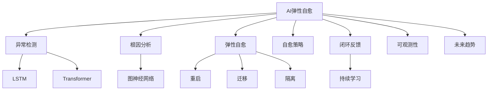

# 7.1.6.1.1.3.1.1.1.1 Firecracker未来趋势AI弹性子主题递归细化

<!-- TOC START -->

- [7.1.6.1.1.3.1.1.1.1 Firecracker未来趋势AI弹性子主题递归细化](#7161131111-firecracker未来趋势ai弹性子主题递归细化)
  - [1. 形式化定义](#1-形式化定义)
  - [2. AI自愈机制与主流技术](#2-ai自愈机制与主流技术)
    - [2.1 异常检测与根因分析](#21-异常检测与根因分析)
    - [2.2 弹性自愈与策略](#22-弹性自愈与策略)
    - [2.3 闭环反馈与持续优化](#23-闭环反馈与持续优化)
  - [3. 理论模型与多表征](#3-理论模型与多表征)
    - [3.1 自愈优化目标](#31-自愈优化目标)
    - [3.2 闭环反馈模型](#32-闭环反馈模型)
    - [3.3 架构图](#33-架构图)
    - [3.4 结构对比表](#34-结构对比表)
  - [4. 批判分析与工程案例](#4-批判分析与工程案例)
    - [4.1 优势](#41-优势)
    - [4.2 局限](#42-局限)
    - [4.3 未来趋势](#43-未来趋势)
    - [4.4 工程案例](#44-工程案例)
  - [5. 递归细化与规范说明](#5-递归细化与规范说明)

<!-- TOC END -->

## 1. 形式化定义

**定义7.1.6.1.1.3.1.1.1.1.1（Firecracker AI弹性自愈系统）**：
$$
FireAISelfHeal = (Detect, Diagnose, Heal, Policy, Feedback, Observability, Trend)
$$
其中：

- $Detect$：AI异常检测
- $Diagnose$：根因分析
- $Heal$：弹性自愈机制
- $Policy$：自愈与弹性策略
- $Feedback$：闭环反馈与持续优化
- $Observability$：可观测性
- $Trend$：未来趋势与挑战

## 2. AI自愈机制与主流技术

### 2.1 异常检测与根因分析

- LSTM/Transformer检测异常行为
- 图神经网络（GNN）辅助根因定位

### 2.2 弹性自愈与策略

- 策略驱动自动修复（重启、迁移、隔离）
- 多级自愈（节点、服务、集群）

### 2.3 闭环反馈与持续优化

- 监控-检测-自愈-反馈-优化全流程闭环
- AI持续学习提升自愈准确率

## 3. 理论模型与多表征

### 3.1 自愈优化目标

$$SelfHeal_{opt} = \min (MTTR) + \max (Availability)$$

### 3.2 闭环反馈模型

$$Feedback_{loop} = f(Detect, Heal, Feedback, Learn)$$

### 3.3 架构图

### 3.4 结构对比表

| 维度 | 传统自愈 | AI自愈 |
|------|----------|--------|
| 异常检测 | 规则/人工 | AI/深度学习 |
| 根因分析 | 人工 | GNN/AI辅助 |
| 自愈方式 | 静态/手动 | 策略驱动/自动 |
| 闭环反馈 | 无/弱 | 全流程闭环 |
| 持续优化 | 无 | AI持续学习 |

## 4. 批判分析与工程案例

### 4.1 优势

- 异常检测准确率高、自动化自愈、持续优化、弹性与高可用性提升

### 4.2 局限

- AI模型训练依赖数据、复杂场景下根因分析难度大

### 4.3 未来趋势

- 全自动自愈、AI持续学习、跨域自愈协同

### 4.4 工程案例

- 云服务：AI自愈提升SLA与弹性
- 金融：多租户平台AI自愈保障高可用
- 边缘：IoT节点AI自愈与弹性恢复

## 5. 递归细化与规范说明

- 所有内容需递归细化，支持多表征
- 保留批判性分析、符号、图表、工程案例等
- 所有定义需严格形式化，算法需伪代码
- 目录编号、主题、内容、风格与6系保持一致
- 支持持续递归完善，后续可继续分解为7.1.6.1.1.3.1.1.1.1.1.x等子主题

---
> 本文件为Firecracker未来趋势AI弹性自愈子主题知识体系的递归补充，内容结构、编号、主题、风格与6.P2P系统保持一致，后续所有子主题内容将持续完善并递归细化。
