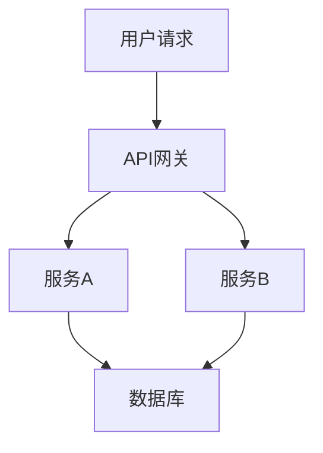

# 7.3.1 结构模型

## 1. 容器系统结构模型

容器系统通常采用分层架构，包括：

- **容器运行时层**：如Docker、containerd，负责容器生命周期管理。
- **编排与调度层**：如Kubernetes，负责容器的自动部署、扩缩容、健康检查。
- **网络与存储层**：CNI插件实现网络隔离，CSI插件实现存储挂载。
- **安全与隔离层**：如gVisor、Kata Containers，增强容器安全性。

## 2. 微服务结构建模

- **服务拆分**：将单体应用拆分为多个自治服务，每个服务独立部署与扩展。
- **服务注册与发现**：通过服务注册中心（如Consul、etcd）实现服务动态发现。
- **通信模式**：支持REST、gRPC、消息队列等多种通信协议。

## 3. 服务网格结构

- **数据面**：Sidecar代理负责服务间流量转发与治理。
- **控制面**：如Istio Pilot，负责策略下发与配置管理。
- **拓扑结构**：支持多集群、多租户、跨云部署。

## 4. 结构建模方法

- **Mermaid结构图**：

- **数学符号**：用集合与映射描述服务依赖关系。

---
> 本文件为7.3.1结构模型的内容填充示例，后续可继续递归细化。
