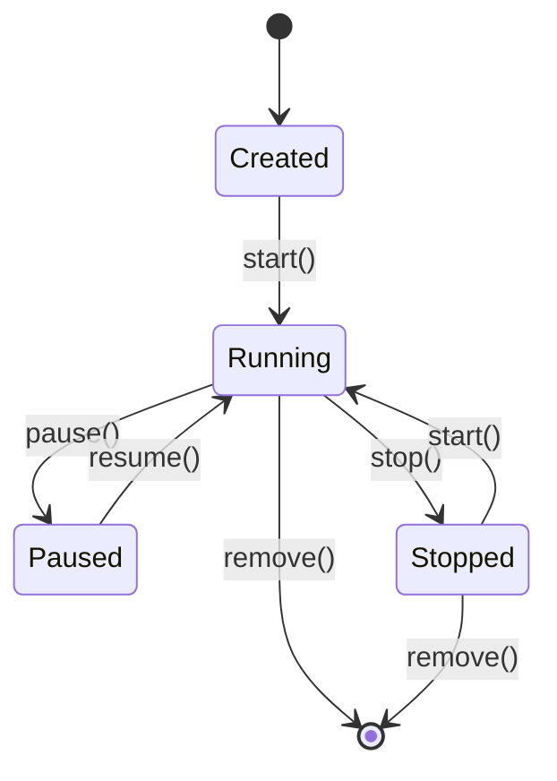

# 7.3.1 结构模型 / Structural Model


<!-- TOC START -->

- [7.3.1 结构模型 / Structural Model](#731-结构模型-structural-model)
  - [1. 容器系统结构模型 / Container System Structural Model](#1-容器系统结构模型-container-system-structural-model)
    - [1.1 容器层次结构 / Container Hierarchy Structure](#11-容器层次结构-container-hierarchy-structure)
    - [1.2 容器隔离模型 / Container Isolation Model](#12-容器隔离模型-container-isolation-model)
    - [1.3 容器生命周期状态机 / Container Lifecycle State Machine](#13-容器生命周期状态机-container-lifecycle-state-machine)
  - [2. 微服务架构结构模型 / Microservice Architecture Structural Model](#2-微服务架构结构模型-microservice-architecture-structural-model)
    - [2.1 微服务系统拓扑 / Microservice System Topology](#21-微服务系统拓扑-microservice-system-topology)
    - [2.2 服务依赖图模型 / Service Dependency Graph Model](#22-服务依赖图模型-service-dependency-graph-model)
    - [2.3 服务网格结构模型 / Service Mesh Structural Model](#23-服务网格结构模型-service-mesh-structural-model)
  - [3. 编排系统结构模型 / Orchestration System Structural Model](#3-编排系统结构模型-orchestration-system-structural-model)
    - [3.1 Kubernetes资源模型 / Kubernetes Resource Model](#31-kubernetes资源模型-kubernetes-resource-model)
    - [3.2 调度器结构模型 / Scheduler Structural Model](#32-调度器结构模型-scheduler-structural-model)
    - [3.3 服务发现模型 / Service Discovery Model](#33-服务发现模型-service-discovery-model)
  - [4. 安全隔离结构模型 / Security Isolation Structural Model](#4-安全隔离结构模型-security-isolation-structural-model)
    - [4.1 多层安全隔离 / Multi-layer Security Isolation](#41-多层安全隔离-multi-layer-security-isolation)
    - [4.2 安全容器模型 / Secure Container Model](#42-安全容器模型-secure-container-model)
  - [5. 网络结构模型 / Network Structural Model](#5-网络结构模型-network-structural-model)
    - [5.1 容器网络模型 / Container Network Model](#51-容器网络模型-container-network-model)
    - [5.2 服务网格网络模型 / Service Mesh Network Model](#52-服务网格网络模型-service-mesh-network-model)
  - [6. 存储结构模型 / Storage Structural Model](#6-存储结构模型-storage-structural-model)
    - [6.1 容器存储层次 / Container Storage Hierarchy](#61-容器存储层次-container-storage-hierarchy)
    - [6.2 持久化存储模型 / Persistent Storage Model](#62-持久化存储模型-persistent-storage-model)
  - [7. 监控与可观测性结构模型 / Monitoring and Observability Structural Model](#7-监控与可观测性结构模型-monitoring-and-observability-structural-model)
    - [7.1 监控数据流模型 / Monitoring Data Flow Model](#71-监控数据流模型-monitoring-data-flow-model)
    - [7.2 可观测性三大支柱 / Three Pillars of Observability](#72-可观测性三大支柱-three-pillars-of-observability)
  - [8. 扩展性结构模型 / Scalability Structural Model](#8-扩展性结构模型-scalability-structural-model)
    - [8.1 水平扩展模型 / Horizontal Scaling Model](#81-水平扩展模型-horizontal-scaling-model)
    - [8.2 垂直扩展模型 / Vertical Scaling Model](#82-垂直扩展模型-vertical-scaling-model)

<!-- TOC END -->

## 1. 容器系统结构模型 / Container System Structural Model

### 1.1 容器层次结构 / Container Hierarchy Structure

```text
┌─────────────────────────────────────┐
│           应用层 / Application      │
├─────────────────────────────────────┤
│           容器引擎 / Engine         │
├─────────────────────────────────────┤
│           运行时 / Runtime          │
├─────────────────────────────────────┤
│           操作系统 / OS             │
├─────────────────────────────────────┤
│           硬件层 / Hardware         │
└─────────────────────────────────────┘
```

### 1.2 容器隔离模型 / Container Isolation Model

**形式化定义：**
$$Container_i = (Namespace_i, CGroup_i, Filesystem_i, Network_i)$$

其中：

- $Namespace_i$：命名空间隔离集合  
  Namespace isolation set
- $CGroup_i$：资源控制组  
  Resource control group
- $Filesystem_i$：文件系统隔离  
  Filesystem isolation
- $Network_i$：网络隔离配置  
  Network isolation configuration

### 1.3 容器生命周期状态机 / Container Lifecycle State Machine



## 2. 微服务架构结构模型 / Microservice Architecture Structural Model

### 2.1 微服务系统拓扑 / Microservice System Topology

**形式化定义：**
$$MS_{System} = (S, C, R, G)$$

其中：

- $S = \{s_1, s_2, ..., s_n\}$：服务集合  
  Service set
- $C = \{c_{ij} | i,j \in [1,n]\}$：通信关系集合  
  Communication relationship set
- $R = \{r_1, r_2, ..., r_m\}$：资源集合  
  Resource set
- $G = \{g_1, g_2, ..., g_k\}$：治理策略集合  
  Governance policy set

### 2.2 服务依赖图模型 / Service Dependency Graph Model

**有向图表示：**
$$G_{MS} = (V, E, W)$$

其中：

- $V = \{v_1, v_2, ..., v_n\}$：服务节点集合  
  Service node set
- $E = \{(v_i, v_j) | v_i, v_j \in V\}$：依赖边集合  
  Dependency edge set
- $W: E \rightarrow \mathbb{R}^+$：权重函数  
  Weight function

### 2.3 服务网格结构模型 / Service Mesh Structural Model

```text
┌─────────────────────────────────────┐
│        应用层 / Application         │
├─────────────────────────────────────┤
│        数据平面 / Data Plane        │
│    ┌─────────┐  ┌─────────┐       │
│    │ Proxy 1 │  │ Proxy 2 │       │
│    └─────────┘  └─────────┘       │
├─────────────────────────────────────┤
│        控制平面 / Control Plane     │
│    ┌─────────┐  ┌─────────┐       │
│    │ Policy  │  │ Config  │       │
│    └─────────┘  └─────────┘       │
└─────────────────────────────────────┘
```

## 3. 编排系统结构模型 / Orchestration System Structural Model

### 3.1 Kubernetes资源模型 / Kubernetes Resource Model

**资源层次结构：**
$$K8s_{Resource} = (Namespace, Pod, Service, Deployment, ConfigMap, Secret)$$

**Pod定义：**
$$Pod = (Containers, Volumes, Network, SecurityContext)$$

其中：

- $Containers = \{c_1, c_2, ..., c_n\}$：容器集合  
  Container set
- $Volumes = \{v_1, v_2, ..., v_m\}$：卷集合  
  Volume set
- $Network = (IP, Ports, DNS)$：网络配置  
  Network configuration
- $SecurityContext = (User, Group, Capabilities)$：安全上下文  
  Security context

### 3.2 调度器结构模型 / Scheduler Structural Model

**调度决策函数：**
$$Scheduler_{Decision} = f(Pod_{Request}, Node_{Capacity}, Policy_{Constraints})$$

其中：

- $Pod_{Request} = (CPU, Memory, Storage, Network)$：Pod资源请求  
  Pod resource request
- $Node_{Capacity} = (CPU_{avail}, Memory_{avail}, Storage_{avail})$：节点可用资源  
  Node available resources
- $Policy_{Constraints} = (Affinity, AntiAffinity, Taints, Tolerations)$：策略约束  
  Policy constraints

### 3.3 服务发现模型 / Service Discovery Model

**服务注册表：**
$$Service_{Registry} = \{(Service_{ID}, Endpoints, Metadata, Health_{Status})\}$$

**负载均衡算法：**
$$LB_{Algorithm} = f(Endpoints, Load_{Metrics}, Policy_{Rules})$$

## 4. 安全隔离结构模型 / Security Isolation Structural Model

### 4.1 多层安全隔离 / Multi-layer Security Isolation

```text
┌─────────────────────────────────────┐
│        应用安全 / App Security      │
├─────────────────────────────────────┤
│        容器安全 / Container Security│
├─────────────────────────────────────┤
│        运行时安全 / Runtime Security│
├─────────────────────────────────────┤
│        内核安全 / Kernel Security   │
├─────────────────────────────────────┤
│        硬件安全 / Hardware Security │
└─────────────────────────────────────┘
```

### 4.2 安全容器模型 / Secure Container Model

**安全容器定义：**
$$SecureContainer = (VM_{Isolation}, Sandbox_{Runtime}, Security_{Policies})$$

其中：

- $VM_{Isolation} = (Hypervisor, VM_{Config}, Memory_{Isolation})$：虚拟机隔离  
  VM isolation
- $Sandbox_{Runtime} = (Runtime_{Type}, Security_{Context}, Resource_{Limits})$：沙箱运行时  
  Sandbox runtime
- $Security_{Policies} = (Network_{Policy}, Access_{Control}, Audit_{Log})$：安全策略  
  Security policies

## 5. 网络结构模型 / Network Structural Model

### 5.1 容器网络模型 / Container Network Model

**网络命名空间：**
$$Network_{Namespace} = (Interface_{Set}, Routing_{Table}, Firewall_{Rules})$$

**网络策略：**
$$Network_{Policy} = (Ingress_{Rules}, Egress_{Rules}, Pod_{Selector})$$

### 5.2 服务网格网络模型 / Service Mesh Network Model

**数据平面网络：**
$$DataPlane_{Network} = (Proxy_{Set}, Traffic_{Rules}, Load_{Balancing})$$

**控制平面网络：**
$$ControlPlane_{Network} = (Config_{Distribution}, Policy_{Enforcement}, Monitoring)$$

## 6. 存储结构模型 / Storage Structural Model

### 6.1 容器存储层次 / Container Storage Hierarchy

```text
┌─────────────────────────────────────┐
│        应用数据 / App Data          │
├─────────────────────────────────────┤
│        容器层 / Container Layer     │
├─────────────────────────────────────┤
│        镜像层 / Image Layer         │
├─────────────────────────────────────┤
│        存储驱动 / Storage Driver    │
├─────────────────────────────────────┤
│        主机存储 / Host Storage      │
└─────────────────────────────────────┘
```

### 6.2 持久化存储模型 / Persistent Storage Model

**存储卷定义：**
$$Volume = (Type, Source, Mount_{Point}, Access_{Mode})$$

**存储类定义：**
$$StorageClass = (Provisioner, Parameters, Reclaim_{Policy})$$

## 7. 监控与可观测性结构模型 / Monitoring and Observability Structural Model

### 7.1 监控数据流模型 / Monitoring Data Flow Model

```text
┌─────────────┐    ┌─────────────┐    ┌─────────────┐
│  数据收集   │───▶│  数据处理   │───▶│  数据存储   │
│  Collection │    │  Processing │    │   Storage   │
└─────────────┘    └─────────────┘    └─────────────┘
       │                   │                   │
       ▼                   ▼                   ▼
┌─────────────┐    ┌─────────────┐    ┌─────────────┐
│  告警系统   │    │  可视化     │    │  分析工具   │
│  Alerting   │    │  Dashboard  │    │  Analytics  │
└─────────────┘    └─────────────┘    └─────────────┘
```

### 7.2 可观测性三大支柱 / Three Pillars of Observability

**指标模型：**
$$Metrics = \{Counter, Gauge, Histogram, Summary\}$$

**日志模型：**
$$Logs = \{Timestamp, Level, Message, Context, Trace_{ID}\}$$

**链路追踪模型：**
$$Traces = \{Trace_{ID}, Span_{ID}, Parent_{ID}, Tags, Events\}$$

## 8. 扩展性结构模型 / Scalability Structural Model

### 8.1 水平扩展模型 / Horizontal Scaling Model

**扩展策略：**
$$Scaling_{Strategy} = f(Load_{Metrics}, Threshold_{Rules}, Resource_{Availability})$$

**负载均衡算法：**
$$LB_{Algorithm} = \{RoundRobin, LeastConnections, Weighted, IPHash\}$$

### 8.2 垂直扩展模型 / Vertical Scaling Model

**资源调整：**
$$Resource_{Adjustment} = f(Current_{Usage}, Target_{Capacity}, Constraints)$$

**性能优化：**
$$Performance_{Optimization} = \{CPU_{Tuning}, Memory_{Tuning}, IOTuning\}$$

---

> 本文件为7.3.1结构模型的系统化形式化建模，采用中英双语对照，突出工程论证与知识点完备性。
> This file provides systematic formal modeling of structural models, with Chinese-English bilingual content, emphasizing engineering argumentation and comprehensive knowledge points.
